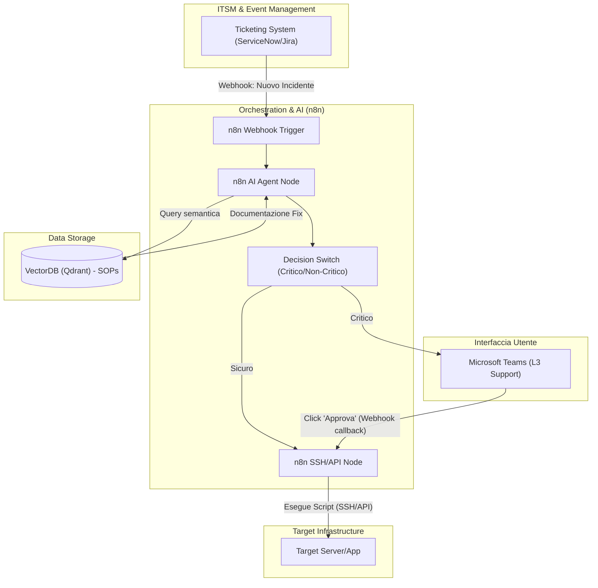
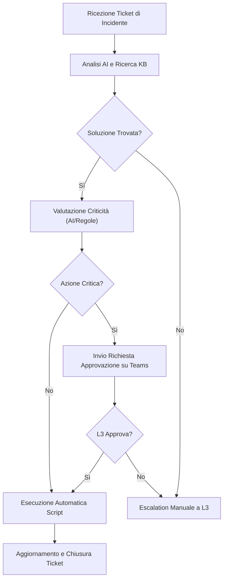
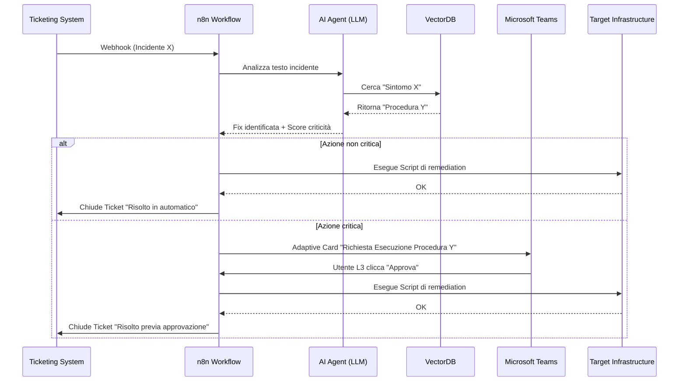

# Blueprint GenAI: Efficentamento del "AIOps - Auto-Remediation Incidenti"

## 1. Descrizione del Caso d'Uso
**Categoria:** Operations & Maintenance
**Titolo:** AIOps - Auto-Remediation Incidenti
**Ruolo:** IT Support Level 3
**Obiettivo Originale (da CSV):** Sviluppo di flussi automatizzati in cui l'agente AI analizza un ticket di incidente, identifica la soluzione documentata (Knowledge Base) ed esegue lo script di risoluzione (es. riavvio servizio, pulizia temp) in totale autonomia, chiedendo conferma solo per casi critici.
**Obiettivo GenAI:** Implementare un flusso di automazione basato su AI che legga i ticket di incidente in ingresso, cerchi la soluzione in una Knowledge Base aziendale e avvii automaticamente gli script di remediation per i casi noti non critici, richiedendo l'approvazione umana su Teams per le criticità.

## 2. Fasi del Processo Efficentato

### Fase 1: Analisi del Ticket e Ricerca Knowledge Base
L'AI analizza il payload del ticket in ingresso (es. da ServiceNow o Jira) e interroga la Knowledge Base tramite VectorDB per trovare la procedura di risoluzione documentata associata all'errore.
*   **Tool Principale Consigliato:** n8n
*   **Alternative:** 1. Microsoft Power Automate, 2. Google Antigravity
*   **Modelli LLM Suggeriti:** OpenAI GPT-5.4 o Google Gemini 3.1 Pro
*   **Modalità di Utilizzo:** n8n riceve il webhook del nuovo ticket. Un nodo AI analizza il testo dell'errore ed esegue una query semantica su un VectorDB (es. Qdrant) che contiene le procedure operative standard (SOP) dell'azienda.
*   **Azione Umana Richiesta:** Nessuna.
*   **Stima Reale di Efficienza:** 
    *   *Tempo As-Is (Manuale):* 15 minuti
    *   *Tempo To-Be (GenAI):* 10 secondi
    *   *Risparmio %:* 98%
    *   *Motivazione:* L'AI estrae istantaneamente il sintomo e recupera il documento di risoluzione senza ricerca manuale del tecnico.

### Fase 2: Esecuzione Remediation o Richiesta Approvazione (Teams)
L'AI valuta il livello di criticità del ticket e la sicurezza dello script. Se è un'azione sicura (es. clear cache), esegue lo script via API/SSH. Se è critica (es. riavvio DB), invia una notifica interattiva su Microsoft Teams per l'approvazione del Supporto L3.
*   **Tool Principale Consigliato:** n8n
*   **Alternative:** 1. Microsoft Teams (Chatbot UI), 2. Copilot Studio
*   **Modelli LLM Suggeriti:** N/A (Logica di orchestrazione + LLM per valutazione rischio)
*   **Modalità di Utilizzo:** Il workflow n8n include uno switch logico. Se `is_critical == true`, invia un Adaptive Card su Teams con i pulsanti "Approva" e "Rifiuta". Una volta approvato (o in automatico), n8n chiama l'API dello strumento di automation (es. Ansible Tower) per eseguire la fix.
*   **Azione Umana Richiesta:** L'IT Support L3 deve cliccare "Approva" o "Rifiuta" su Teams per i task critici.
*   **Stima Reale di Efficienza:** 
    *   *Tempo As-Is (Manuale):* 30-45 minuti
    *   *Tempo To-Be (GenAI):* 2 minuti (tempo di lettura e click)
    *   *Risparmio %:* 95%
    *   *Motivazione:* L'azione umana è ridotta alla pura supervisione e autorizzazione (1-click approval) invece che accedere ai server ed eseguire comandi manualmente.

## 3. Descrizione del Flusso Logico
Il flusso adotta un approccio **Single-Agent** orchestrato all'interno di un workflow `n8n`. Quando un sistema di ticketing emette un webhook di "Nuovo Incidente", n8n cattura l'evento. L'agente AI integrato nel workflow legge la descrizione dell'incidente ed esegue una ricerca semantica nel VectorDB aziendale che contiene i manuali di troubleshooting. Trovata la soluzione, l'AI classifica il task: se rientra in una whitelist di azioni sicure (es. riavvio servizio web, pulizia disco temp), n8n esegue immediatamente lo script di remediation tramite SSH o API (es. Ansible) e chiude il ticket. Se l'azione ha un impatto maggiore (es. riavvio database), n8n inoltra un messaggio interattivo con Adaptive Card al canale Microsoft Teams del team IT Support L3. Il tecnico L3, analizzando il riepilogo generato dall'AI, clicca "Approva" direttamente da Teams, innescando l'esecuzione dello script.

## 4. Diagrammi UML (Mermaid.js)

### 4.1 Architecture Diagram


### 4.2 Process Diagram


### 4.3 Sequence Diagram


## 5. Guida all'Implementazione Tecnica
### Prerequisiti
- Istanza di n8n operativa.
- API Key per OpenAI (GPT-5.4) o Google Gemini (3.1 Pro).
- Database Vettoriale (es. Qdrant Cloud o Pinecone) popolato con le Knowledge Base aziendali (SOP).
- Credenziali di accesso a Microsoft Teams (per la creazione dell'app bot o integrazione n8n-Teams).
- Credenziali per l'esecuzione di script sull'infrastruttura (chiavi SSH o API Token di un sistema di automation come Ansible).

### Step 1: Configurazione del VectorDB e Knowledge Base
1. Creare una collection su Qdrant (es. `it_sops`).
2. Sviluppare un piccolo script/flusso (anche separato) che converta i manuali IT esistenti in PDF/Word in embeddings vettoriali caricandoli nel database Qdrant.

### Step 2: Creazione del Workflow n8n
1. Accedere a n8n e creare un nuovo workflow.
2. Aggiungere un nodo **Webhook** in ascolto di richieste POST dal sistema di ticketing.
3. Aggiungere un nodo **AI Agent**:
   - Collegarlo al Language Model scelto (es. OpenAI).
   - Inserire un "Vector Store Tool" collegato al database Qdrant.
   - Fornire un System Prompt simile a:
     ```markdown
     Sei un IT Support di Livello 3. Riceverai i dettagli di un incidente.
     Usa il tool VectorDB per cercare la soluzione. 
     Se la trovi, restituisci un JSON con lo "script_da_eseguire" e un flag "critico" (true/false) a seconda che l'azione comporti impatti sui servizi (es. riavvi o drop di dati).
     ```

### Step 3: Implementazione della Logica e Integrazione Teams
1. Aggiungere un nodo **If/Switch** in n8n basato sul valore restituito dal flag `critico`.
2. Nel ramo `critico == false`: aggiungere un nodo **SSH** o HTTP Request per lanciare il comando direttamente.
3. Nel ramo `critico == true`: aggiungere il nodo **Microsoft Teams**. Configurare l'invio di un'Adaptive Card interattiva al canale del supporto L3, esponendo il riepilogo del problema e i bottoni "Approva" e "Rifiuta" collegati ad un endpoint di attesa in n8n.
4. Creare un nodo o webhook secondario in n8n che attenda la callback del bottone "Approva" di Teams per poi attivare il nodo di esecuzione (SSH/HTTP).

### Step 4: Chiusura del Ciclo
1. Indipendentemente dal percorso, dopo che lo script è terminato con successo, usare un nodo HTTP Request per fare una chiamata API verso il sistema di ticketing e chiudere l'incidente, documentando i log d'esecuzione.

## 6. Rischi e Mitigazioni
- **Rischio 1:** Esecuzione accidentale di script distruttivi dovuta ad allucinazioni dell'AI nella scelta della remediation. -> **Mitigazione:** Limitare l'Agente: n8n non deve poter eseguire comandi arbitrari inventati dall'AI, ma l'AI deve solo restituire l'ID di uno script pre-approvato presente nella Knowledge Base. Applicare il principio del minimo privilegio alle chiavi SSH fornite a n8n.
- **Rischio 2:** Bypass dei controlli umani per incidenti ad alto impatto sfuggiti alle regole di classificazione dell'LLM. -> **Mitigazione:** Hard-coding nel workflow n8n (fuori dal controllo dell'LLM) di una blacklist di server o servizi (es. nodi database primari) per i quali l'azione umana su Teams è sempre obbligatoria a prescindere dal giudizio dell'AI.