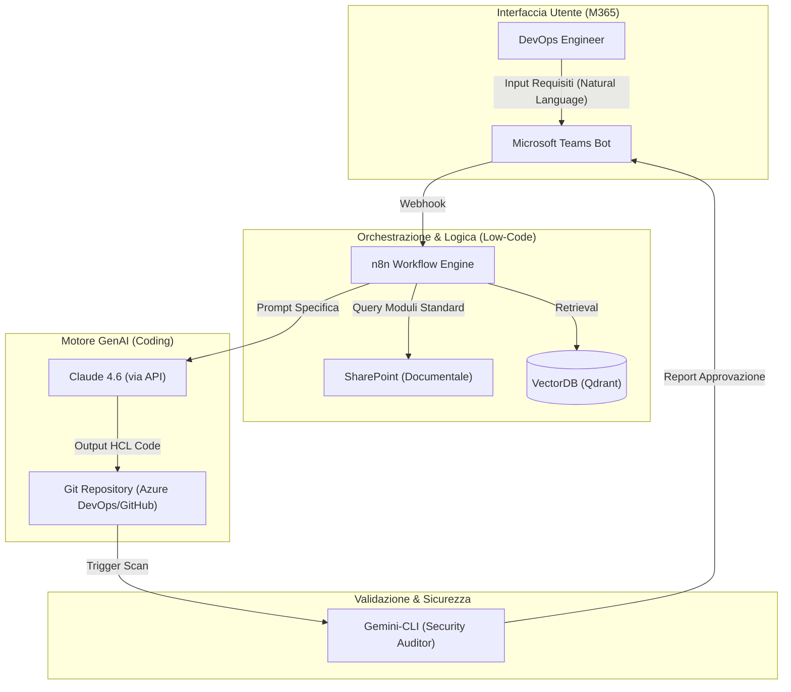
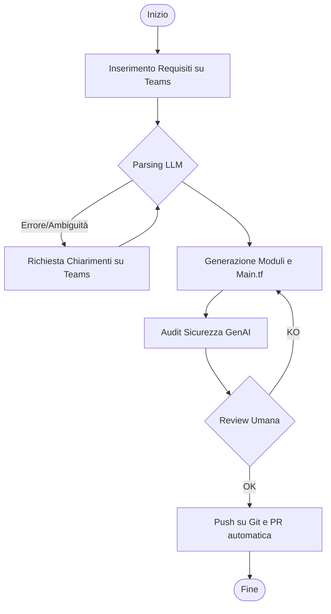
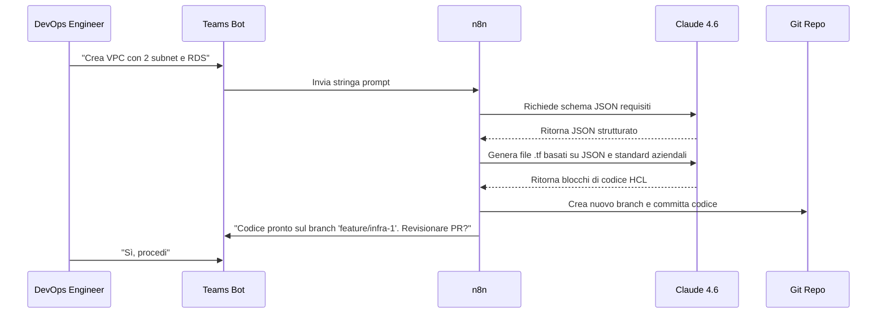

# Blueprint GenAI: Efficentamento dello "Sviluppo Codice Terraform (IaC)"

## 1. Descrizione del Caso d'Uso
**Categoria:** Provisioning & Automation
**Titolo:** Sviluppo Codice Terraform (IaC)
**Ruolo:** DevOps Engineer
**Obiettivo Originale (da CSV):** Scrittura di codice dichiarativo Terraform per il provisioning automatizzato e ripetibile di risorse cloud (VPC, EC2, RDS, IAM Roles). Creazione di moduli riutilizzabili e gestione sicura dei tfstate.
**Obiettivo GenAI:** Automatizzare la generazione di file di configurazione Terraform (`.tf`), la creazione di moduli standardizzati e la predisposizione del backend per il `tfstate` partendo da requisiti espressi in linguaggio naturale.

## 2. Fasi del Processo Efficentato

### Fase 1: Definizione Requisiti e Scaffolding
L'utente interagisce con un bot su Teams per descrivere l'infrastruttura desiderata (es. "VPC in AWS con 3 subnet private, un RDS Aurora e ruoli IAM minimi"). Il sistema trasforma la richiesta in un file di specifica tecnica (JSON/YAML) che funge da input per la generazione del codice.
*   **Tool Principale Consigliato:** `Microsoft Teams (Chatbot UI)` + `n8n`
*   **Alternative:** 1. `accenture ametyst`, 2. `chatgpt agent`
*   **Modelli LLM Suggeriti:** Google Gemini 3 Deep Think (per la scomposizione logica dei requisiti)
*   **Modalità di Utilizzo:** Orchestrazione tramite n8n che riceve il messaggio da Teams, interroga l'LLM per estrarre i parametri tecnici e produce uno schema di input strutturato.
*   **Azione Umana Richiesta:** Validazione dello schema dei parametri prima della generazione del codice.
*   **Stima Reale di Efficienza:** 
    *   *Tempo As-Is (Manuale):* 2 ore (riunioni e stesura specifiche)
    *   *Tempo To-Be (GenAI):* 10 minuti
    *   *Risparmio %:* 92%
    *   *Motivazione:* Eliminazione della necessità di redigere manualmente documenti di specifica intermedi.

### Fase 2: Generazione Codice HCL e Moduli
Utilizzo di un agente specializzato per scrivere materialmente i file `.tf` (main, variables, outputs) e i moduli riutilizzabili, seguendo le best practice aziendali memorizzate in un repository (RAG).
*   **Tool Principale Consigliato:** `claude-code`
*   **Alternative:** 1. `visualstudio + copilot`, 2. `OpenAI Codex`
*   **Modelli LLM Suggeriti:** Anthropic Claude Sonnet 4.6 (superiore per precisione sintattica HCL)
*   **Modalità di Utilizzo:** Integrazione via CLI o Agent. L'agente legge i moduli standard da un `VectorDB` (basato su SharePoint) e genera il codice richiamando i moduli esistenti invece di scrivere risorse "raw".
    *   *Esempio Prompt (System Prompt):* 
    ```text
    Agisci come un Senior DevOps Expert specializzato in Terraform. 
    Genera codice HCL per AWS seguendo questi standard:
    1. Usa solo i moduli presenti nel catalogo aziendale (SharePoint).
    2. Inserisci sempre il blocco 'terraform { backend "s3" {} }'.
    3. Ogni risorsa deve avere il tag 'ManagedBy: Terraform' e 'Owner: [User]'.
    ```
*   **Azione Umana Richiesta:** Revisione del codice generato (Code Review).
*   **Stima Reale di Efficienza:** 
    *   *Tempo As-Is (Manuale):* 6 ore
    *   *Tempo To-Be (GenAI):* 15 minuti
    *   *Risparmio %:* 96%
    *   *Motivazione:* La generazione massiva di boilerplate e la logica dei moduli è istantanea.

### Fase 3: Security Linting e Configurazione Backend
Analisi automatizzata del codice per individuare drift di sicurezza o configurazioni errate (es. bucket S3 pubblici) e generazione automatica dello script per l'inizializzazione del backend remoto (S3/DynamoDB).
*   **Tool Principale Consigliato:** `gemini-cli`
*   **Alternative:** 1. `visualstudio + copilot`, 2. `n8n` (con integrazione tfsec)
*   **Modelli LLM Suggeriti:** Google Gemini 3.1 Pro
*   **Modalità di Utilizzo:** Script bash che invia il file generato a `gemini-cli` con un prompt di auditing di sicurezza.
*   **Azione Umana Richiesta:** Approvazione finale del report di sicurezza e comando `terraform apply`.
*   **Stima Reale di Efficienza:** 
    *   *Tempo As-Is (Manuale):* 2 ore
    *   *Tempo To-Be (GenAI):* 5 minuti
    *   *Risparmio %:* 96%
    *   *Motivazione:* L'AI identifica vulnerabilità istantaneamente confrontando il codice con le policy OPA o standard CIS.

## 3. Descrizione del Flusso Logico
Il flusso è progettato come **Single-Agent orchestrato da n8n**. L'utente avvia il processo su Teams inserendo i requisiti. n8n funge da "colla", chiamando l'LLM per la strutturazione dei dati, recuperando i template dei moduli da SharePoint e infine invocando `claude-code` o un Agent via API per scrivere i file su un branch Git dedicato. L'approccio Single-Agent è preferito per mantenere la coerenza tra i parametri e il codice generato, evitando conflitti di "passaggio di testimone" tra agenti diversi su un task sintattico così delicato.

## 4. Diagrammi UML (Mermaid.js)

### 4.1 Architecture Diagram


### 4.2 Process Diagram


### 4.3 Sequence Diagram


## 5. Guida all'Implementazione Tecnica

### Prerequisiti
- Licenza **Copilot Studio** o account **n8n** (self-hosted o cloud).
- API Key per **Anthropic Claude** (via AWS Bedrock o Google Vertex AI).
- Repository Git con accesso tramite **Personal Access Token (PAT)**.
- Accesso a SharePoint per la base di conoscenza dei moduli.

### Step 1: Configurazione n8n e Ingestione
1. Creare un webhook in n8n collegato a un'app bot di Microsoft Teams.
2. Utilizzare il nodo "AI Agent" in n8n, configurandolo con il modello Claude 4.6.
3. Collegare un nodo "Microsoft SharePoint" per scaricare i file `.tf` dei moduli esistenti da indicizzare nel VectorDB.

### Step 2: Definizione del System Prompt per la Generazione
Configurare l'agente con il seguente prompt operativo:
> "Sei un generatore di codice Terraform. Il tuo output deve essere esclusivamente codice HCL valido. Non aggiungere commenti discorsivi fuori dai blocchi di codice. Usa variabili per ogni parametro configurabile. Implementa sempre il versioning dei moduli."

### Step 3: Pipeline di Validazione
1. Implementare un nodo n8n che esegue un comando shell: `terraform validate`.
2. Inviare l'output di `terraform plan` a `gemini-cli` per una spiegazione in linguaggio naturale dei costi previsti e dei potenziali rischi di sicurezza rilevati.

## 6. Rischi e Mitigazioni
- **Rischio 1: Allucinazioni sintattiche (codice non valido)** -> **Mitigazione:** Integrazione obbligatoria di un passo di `terraform validate` nel workflow prima della consegna.
- **Rischio 2: Esposizione di Secret (API Keys nel codice)** -> **Mitigazione:** Configurazione dell'LLM per utilizzare esclusivamente riferimenti a KeyVault/Secret Manager e integrazione di uno scanner di secret (es. Gitleaks) nella pipeline.
- **Rischio 3: Utilizzo di moduli obsoleti** -> **Mitigazione:** Utilizzo di un VectorDB (RAG) che indicizza in tempo reale solo l'ultima versione del repository `terraform-modules` aziendale.
