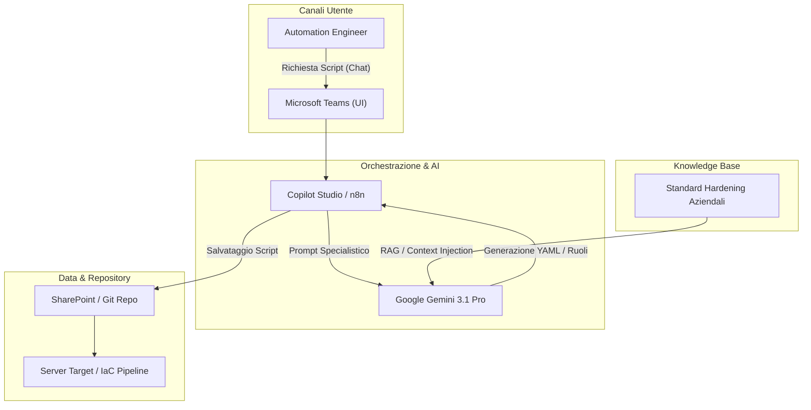
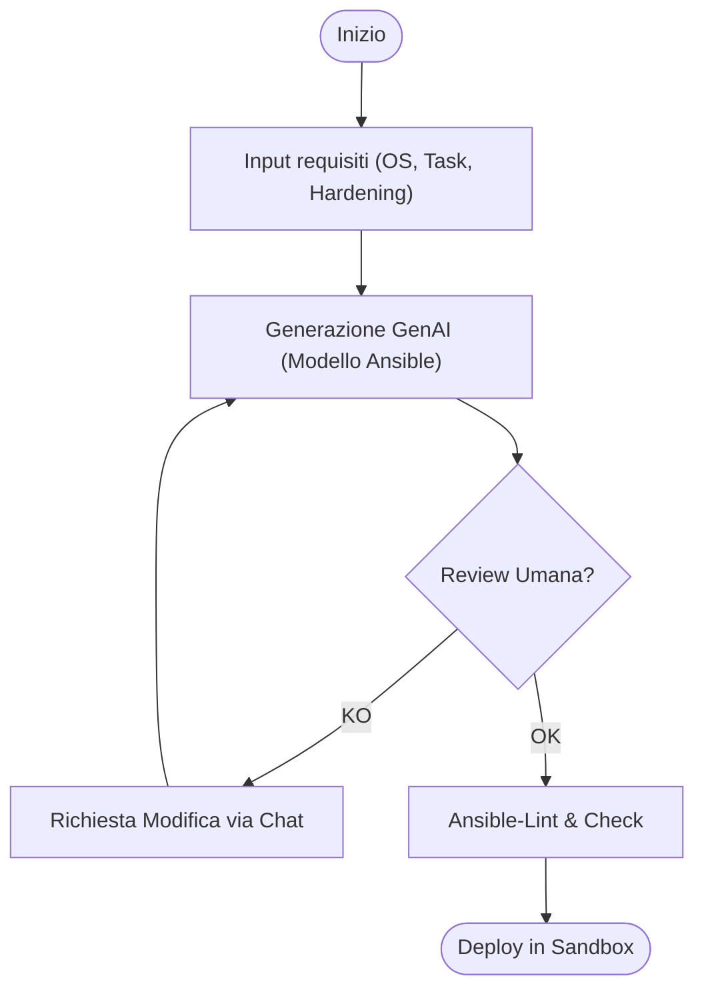
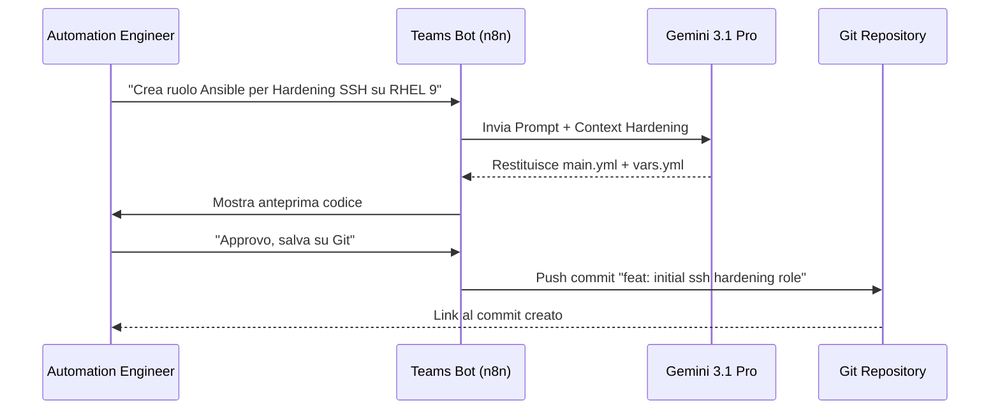

# Blueprint GenAI: Efficentamento del "Sviluppo Script Ansible (Configuration Management)"

## 1. Descrizione del Caso d'Uso
**Categoria:** Provisioning & Automation  
**Titolo:** Sviluppo Script Ansible (Configuration Management)  
**Ruolo:** Automation Engineer  
**Obiettivo Originale (da CSV):** Creazione di playbook e ruoli Ansible per l'automazione della configurazione post-provisioning dei sistemi operativi. Installazione di pacchetti, hardening di base, deploy di agenti di monitoraggio e gestione utenti locali.  
**Obiettivo GenAI:** Automatizzare la generazione di playbook e ruoli Ansible (YAML) partendo da specifiche in linguaggio naturale, garantendo l'allineamento istantaneo agli standard di hardening aziendali e riducendo gli errori di sintassi o logica.

## 2. Fasi del Processo Efficentato

### Fase 1: Richiesta e Generazione Struttura (Ansible scaffolding)
L'utente richiede via chat (Teams) la creazione di un ruolo o playbook specifico fornendo i requisiti (es. "Installa nginx, crea utente 'deploy' e applica hardening SSH"). L'AI genera istantaneamente la struttura di cartelle (`tasks/`, `handlers/`, `vars/`) e il codice YAML.
*   **Tool Principale Consigliato:** `Microsoft Teams (Chatbot UI)` integrato con `n8n` e `gemini-cli`.
*   **Alternative:** 1. `visualstudio + copilot`, 2. `claude-code`.
*   **Modelli LLM Suggeriti:** *Google Gemini 3.1 Pro* (per l'ottima gestione di file strutturati e logica di sistema).
*   **Modalità di Utilizzo:** Un bot su Teams riceve la richiesta e invoca un workflow n8n che utilizza l'LLM per generare il codice.
    *   **Bozza System Prompt per Ansible Agent:**
    ```markdown
    Sei un Senior Automation Engineer esperto in Ansible. 
    Il tuo compito è generare playbook e ruoli Ansible YAML seguendo queste regole:
    1. Usa sempre nomi di task descrittivi.
    2. Includi sempre 'become: yes' dove necessario.
    3. Segui le best practice di hardening (es. non permettere login root SSH).
    4. Usa variabili per parametri configurabili (es. porte, nomi utenti).
    5. Struttura l'output come un blocco di codice YAML pulito o una struttura di file se richiesto un ruolo.
    ```
*   **Azione Umana Richiesta:** Revisione dei parametri (variabili) e approvazione della logica.
*   **Stima Reale di Efficienza:** 
    *   *Tempo As-Is (Manuale):* 2 ore (ricerca moduli, stesura YAML, debugging sintassi).
    *   *Tempo To-Be (GenAI):* 5 minuti.
    *   *Risparmio %:* 96%.
    *   *Motivazione:* L'AI elimina la necessità di consultare la documentazione dei moduli Ansible per ogni parametro e pre-compila gli standard di hardening.

### Fase 2: Refactoring e Validazione Idempotenza
Ottimizzazione del codice generato per garantire che sia idempotente e privo di errori di esecuzione su diverse distribuzioni OS (Debian/RHEL).
*   **Tool Principale Consigliato:** `claude-code`.
*   **Alternative:** 1. `visualstudio + copilot`, 2. `gemini-cli`.
*   **Modelli LLM Suggeriti:** *Anthropic Claude Sonnet 4.6* (eccellente per il debugging di script infrastrutturali).
*   **Modalità di Utilizzo:** Tramite CLI, si lancia il comando per analizzare il file YAML locale e suggerire miglioramenti per l'idempotenza.
    *   **Comando Suggerito:** `claude-code "Analizza questo playbook Ansible e assicurati che sia totalmente idempotente e compatibile sia con Ubuntu che con CentOS." playbook.yml`
*   **Azione Umana Richiesta:** Esecuzione di `ansible-playbook --check` in ambiente di staging.
*   **Stima Reale di Efficienza:** 
    *   *Tempo As-Is (Manuale):* 1 ora (test manuali su diverse distro).
    *   *Tempo To-Be (GenAI):* 10 minuti.
    *   *Risparmio %:* 83%.
    *   *Motivazione:* L'AI riconosce istantaneamente le differenze nei nomi dei pacchetti e nei percorsi dei file tra diverse distribuzioni.

## 3. Descrizione del Flusso Logico
Il flusso è di tipo **Single-Agent** per mantenere la semplicità estrema. 
1. L'Automation Engineer interagisce con un **Teams Bot** (interfaccia familiare). 
2. Il Bot invia il prompt a un motore GenAI (Gemini) tramite **n8n** (orchestratore low-code). 
3. L'output (YAML) viene salvato direttamente su uno **SharePoint** o in una cartella Git monitorata. 
4. L'umano interviene solo per la validazione finale e il commit.

## 4. Diagrammi UML (Mermaid.js)

### 4.1 Architecture Diagram


### 4.2 Process Diagram


### 4.3 Sequence Diagram


## 5. Guida all'Implementazione Tecnica

### Prerequisiti
- Account **Microsoft 365** con licenza Teams e Power Virtual Agents (Copilot Studio).
- Istanza **n8n** (Self-hosted o Cloud) per gestire i webhook e la logica di connessione.
- API Key per **Google Gemini** (via AI Studio) o accesso ad **Amethyst**.
- Repository Git aziendale (es. GitLab o GitHub).

### Step 1: Configurazione n8n Workflow
1. Crea un trigger **Webhook** in n8n.
2. Aggiungi un nodo **AI Agent** (o HTTP Request) che invia la descrizione dell'attività a Gemini 3.1 Pro.
3. Inserisci nel prompt le "Linee Guida di Hardening" del cliente (es. link a documenti SharePoint o testo statico).
4. Aggiungi un nodo **GitHub/GitLab** per fare il commit automatico del file generato.

### Step 2: Integrazione Teams via Copilot Studio
1. Crea un nuovo bot in **Copilot Studio**.
2. Configura un "Topic" di generazione script.
3. Collega l'azione del Topic al Webhook di n8n creato nello Step 1.
4. Pubblica il bot sul canale Teams del team Automation.

### Step 3: Utilizzo di claude-code per il Refinement (Locale)
1. Installa l'utility: `npm install -g @anthropic-ai/claude-code`.
2. Dalla cartella del progetto Ansible, esegui il login e usa l'AI per ottimizzare i file appena scaricati da Git.

## 6. Rischi e Mitigazioni
- **Rischio:** Generazione di comandi distruttivi (es. `rm -rf /`). -> **Mitigazione:** Obbligo di `ansible-playbook --check` e revisione umana dei task "file" o "shell".
- **Rischio:** Mancata idempotenza degli script generati. -> **Mitigazione:** Utilizzo di moduli Ansible nativi (es. `apt`, `yum`, `lineinfile`) invece di comandi `shell` generici.
- **Rischio:** Credenziali in chiaro negli script. -> **Mitigazione:** Configurazione del prompt affinché utilizzi sempre `ansible-vault` o variabili caricate dinamicamente.
