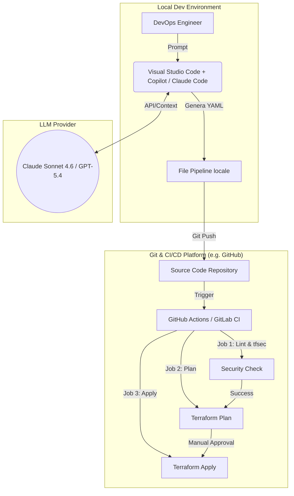
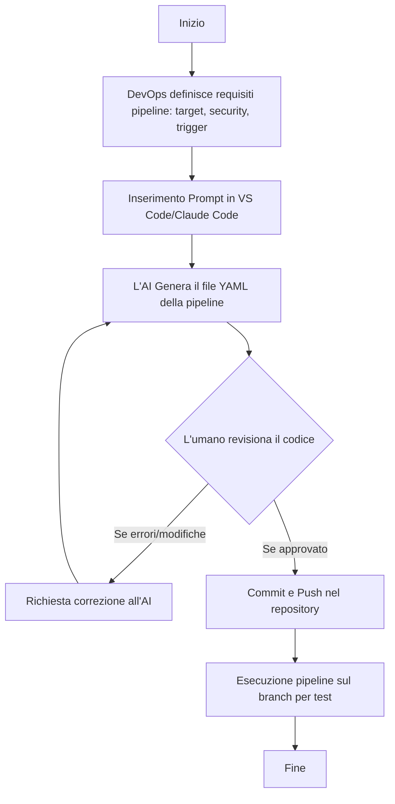
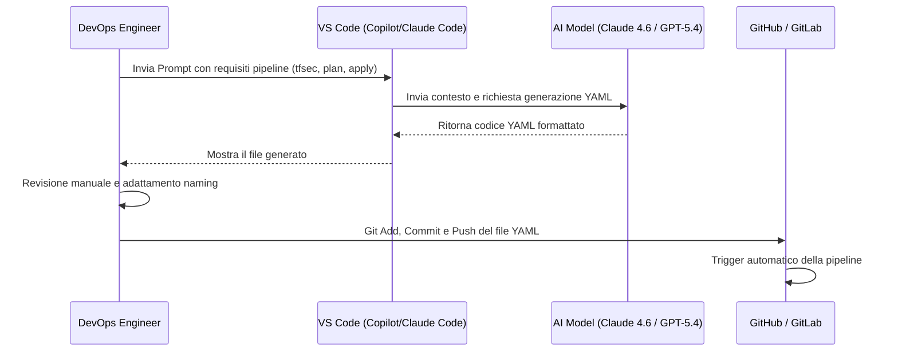

# Blueprint GenAI: Efficentamento dell'"Automazione Pipeline CI/CD Infrastrutturali"

## 1. Descrizione del Caso d'Uso
**Categoria:** Provisioning & Automation
**Titolo:** Automazione Pipeline CI/CD Infrastrutturali
**Ruolo:** DevOps Engineer
**Obiettivo Originale (da CSV):** Progettazione e implementazione di pipeline (es. GitHub Actions, GitLab CI, Azure DevOps) per la validazione automatica (linting, tfsec), l'approvazione e il rilascio sicuro in produzione delle modifiche al codice IaC.
**Obiettivo GenAI:** Automatizzare la generazione, stesura e configurazione dei file YAML per le pipeline CI/CD, integrando nativamente i controlli di sicurezza (es. tfsec, tflint) e le regole di approvazione manuale (Human-in-the-loop).

## 2. Fasi del Processo Efficentato

### Fase 1: Generazione del File Configurazione Pipeline (YAML)
L'AI viene utilizzata per generare istantaneamente il file di configurazione della pipeline CI/CD per lo strumento target (es. `.github/workflows/terraform.yml`), partendo da una semplice descrizione in linguaggio naturale dei check richiesti.

*   **Tool Principale Consigliato:** `visualstudio + copilot` (o GitHub Copilot Chat in VS Code)
*   **Alternative:** 1. `claude-code` (per generazione rapida da terminale), 2. `chatgpt agent`
*   **Modelli LLM Suggeriti:** Anthropic Claude Sonnet 4.6 (tramite Claude Code/VSCode) o OpenAI GPT-5.4
*   **Modalità di Utilizzo:** Il DevOps Engineer utilizza l'interfaccia chat dell'IDE o il prompt CLI per richiedere la generazione del codice della pipeline. 

    *Esempio di Prompt per l'AI:*
    ```text
    Scrivi un workflow GitHub Actions completo per Terraform. Il workflow deve:
    1. Scattare su ogni Pull Request verso il branch 'main'.
    2. Avere un job 'Validate' che esegue 'terraform fmt -check', 'tflint' e 'tfsec'.
    3. Avere un job 'Plan' che esegue 'terraform plan' e aggiunge il risultato come commento alla PR.
    4. Avere un job 'Apply' che scatta solo sul merge in 'main', richiede un'approvazione tramite 'environment' e fa 'terraform apply'.
    Usa solo secret OIDC per AWS, non chiavi statiche.
    ```
*   **Azione Umana Richiesta (Human-in-the-loop):** Il DevOps Engineer deve revisionare attentamente il file YAML generato, verificare i permessi IAM assunti (OIDC) e validare la corretta implementazione dei branch di trigger.
*   **Stima Reale di Efficienza:** 
    *   *Tempo As-Is (Manuale):* 2-3 ore (ricerca sintassi, composizione step, debug iniziale)
    *   *Tempo To-Be (GenAI):* 15 minuti (generazione e revisione)
    *   *Risparmio %:* 85-90%
    *   *Motivazione:* La sintassi YAML delle pipeline e dei relativi marketplace actions è ampiamente conosciuta dall'AI, che assembla i blocchi standard e le best practice di sicurezza in pochi secondi, azzerando il tempo di scrittura boilerplate.

## 3. Descrizione del Flusso Logico
L'approccio scelto è **Single-Agent** (basato sull'assistente integrato nell'IDE o nel terminale). Il DevOps Engineer descrive l'infrastruttura di base e i requisiti di automazione all'AI. L'agente genera il file YAML che definisce i vari stage (Lint, Sec, Plan, Apply). L'ingegnere valida il codice generato all'interno del proprio ambiente di sviluppo, inserisce i puntamenti corretti ai repository o ai bucket di stato, e committa il file. Una volta caricato su git, il sistema CI/CD nativo prende il controllo ed esegue l'automazione infrastrutturale vera e propria.

## 4. Diagrammi UML (Mermaid.js)

### 4.1 Architecture Diagram


### 4.2 Process Diagram


### 4.3 Sequence Diagram


## 5. Guida all'Implementazione Tecnica
### Prerequisiti
- IDE configurato (es. Visual Studio Code).
- Estensione AI attiva (es. GitHub Copilot, Claude Code o equivalenti).
- Accesso al repository Git (GitHub, GitLab, Azure DevOps).

### Step 1: Apertura del contesto in VS Code
Aprire in VS Code la cartella del progetto IaC (es. contenente i file Terraform `.tf`). In questo modo l'AI può leggere automaticamente il nome dei moduli e le versioni di Terraform utilizzate per settare correttamente la pipeline.

### Step 2: Generazione della Pipeline tramite Prompt
Aprire la chat dell'AI (es. Copilot Chat) e incollare il prompt suggerito nella Fase 1, adattando il nome del cloud provider (AWS, Azure, GCP) e il branch di destinazione. 

### Step 3: Salvataggio e Personalizzazione
Cliccare su "Inserisci in nuovo file" e salvare il file nel percorso corretto previsto dalla piattaforma CI/CD (es. `.github/workflows/deploy.yml` per GitHub Actions, `.gitlab-ci.yml` per GitLab). Sostituire eventuali placeholder lasciati dall'AI (es. `<TUO_ROLE_ARN>`) con i valori reali passati tramite secret del repository.

### Step 4: Test e Validazione
Effettuare un push su un branch di test (es. `feature/cicd-setup`) e aprire una Pull Request per verificare che i job di linting, `tfsec` e `terraform plan` vengano eseguiti correttamente dall'infrastruttura CI.

## 6. Rischi e Mitigazioni
- **Rischio 1: Hardcoding di segreti o IAM keys.** L'AI potrebbe inserire (per errore o allucinazione) credenziali statiche nel codice YAML come esempio. 
  -> **Mitigazione:** Istruire esplicitamente l'AI nel prompt a usare *esclusivamente* meccanismi sicuri come OIDC (OpenID Connect) o le variabili Secret dell'ambiente. L'umano deve sempre validare che non ci siano plain-text secrets nel YAML prima del commit.
- **Rischio 2: Versioning incorretto di Actions esterne.** L'AI potrebbe suggerire plugin o container action di terze parti (es. tfsec action) usando tag deprecati o vulnerabili. 
  -> **Mitigazione:** L'ingegnere DevOps deve controllare le versioni proposte (es. `uses: aquasecurity/tfsec-action@v1`) e aggiornarle alla major release corrente, configurando eventualmente un bot come Dependabot per gli aggiornamenti futuri.