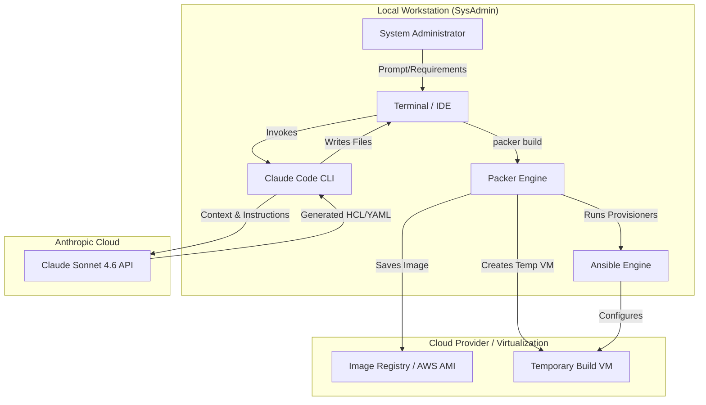
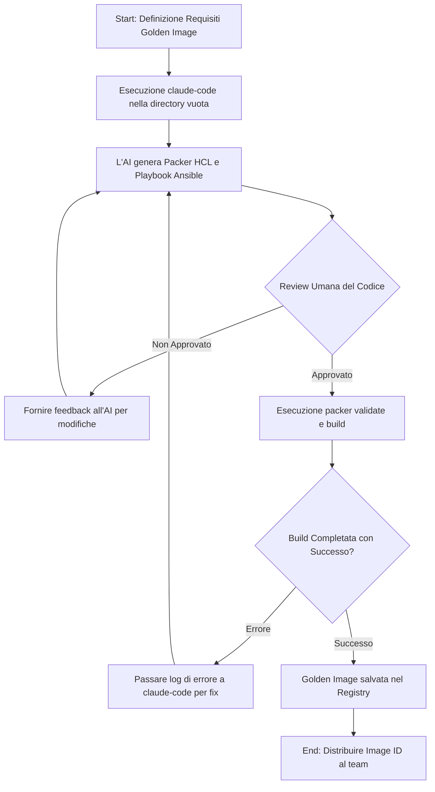
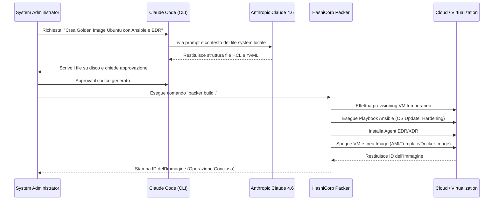

# Blueprint GenAI: Efficentamento del "Creazione Immagini Standard (Golden Image)"

## 1. Descrizione del Caso d'Uso
**Categoria:** Provisioning & Automation
**Titolo:** Creazione Immagini Standard (Golden Image)
**Ruolo:** System Administrator
**Obiettivo Originale (da CSV):** Sviluppo automatizzato (es. tramite Packer) di immagini pre-configurate e sicure per macchine virtuali o container, contenenti il SO base, le patch critiche, le policy aziendali e gli strumenti di sicurezza standard (EDR/XDR).
**Obiettivo GenAI:** Automatizzare la generazione del codice HashiCorp Packer (in HCL) e dei relativi script di provisioning (es. Ansible Playbooks o Bash) per la configurazione del sistema operativo, delle policy aziendali e dell'installazione di agenti EDR/XDR, minimizzando l'effort di codifica manuale.

## 2. Fasi del Processo Efficentato

### Fase 1: Generazione Automatica del Codice Packer e Provisioning
L'amministratore di sistema fornisce in linguaggio naturale i requisiti della Golden Image (es. OS, cloud provider, hardening CIS, agent da installare). L'assistente AI genera l'intera struttura del progetto Packer (HCL) e i file di provisioning (Ansible/Bash).
*   **Tool Principale Consigliato:** `claude-code` (per generazione autonoma dell'intera struttura dei file direttamente da riga di comando)
*   **Alternative:** 1. `visualstudio + copilot` (per sviluppo assistito interattivo), 2. `ChatGPT Agent`
*   **Modelli LLM Suggeriti:** Anthropic Claude Sonnet 4.6 (il miglior modello allo stato dell'arte per coding autonomo e ragionamento architetturale).
*   **Modalità di Utilizzo:** Utilizzo di `claude-code` nella directory del progetto.
    *Esempio di prompt da passare al tool:*
    ```text
    Genera un template Packer in formato HCL per creare un'AMI AWS basata su Ubuntu 24.04. 
    L'immagine deve includere un provisioner Ansible che esegua i seguenti task:
    1. Aggiornamento di tutti i pacchetti di sistema.
    2. Hardening SSH (disabilita root login, cambia porta a 2222).
    3. Installazione e configurazione dell'agent CrowdStrike Falcon (usa variabili per il CID).
    4. Installazione di un agent di log forwarding standard (es. Fluent Bit).
    Crea i file `build.pkr.hcl`, `variables.pkr.hcl` e il playbook Ansible `playbook.yml`.
    ```
*   **Azione Umana Richiesta:** Il System Administrator deve validare visivamente il codice HCL/YAML prodotto e configurare le credenziali/token reali per gli agent (es. CID di CrowdStrike via variabili d'ambiente) prima di avviare il processo di build.
*   **Stima Reale di Efficienza:** 
    *   *Tempo As-Is (Manuale):* 6 ore
    *   *Tempo To-Be (GenAI):* 30 minuti
    *   *Risparmio %:* 91%
    *   *Motivazione:* La scrittura manuale da zero e il debugging della sintassi incrociata tra Packer e Ansible richiedono ore di tentativi ed errori. L'AI produce una base sintatticamente corretta, idempotente e modulare in pochi secondi, riducendo il lavoro umano alla sola validazione logica e al run effettivo.

## 3. Descrizione del Flusso Logico
L'approccio scelto è **Single-Agent** orientato al coding autonomo. Si predilige la massima semplicità e operatività utilizzando un assistente a riga di comando (`claude-code`) direttamente nella workstation del System Administrator. L'operatore inizializza una directory vuota e invoca l'AI descrivendo le specifiche della Golden Image (sistema operativo, target cloud/on-prem, policy di sicurezza). L'agente analizza i requisiti, può eventualmente leggere file di policy aziendali locali (es. PDF/Markdown di hardening presenti nella cartella) e genera automaticamente l'infrastruttura as code. L'amministratore supervisiona i file creati (Human-in-the-loop) e lancia il comando di validazione e build (`packer validate` e `packer build`). Se durante la build si verificano errori sintattici o di sistema, l'output d'errore del terminale può essere re-iniettato nell'agente per una correzione istantanea (Self-healing assistito).

## 4. Diagrammi UML (Mermaid.js)

### 4.1 Architecture Diagram


### 4.2 Process Diagram


### 4.3 Sequence Diagram


## 5. Guida all'Implementazione Tecnica

### Prerequisiti
- **Node.js** installato (necessario per eseguire il pacchetto npm Claude Code).
- **API Key** attiva di Anthropic associata al proprio account.
- **HashiCorp Packer** installato e configurato nel `PATH` di sistema.
- **Ansible** installato localmente sulla macchina del SysAdmin.
- Credenziali del Cloud Provider (es. AWS CLI configurata, chiavi di accesso Azure/GCP) o permessi di interazione verso l'hypervisor (es. vSphere).

### Step 1: Installazione e Configurazione di Claude Code
1. Aprire il terminale e installare l'utility globalmente tramite npm: 
   `npm install -g @anthropic-ai/claude-code`
2. Autenticarsi eseguendo il comando `claude`. Seguire la procedura OAuth nel browser per collegare l'account Anthropic.

### Step 2: Inizializzazione del Progetto
1. Creare una directory dedicata per la nuova Golden Image:
   ```bash
   mkdir golden-image-ubuntu24
   cd golden-image-ubuntu24
   ```
2. *(Opzionale)* Copiare nella cartella le direttive aziendali in formato testuale o PDF (es. `policy-sicurezza.md`, `requisiti-edr.txt`) in modo che l'AI possa leggerle per generare l'infrastruttura ad-hoc.

### Step 3: Generazione del Codice tramite AI
1. All'interno della cartella del progetto, avviare l'assistente digitando `claude`.
2. Fornire il prompt con le specifiche. Esempio:
   *"Crea i file Packer HCL per un'AMI AWS basata su Ubuntu 24.04. Includi un file `ansible-playbook.yml` per l'aggiornamento dell'OS, l'installazione di CrowdStrike e l'applicazione delle regole di hardening descritte nel file `policy-sicurezza.md` presente in questa cartella. Assicurati di usare variabili Packer per le AWS region e le credenziali, non inserire secret in chiaro."*
3. L'agente proporrà la scrittura dei file e ne chiederà la conferma per salvarli.

### Step 4: Validazione e Build
1. Aprire il codice generato per una rapida review.
2. Inserire le variabili reali tramite un file `.pkrvars.hcl` o variabili d'ambiente.
3. Eseguire: `packer validate .`
4. Se il comando restituisce successo, avviare il build: `packer build .`
5. In caso di errore durante la fase di provisioning di Ansible o Packer, copiare l'errore nel terminale di Claude per un refactoring immediato (es. *"La build ha fallito con questo errore Ansible, correggilo:"*).

## 6. Rischi e Mitigazioni
- **Rischio 1: Hardcoding di credenziali.** L'AI potrebbe inserire involontariamente token, API key o password di default in chiaro nei file di provisioning o in Packer.
  - **Mitigazione:** Istruire esplicitamente l'AI a utilizzare unicamente variabili ambientali (es. `var.secret_token`). L'operatore umano deve verificare strettamente i file prima dell'esecuzione per evitare l'esposizione di secret nei repository o nell'immagine creata.
- **Rischio 2: Allucinazioni o deprecazione di moduli.** L'AI potrebbe usare sintassi HCL obsoleta o moduli Ansible non più supportati, causando il fallimento della build.
  - **Mitigazione:** L'esecuzione di `packer validate` bloccherà immediatamente eventuali macro-errori sintattici. L'utilizzo di modelli allo stato dell'arte come Sonnet 4.6 riduce del 90% questo rischio essendo addestrato sulle reference guide attuali. L'immagine finale va comunque testata ed analizzata con un tool di Vulnerability Assessment prima di essere dichiarata "Golden".
