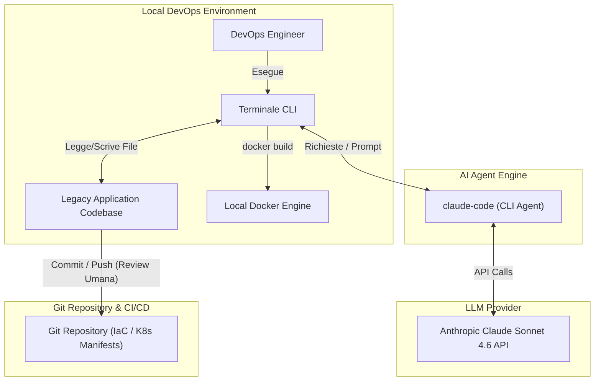
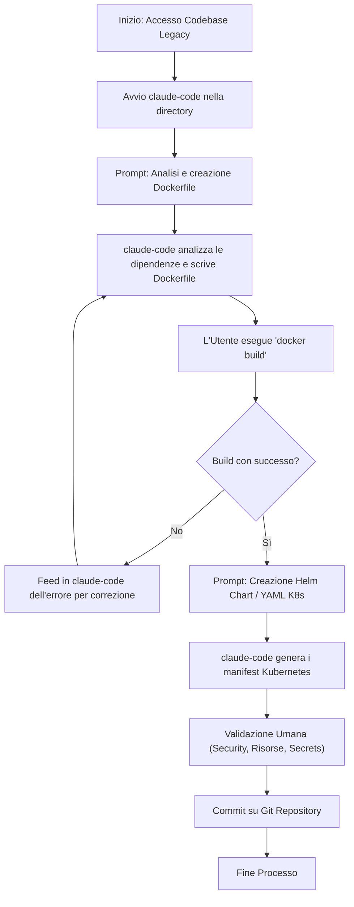
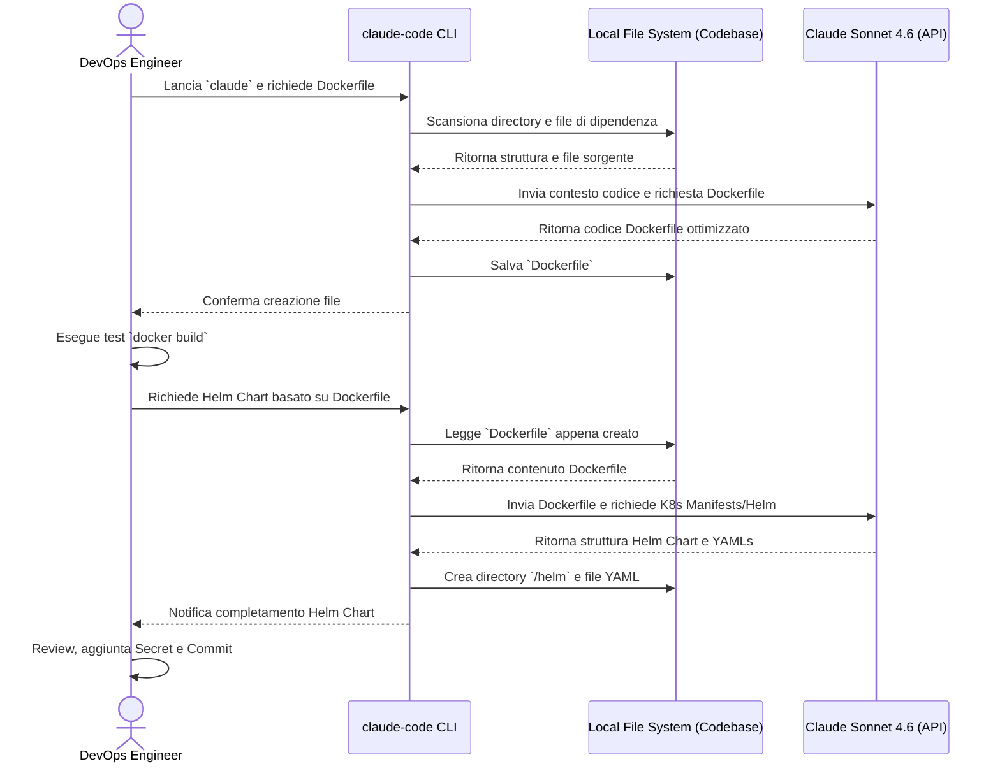

# Blueprint GenAI: Efficentamento del "Containerizzazione Applicazioni Legacy"

## 1. Descrizione del Caso d'Uso
**Categoria:** Provisioning & Automation
**Titolo:** Containerizzazione Applicazioni Legacy
**Ruolo:** DevOps Engineer
**Obiettivo Originale (da CSV):** Analisi delle dipendenze di un'applicazione tradizionale e scrittura di Dockerfile ottimizzati per convertirla in microservizi. Creazione dei manifest YAML o Helm Chart per il deployment su cluster Kubernetes.
**Obiettivo GenAI:** Automatizzare l'analisi profonda della codebase legacy per identificare runtime, dipendenze e configurazioni, generando istantaneamente Dockerfile ottimizzati (multi-stage) e la relativa pletora di manifest Kubernetes (o Helm Chart) pronti per il deployment, limitando l'intervento umano alla sola validazione e test.

## 2. Fasi del Processo Efficentato

### Fase 1: Analisi Codebase e Generazione Dockerfile Ottimizzato
In questa fase, l'agente AI analizza autonomamente i file sorgente, i file di configurazione (es. `pom.xml`, `package.json`, `requirements.txt`) e le dipendenze dell'applicazione legacy, generando un Dockerfile sicuro ed efficiente.
*   **Tool Principale Consigliato:** `claude-code`
*   **Alternative:** 1. `visualstudio + copilot`, 2. `gemini-cli`
*   **Modelli LLM Suggeriti:** Anthropic Claude Sonnet 4.6 (ideale per l'analisi autonoma dell'intera codebase e la generazione di codice infrastrutturale).
*   **Modalità di Utilizzo:** Esecuzione di `claude-code` direttamente da terminale nella root directory del progetto legacy.
    ```bash
    # Avvio di claude-code nel terminale
    claude
    
    # Prompt da inserire nell'interfaccia interattiva:
    "Analizza l'intera codebase in questa directory per comprendere le dipendenze, il linguaggio e i framework di questa applicazione legacy. Crea un `Dockerfile` multi-stage ottimizzato per la produzione. Usa un'immagine base minimale (es. Alpine o Distroless), esponi le porte corrette e assicurati che l'applicazione non giri come utente root."
    ```
*   **Azione Umana Richiesta:** Il DevOps Engineer deve eseguire una `docker build` di test per verificare che le dipendenze siano state risolte correttamente e validare l'assenza di vulnerabilità critiche nell'immagine base.
*   **Stima Reale di Efficienza:** 
    *   *Tempo As-Is (Manuale):* 8 ore (studio del codice, test build, risoluzione conflitti librerie).
    *   *Tempo To-Be (GenAI):* 30 minuti.
    *   *Risparmio %:* 93%.
    *   *Motivazione:* L'AI esegue il reverse engineering delle dipendenze in pochi secondi, scrivendo boilerplate code e applicando best practice di containerizzazione immediatamente.

### Fase 2: Generazione Manifest Kubernetes o Helm Chart
Una volta stabilizzato il container, l'agente viene istruito per generare l'infrastruttura di deployment necessaria per orchestrare l'applicazione su Kubernetes.
*   **Tool Principale Consigliato:** `claude-code`
*   **Alternative:** 1. `visualstudio + copilot`, 2. `OpenAI Codex`
*   **Modelli LLM Suggeriti:** Anthropic Claude Sonnet 4.6
*   **Modalità di Utilizzo:** Continuazione della conversazione con `claude-code` nello stesso contesto.
    ```bash
    # Prompt successivo:
    "Basandoti sul Dockerfile appena creato e sull'architettura dell'applicazione, genera un Helm Chart completo (o i file YAML separati) per fare il deploy su Kubernetes. Includi Deployment, Service, Ingress, e definisci risorse di default (requests/limits), liveness/readiness probes, e un ConfigMap per le variabili d'ambiente identificate nel codice."
    ```
*   **Azione Umana Richiesta:** Revisione dei valori di `requests` e `limits` di CPU/RAM per adeguarli al reale consumo dell'applicazione e inserimento dei secret reali (es. password DB) nei sistemi di gestione preposti (es. HashiCorp Vault o External Secrets), non generati in chiaro dall'AI.
*   **Stima Reale di Efficienza:** 
    *   *Tempo As-Is (Manuale):* 4 ore.
    *   *Tempo To-Be (GenAI):* 15 minuti.
    *   *Risparmio %:* 93%.
    *   *Motivazione:* La stesura manuale di YAML è prona ad errori di sintassi e indentazione. L'AI produce chart completi e validi al primo colpo, pronti per essere applicati.

## 3. Descrizione del Flusso Logico
Il processo segue un approccio **Single-Agent** eseguito in locale sull'ambiente di sviluppo o sulla bastion host del DevOps Engineer. L'uso di `claude-code` è ideale perché permette all'LLM di leggere in modo iterativo l'intero filesystem della codebase legacy, capendo come i vari moduli comunicano. Il flusso inizia con l'analisi della root directory: l'agente estrapola le dipendenze, crea il Dockerfile e chiede approvazione all'utente. Se la build del Dockerfile fallisce, l'utente può semplicemente copiare l'errore nel terminale di `claude-code`, che correggerà autonomamente il file. Una volta validato il container, l'agente genera la struttura YAML o l'Helm Chart, leggendo le porte e le variabili d'ambiente direttamente dal Dockerfile appena creato, garantendo perfetta coerenza. L'umano interviene alla fine del processo per la review finale e il commit su Git.

## 4. Diagrammi UML (Mermaid.js)

### 4.1 Architecture Diagram


### 4.2 Process Diagram


### 4.3 Sequence Diagram


## 5. Guida all'Implementazione Tecnica

### Prerequisiti
- Node.js installato sull'ambiente di lavoro (necessario per `claude-code`).
- Una API Key attiva di Anthropic con crediti sufficienti.
- Docker installato per il test locale.
- Accesso in lettura/scrittura alla repository del codice legacy.

### Step 1: Installazione e Autenticazione di `claude-code`
Aprire il terminale e installare il tool a livello globale tramite npm:
```bash
npm install -g @anthropic-ai/claude-code
```
Autenticarsi con il proprio account Anthropic o configurare la variabile d'ambiente per l'API key:
```bash
export ANTHROPIC_API_KEY="sk-ant-..."
```

### Step 2: Generazione del Dockerfile
Spostarsi nella directory root dell'applicazione legacy:
```bash
cd /path/to/legacy-app
claude
```
Nel prompt interattivo che appare, incollare la richiesta di analisi e containerizzazione descritta nella Fase 1. `claude-code` navigherà i file autonomamente. Se necessario, vi chiederà conferma prima di eseguire comandi o creare file. Acconsentire alla creazione del `Dockerfile`.

### Step 3: Test e Generazione K8s Manifests
Uscire temporaneamente o aprire un altro tab del terminale per testare l'immagine:
```bash
docker build -t legacy-app:test .
```
Se ci sono errori (es. librerie native mancanti per l'immagine Alpine scelta), copiare l'errore e incollarlo in `claude-code` dicendo: "La build fallisce con questo errore: [ERRORE]. Correggi il Dockerfile".
Una volta che la build passa, nello stesso prompt di `claude-code`, chiedere la generazione dei manifest Kubernetes (come descritto nella Fase 2). `claude-code` creerà la cartella necessaria (es. `/chart` o `/k8s`) popolandola con i YAML richiesti.

## 6. Rischi e Mitigazioni
- **Rischio di Sicurezza nei Container (Misconfiguration):** L'AI potrebbe generare Dockerfile che eseguono processi come `root` o utilizzare immagini base deprecate o con CVE note.
  - **Mitigazione:** Istruire esplicitamente l'AI (nel prompt) a usare la direttiva `USER` non-root. Introdurre uno step obbligatorio di scansione dell'immagine generata tramite tool come **Trivy** prima di fare push su registry aziendali.
- **Allucinazione di Dipendenze o Parametri K8s:** L'LLM potrebbe inventare flag di configurazione per il framework legacy non esistenti o stimare `requests/limits` K8s totalmente errati.
  - **Mitigazione:** Il DevOps Engineer ("Human-in-the-loop") deve rivedere manualmente le quote K8s. La build locale del container (`docker build`) funge da test inconfutabile per sventare le allucinazioni sulle dipendenze applicative.
- **Esposizione di Dati Sensibili:** Durante l'analisi, `claude-code` invia frammenti di codice ai server Anthropic.
  - **Mitigazione:** Assicurarsi che nel codice legacy non siano hard-coded password, chiavi AWS o certificati. Utilizzare file `.claudeignore` (o simili) se alcune directory contengono materiale estremamente confidenziale che non serve all'analisi del container. Se la policy aziendale è strict "No-Cloud", sostituire `claude-code` con modelli locali via **OpenClaw** (es. *Meta Llama 4 Scout*), guidandoli tramite terminale o script Python custom, pur con minor autonomia agentica.