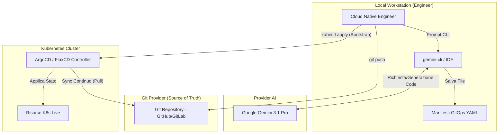
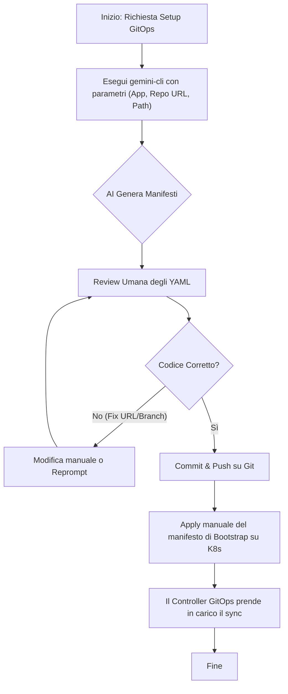
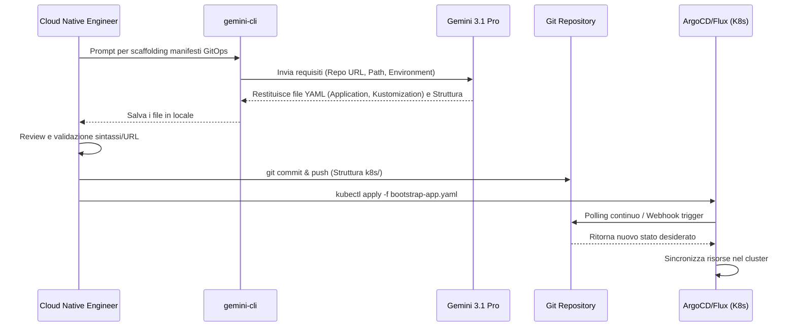

# Blueprint GenAI: Efficentamento del "Implementazione GitOps (ArgoCD/Flux)"

## 1. Descrizione del Caso d'Uso
**Categoria:** Provisioning & Automation
**Titolo:** Implementazione GitOps (ArgoCD/Flux)
**Ruolo:** Cloud Native Engineer
**Obiettivo Originale (da CSV):** Configurazione di un paradigma GitOps in cui il repository Git diventa l'unica fonte di verità per lo stato del cluster Kubernetes. Automazione della sincronizzazione continua tra codice e ambiente live senza interventi manuali.
**Obiettivo GenAI:** Automatizzare la generazione dei file di scaffolding del repository GitOps (struttura directory) e dei manifesti di configurazione (es. `Application` per ArgoCD o `GitRepository`/`Kustomization` per Flux) necessari ad avviare la sincronizzazione continua sul cluster Kubernetes.

## 2. Fasi del Processo Efficentato

### Fase 1: Scaffolding e Generazione Manifesti GitOps
Generazione automatica dell'alberatura del repository e dei manifesti YAML di base per collegare il cluster Kubernetes al repository Git (es. risorse ArgoCD o FluxCD).
*   **Tool Principale Consigliato:** `gemini-cli`
*   **Alternative:** 1. `visualstudio + copilot`, 2. `chatgpt agent`
*   **Modelli LLM Suggeriti:** Google Gemini 3.1 Pro (ottimizzato per scripting e IaC)
*   **Modalità di Utilizzo:** Esecuzione di un comando `gemini-cli` per generare la struttura del progetto e i file YAML direttamente nella cartella di lavoro del Cloud Native Engineer.
    ```bash
    gemini-cli "Crea la struttura di un repository GitOps per ArgoCD per l'app 'frontend-web'. Genera un file 'argocd-app.yaml' che punta al branch 'main' della repo 'https://github.com/org/repo.git' nel path 'k8s/overlays/prod'. Includi anche un file README.md con i comandi kubectl per l'apply iniziale." --save-files
    ```
*   **Azione Umana Richiesta:** Il Cloud Native Engineer deve revisionare i manifesti generati, confermare gli URL del repository, i nomi dei branch e i path prima di applicarli al cluster (`kubectl apply -f argocd-app.yaml`).
*   **Stima Reale di Efficienza:** 
    *   *Tempo As-Is (Manuale):* 2 ore (scrittura YAML da zero, consultazione documentazione per API version, setup directory)
    *   *Tempo To-Be (GenAI):* 10 minuti
    *   *Risparmio %:* 91%
    *   *Motivazione:* L'AI elimina la fase di boilerplate e la ricerca della corretta sintassi dei Custom Resource Definition (CRD) di ArgoCD/Flux, fornendo asset pronti all'uso senza errori di indentazione.

## 3. Descrizione del Flusso Logico
Il processo segue un approccio **Single-Agent** per mantenere la massima semplicità, dato che il task consiste principalmente nella generazione di codice di configurazione (YAML). Il Cloud Native Engineer utilizza `gemini-cli` (o il proprio IDE con Copilot) per richiedere lo scaffolding di una nuova applicazione GitOps. L'agente AI genera i manifesti di Application/Kustomization e la struttura di directory base. L'umano interviene esclusivamente per una rapida review del codice prodotto, validando i reference al repository Git e ai branch. Una volta confermato, l'ingegnere esegue il commit nel repository Git e applica il manifesto di bootstrap sul cluster, demandando il resto del lavoro di sincronizzazione ad ArgoCD/Flux.

## 4. Diagrammi UML (Mermaid.js)

### 4.1 Architecture Diagram


### 4.2 Process Diagram


### 4.3 Sequence Diagram


## 5. Guida all'Implementazione Tecnica
### Prerequisiti
- Accesso al terminale con `gemini-cli` installato e configurato con API Key valida (Gemini 3.1 Pro).
- Cluster Kubernetes con ArgoCD o FluxCD pre-installato.
- Credenziali (Kubeconfig) per applicare risorse al cluster.
- Accesso in scrittura al repository Git designato come "Source of Truth".

### Step 1: Esecuzione del Prompt di Scaffolding
Aprire il terminale nella cartella root del progetto locale ed eseguire `gemini-cli` passando le direttive per creare i file YAML.
Esempio di comando per ArgoCD:
```bash
gemini-cli "Crea un file 'application.yaml' per ArgoCD. Il nome dell'app è 'backend-api', il namespace di destinazione è 'prod'. Il repo git è 'https://github.com/azienda/infrastruttura.git', il targetRevision è 'HEAD', e il path è 'k8s/apps/backend-api/overlays/prod'. Usa l'API argoproj.io/v1alpha1." --save-files
```

### Step 2: Validazione del Codice
Aprire il file `application.yaml` generato e verificare che i campi `repoURL`, `path`, e `targetRevision` siano corretti. Assicurarsi che l'indentazione YAML sia conforme.

### Step 3: Push su Git e Bootstrap
1. Eseguire il commit dei file di configurazione dell'applicazione e pusharli sul repository Git:
   ```bash
   git add k8s/
   git commit -m "feat: aggiunti manifesti base applicazione backend-api"
   git push origin main
   ```
2. Applicare il manifesto Application sul cluster per istruire ArgoCD (o Flux) a iniziare a monitorare quel path:
   ```bash
   kubectl apply -f application.yaml -n argocd
   ```
3. Verificare tramite UI o CLI di ArgoCD/Flux che la sincronizzazione sia andata a buon fine.

## 6. Rischi e Mitigazioni
- **Rischio 1:** **Allucinazioni nei path o nei branch Git** (l'AI potrebbe inventare un branch di default come 'master' invece di 'main'). -> **Mitigazione:** Il prompt deve sempre esplicitare i nomi corretti; la revisione umana (Human-in-the-loop) prima dell'apply è obbligatoria.
- **Rischio 2:** **Creazione di manifesti incompatibili con la versione di ArgoCD/Flux** installata sul cluster. -> **Mitigazione:** Specificare l'esatta `apiVersion` desiderata nel prompt o fornire in contesto la versione del tool in uso.
- **Rischio 3:** **Esposizione di Secret nei manifesti autogenerati.** -> **Mitigazione:** Istruire l'LLM a non generare mai file K8s di tipo `Secret` in chiaro, ma di utilizzare referenze a tool di gestione segreti (es. External Secrets Operator o SealedSecrets).