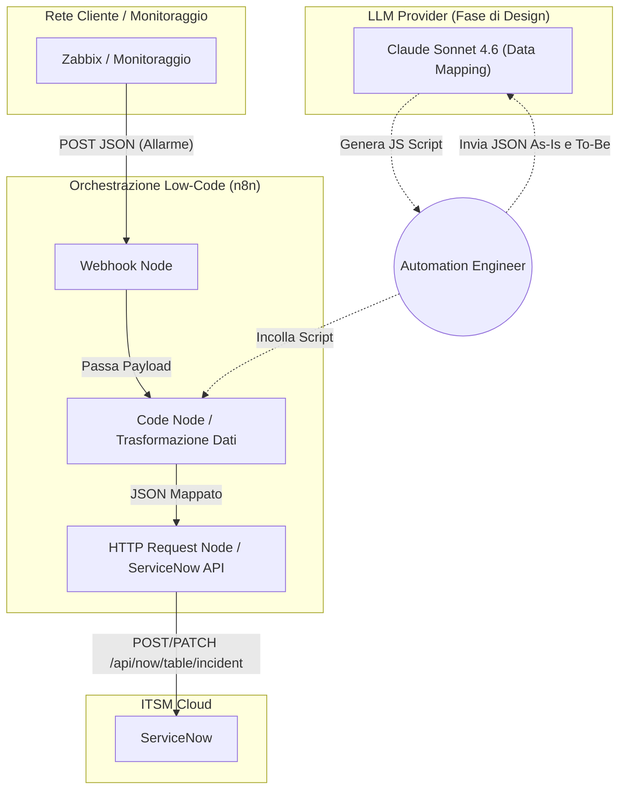
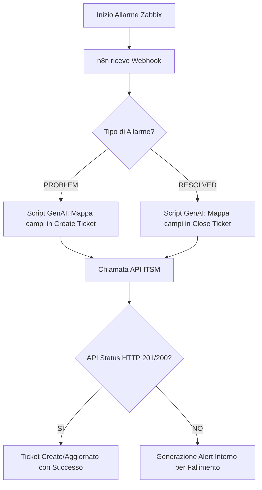
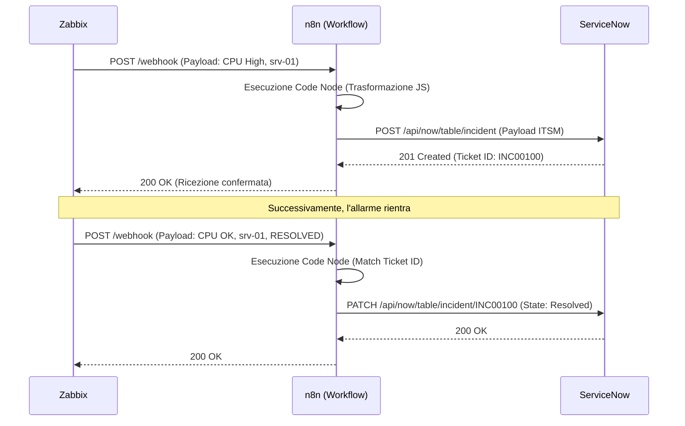

# Blueprint GenAI: Efficentamento del "Integrazione Webhook Sistemi ITSM"

## 1. Descrizione del Caso d'Uso
**Categoria:** Provisioning & Automation
**Titolo:** Integrazione Webhook Sistemi ITSM
**Ruolo:** Automation Engineer
**Obiettivo Originale (da CSV):** Sviluppo di script e flussi di automazione per integrare i sistemi di monitoraggio infrastrutturale (es. Zabbix) direttamente con il sistema di ticketing aziendale (es. ServiceNow), creando e chiudendo automaticamente i ticket in base agli allarmi.
**Obiettivo GenAI:** Automatizzare la creazione dei flussi di integrazione e la traduzione dei payload (da Zabbix a ServiceNow) utilizzando una piattaforma low-code assistita dall'AI per la generazione istantanea degli script di trasformazione dati, eliminando lo sviluppo manuale di codice boilerplate.

## 2. Fasi del Processo Efficentato

### Fase 1: Creazione Workflow e Mappatura Payload Assistita
L'Automation Engineer utilizza un ambiente visuale per ricevere i webhook. L'AI generativa viene impiegata per analizzare la documentazione API (o i JSON di esempio) di entrambi i sistemi e scrivere istantaneamente lo script di traduzione/adattamento dei campi (es. mappare le severity di Zabbix nelle urgency di ServiceNow).
*   **Tool Principale Consigliato:** `n8n`
*   **Alternative:** `visualstudio + copilot`, `gemini-cli`
*   **Modelli LLM Suggeriti:** Anthropic Claude Sonnet 4.6 (eccellente per data mapping e script JavaScript/JSON veloci)
*   **Modalità di Utilizzo:** Configurazione di un workflow su n8n con nodo "Webhook" in ascolto. Si interroga l'LLM fornendo i payload di esempio per farsi generare il codice del nodo "Code".
    **Bozza Prompt per LLM:**
    ```text
    Agisci come un Automation Engineer esperto di n8n.
    Ho un nodo Webhook che riceve questo JSON da Zabbix:
    {"alert_name": "CPU High", "host": "srv-01", "severity": "High", "status": "PROBLEM"}
    Devo inviarlo a ServiceNow tramite un nodo HTTP Request all'endpoint /api/now/table/incident.
    Scrivi il codice JavaScript per il nodo 'Code' di n8n che estragga questi dati e li formatti nel JSON richiesto da ServiceNow. Mappa lo status 'PROBLEM' come creazione ticket e la 'severity' nei corrispondenti valori di impact/urgency (1 a 3) di ServiceNow. Restituisci solo il codice JS.
    ```
*   **Azione Umana Richiesta (Human-in-the-loop):** L'Automation Engineer deve incollare il codice nel nodo n8n, verificare la corretta mappatura logica e lanciare un test di esecuzione con dati fittizi.
*   **Stima Reale di Efficienza (ROI strutturato):** 
    *   *Tempo As-Is (Manuale):* 8 ore (studio API, scrittura script Python custom, gestione autenticazione, test e deploy su server).
    *   *Tempo To-Be (GenAI):* 30 minuti.
    *   *Risparmio %:* 93%.
    *   *Motivazione:* n8n rimuove la necessità di gestire l'infrastruttura di ascolto (server web/flask), mentre l'LLM azzera il tempo speso per capire come tradurre i campi da una struttura dati all'altra.

## 3. Descrizione del Flusso Logico
Il flusso adotta un approccio **Single-Agent** (l'LLM funge da assistente per il coding "one-shot" durante il design del workflow). L'Automation Engineer configura l'integrazione base su n8n in pochi minuti. Interroga quindi il modello GenAI per produrre la logica di trasformazione (nodo "Code") passando i JSON di Zabbix e ServiceNow. Durante il runtime (produzione), l'infrastruttura n8n riceverà in automatico i webhook da Zabbix, il blocco di codice generato formatterà i dati correttamente, e la richiesta HTTP integrata creerà o chiuderà il ticket su ServiceNow in tempo reale.

## 4. Diagrammi UML (Mermaid.js)

### 4.1 Architecture Diagram


### 4.2 Process Diagram


### 4.3 Sequence Diagram


## 5. Guida all'Implementazione Tecnica
### Prerequisiti
- Piattaforma n8n (Cloud o Self-Hosted) installata e accessibile.
- Credenziali API / Service Account di ServiceNow (Username/Password o OAuth2).
- Accesso a Zabbix per la configurazione dei Media Type (Webhook).
- Accesso a un modello LLM (es. Claude via Anthropic API, web UI o enterprise proxy).

### Step 1: Configurazione del Trigger n8n
1. Accedere all'interfaccia di n8n e creare un nuovo workflow.
2. Aggiungere il nodo **Webhook**.
3. Impostare il metodo HTTP su `POST` e copiare l'URL del "Test Webhook".
4. Spuntare l'opzione "Respond with" a "Immediately" per non far andare in timeout Zabbix.

### Step 2: Generazione della Logica di Trasformazione con GenAI
1. Effettuare un test da Zabbix verso l'URL di n8n per visualizzare il payload JSON effettivo nel nodo Webhook.
2. Aprire l'interfaccia dell'LLM (es. Chat Enterprise).
3. Utilizzare il prompt fornito nella *Fase 1*, includendo il vero JSON ricevuto da Zabbix e la documentazione del payload atteso da ServiceNow.
4. Aggiungere a n8n il nodo **Code** e incollare il codice JavaScript generato dall'LLM.

### Step 3: Integrazione ServiceNow
1. Aggiungere il nodo **HTTP Request** subito dopo il nodo Code.
2. Configurare l'autenticazione scegliendo "Basic Auth" (inserendo il service account di ServiceNow).
3. Impostare il metodo su `POST`, l'URL sull'endpoint degli Incidenti (es. `https://[instance].service-now.com/api/now/table/incident`) e il parametro Body attingendolo dall'output del nodo Code (es. `{{ $json }}`).
4. Attivare il workflow e commutare l'URL Webhook da "Test" a "Production" su Zabbix.

## 6. Rischi e Mitigazioni
- **Rischio 1:** Formattazione errata dei campi in uscita a causa di variazioni minime nel payload in ingresso (Allucinazioni GenAI o cambi di versione Zabbix). -> **Mitigazione:** Il codice JavaScript generato dall'AI deve implementare controlli di validazione (es. verifica presenza chiavi obbligatorie prima della chiamata API) suggeriti sempre tramite il prompt.
- **Rischio 2:** Esposizione del Webhook n8n su internet pubblica. -> **Mitigazione:** Limitare l'accesso al Webhook tramite IP Whitelisting o configurando header di autenticazione (es. bearer token) scambiati in modo sicuro tra Zabbix e n8n.