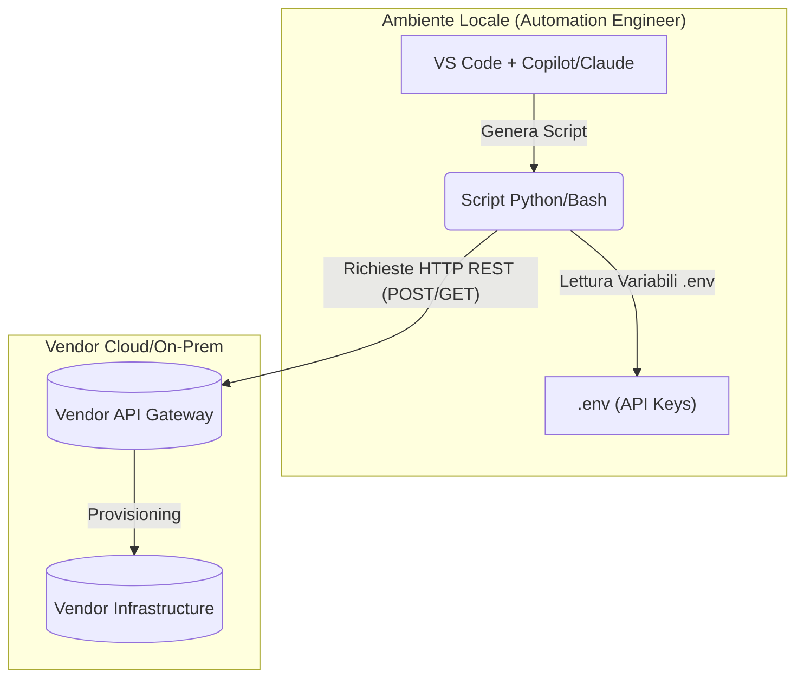
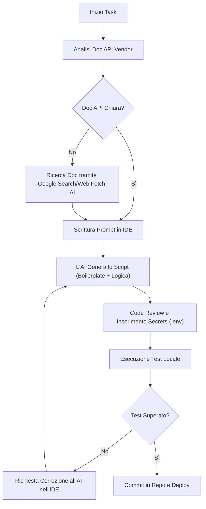
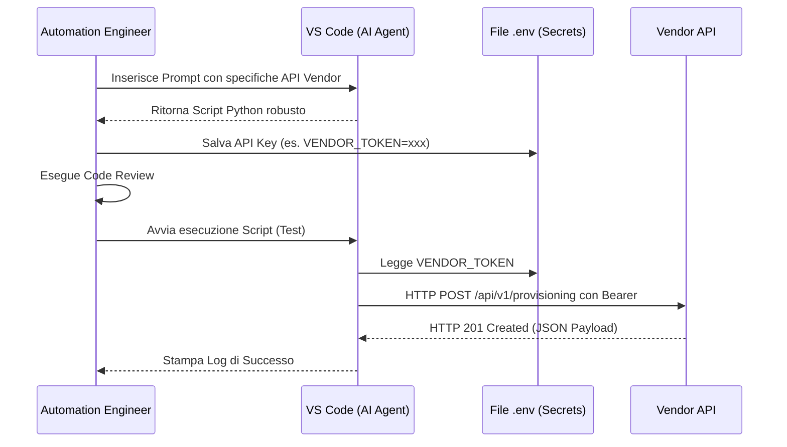

# Blueprint GenAI: Efficentamento del "Automazione Provisioning tramite API"

## 1. Descrizione del Caso d'Uso
**Categoria:** Provisioning & Automation
**Titolo:** Automazione Provisioning tramite API
**Ruolo:** Automation Engineer
**Obiettivo Originale (da CSV):** Sviluppo di script (es. Python/Bash) interfacciati direttamente alle API dei vendor per automatizzare operazioni infrastrutturali non nativamente supportate da Terraform o Ansible.
**Obiettivo GenAI:** Automatizzare e velocizzare la scrittura di script (Python/Bash) robusti per interagire con le API proprietarie dei vendor, includendo nativamente logica di autenticazione, gestione degli errori, retry e parsing del payload JSON.

## 2. Fasi del Processo Efficentato

### Fase 1: Generazione dello Script di Integrazione API
L'Automation Engineer fornisce all'AI il link o il testo della documentazione API del vendor (es. endpoint, metodi di autenticazione e payload richiesto). L'AI genera immediatamente lo script Python o Bash pronto all'uso.
*   **Tool Principale Consigliato:** visualstudio + copilot
*   **Alternative:** 1. claude-code, 2. gemini-cli
*   **Modelli LLM Suggeriti:** Anthropic Claude Sonnet 4.6 (eccellente nel coding) o OpenAI GPT-5.4.
*   **Modalità di Utilizzo:** Interazione diretta tramite la chat integrata nell'IDE (es. GitHub Copilot Chat in VS Code). L'utente fornisce un prompt descrittivo.
    ```markdown
    **Bozza Prompt in VS Code:**
    "@workspace Crea uno script Python 3 usando la libreria `requests` per creare un nuovo tenant sull'infrastruttura VendorX. 
    L'API di base è `https://api.vendorx.com/v2`. 
    L'autenticazione richiede un Bearer token nell'header `Authorization`. 
    Il payload POST verso `/tenants` deve contenere `{"name": "test", "quota": 100}`. 
    Includi il blocco try-except, il logging degli errori e una funzione di retry (max 3 tentativi) usando `tenacity` o logica custom. 
    Carica il token da variabili d'ambiente."
    ```
*   **Azione Umana Richiesta:** Validazione del codice generato (Code Review), configurazione sicura delle variabili d'ambiente (API Keys/Secrets) e testing in ambiente non produttivo.
*   **Stima Reale di Efficienza:** 
    *   *Tempo As-Is (Manuale):* 4 ore (lettura doc, scrittura boilerplate, test gestione errori)
    *   *Tempo To-Be (GenAI):* 20 minuti
    *   *Risparmio %:* 91%
    *   *Motivazione:* L'AI azzera i tempi di scrittura del boilerplate HTTP, la strutturazione del payload e l'implementazione delle best practice (retry, logging, error handling), lasciando all'ingegnere solo il test e l'integrazione.

## 3. Descrizione del Flusso Logico
Il processo, di natura **Single-Agent**, si svolge interamente all'interno dell'IDE dell'Automation Engineer. L'utente apre il proprio editor (VS Code) e utilizza l'assistente integrato per richiedere la generazione del codice, fornendo i dettagli specifici dell'API (endpoint, auth, parametri). L'agente genera lo script completo di gestione degli errori e logging. L'Automation Engineer esegue una code review, inserisce le credenziali nei file `.env` locali (mai nel codice) e testa lo script. Una volta validato, lo script può essere integrato nella pipeline CI/CD o eseguito come task programmato.

## 4. Diagrammi UML (Mermaid.js)

### 4.1 Architecture Diagram


### 4.2 Process Diagram


### 4.3 Sequence Diagram


## 5. Guida all'Implementazione Tecnica
### Prerequisiti
- IDE compatibile (es. Visual Studio Code o Cursor).
- Licenza AI Coding Assistant (es. GitHub Copilot, Claude Code, o estensione AI-Studio).
- Documentazione API del vendor accessibile.
- Interprete Python o ambiente Bash configurato localmente.

### Step 1: Configurazione dell'Ambiente e dell'AI
Aprire il proprio IDE. Assicurarsi di aver installato ed effettuato l'accesso all'estensione dell'assistente AI (es. GitHub Copilot Chat).
Creare la cartella di progetto e i file iniziali: `script.py` e `.env` (assicurandosi di aggiungere `.env` al `.gitignore`).

### Step 2: Generazione Assistita del Codice
Aprire `script.py`, avviare l'assistente in linea (es. `Cmd+I` o tramite pannello Chat) e incollare un prompt dettagliato che includa: l'obiettivo, l'URL base dell'API, il metodo di autenticazione e la struttura dei dati richiesta. Esempio: "Genera un client Python per l'API X che esegua il provisioning di una risorsa Y. Usa `requests`, carica la chiave da `.env` con `python-dotenv`, gestisci HTTP 429 con retry backoff".

### Step 3: Gestione Credenziali e Test
Accettare il codice suggerito. Inserire le credenziali di test nel file `.env`.
Eseguire lo script dal terminale dell'IDE:
`python script.py`
Osservare l'output. In caso di errore (es. JSON non formattato correttamente), copiare il messaggio di errore del terminale e incollarlo nella chat dell'AI chiedendo: "Risolvi questo errore di esecuzione".

## 6. Rischi e Mitigazioni
- **Rischio 1:** Esposizione accidentale di credenziali API (Hardcoding) -> **Mitigazione:** Istruire esplicitamente l'AI nel prompt a usare variabili d'ambiente (es. `os.environ.get()`) o framework come `python-dotenv`. Verificare visivamente l'assenza di stringhe in chiaro prima del commit.
- **Rischio 2:** Allucinazioni sui nomi dei parametri API -> **Mitigazione:** Validare sempre il payload generato dall'AI confrontandolo con la documentazione ufficiale del vendor prima di lanciare richieste verso ambienti di produzione. Usare i namespace API sandbox se disponibili.
- **Rischio 3:** Eccesso di chiamate (Rate Limiting) per errori nei loop -> **Mitigazione:** Far generare all'AI blocchi `try/except` robusti e librerie di retry controllate (es. `tenacity` in Python) con ritardi logici.
