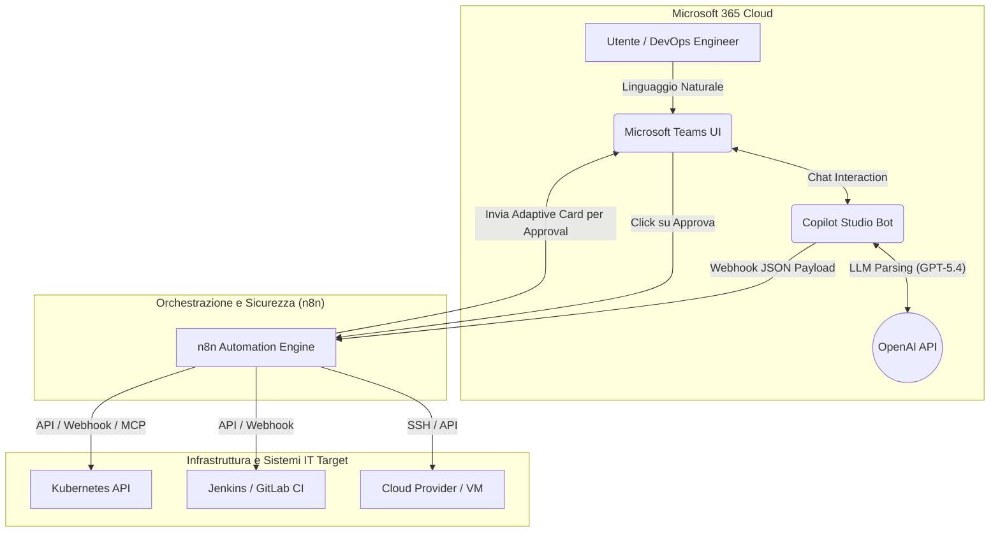
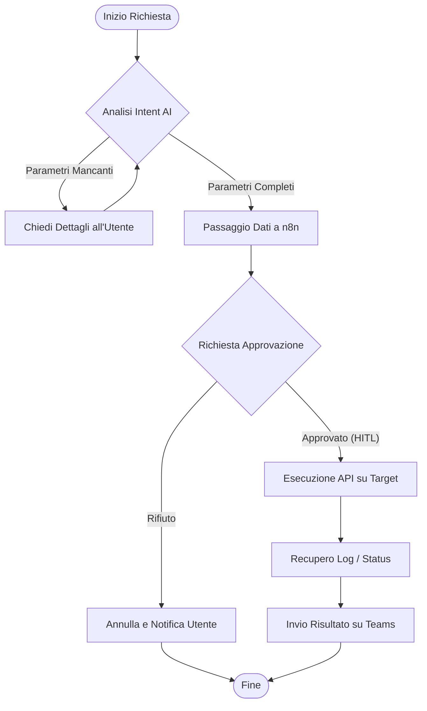
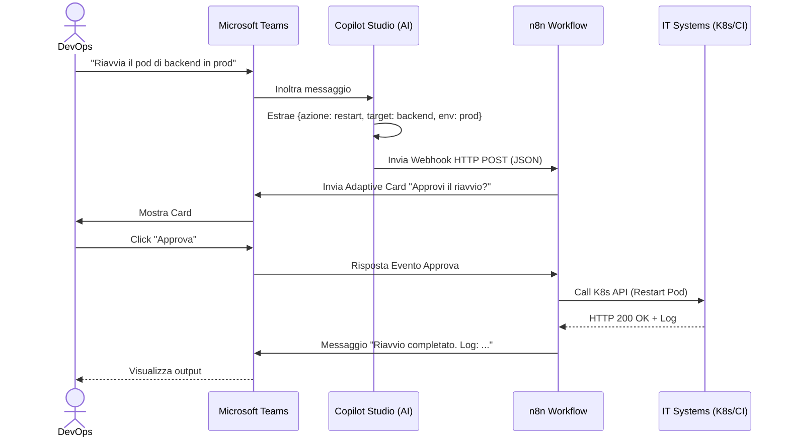

# Blueprint GenAI: Efficentamento dell'"Integrazione ChatOps"

## 1. Descrizione del Caso d'Uso
**Categoria:** Provisioning & Automation
**Titolo:** Integrazione ChatOps
**Ruolo:** DevOps Engineer
**Obiettivo Originale (da CSV):** Configurazione di bot integrati nelle piattaforme di chat aziendale (Teams, Slack) per permettere agli amministratori di interrogare lo stato dei sistemi, riavviare servizi o lanciare job di deploy direttamente da riga di comando conversazionale.
**Obiettivo GenAI:** Realizzare un ChatOps Bot Single-Agent su Microsoft Teams basato su LLM, capace di interpretare richieste in linguaggio naturale degli amministratori, estrarre i parametri operativi (es. target, azione) ed eseguire i comandi in totale sicurezza tramite automazione API.

## 2. Fasi del Processo Efficentato

### Fase 1: Sviluppo del Chatbot NLP su Microsoft Teams
Descrizione della fase: Creazione di un assistente conversazionale integrato nell'ecosistema di collaborazione aziendale. Il bot riceve l'input destrutturato (es. "Riavvia il pod del frontend in produzione"), ne comprende l'intento e ne estrae le entità rilevanti (azione: riavvia, target: pod frontend, ambiente: produzione).
*   **Tool Principale Consigliato:** `copilot studio`
*   **Alternative:** `n8n`, `Microsoft Teams (Chatbot UI)`
*   **Modelli LLM Suggeriti:** *OpenAI GPT-5.4* (sottostante al motore AI di Copilot per la massima comprensione contestuale).
*   **Modalità di Utilizzo:** Configurazione via interfaccia no-code di Copilot Studio, impostando l'entità principale tramite un System Prompt dedicato.
    ```text
    Sei un assistente DevOps esperto (ChatOps Bot). Il tuo compito è interpretare i comandi operativi degli amministratori IT.
    Quando un utente ti chiede di eseguire un'operazione, devi:
    1. Identificare l'azione (Status, Restart, Deploy).
    2. Identificare il sistema target (es. server, servizio, pod, pipeline).
    3. Identificare l'ambiente (Dev, Test, Prod).
    Se mancano dei parametri, chiedi all'utente di specificarli prima di procedere.
    Quando hai tutti i dati, richiama l'Azione configurata passando i parametri strutturati in JSON.
    ```
*   **Azione Umana Richiesta:** Il DevOps deve definire le "Topics" autorizzate (i recinti di ciò che il bot può comprendere) ed evitare che risponda a domande fuori contesto.
*   **Stima Reale di Efficienza:** 
    *   *Tempo As-Is (Manuale):* 16 ore (sviluppo custom bot con intent classifier e script complessi)
    *   *Tempo To-Be (GenAI):* 2 ore
    *   *Risparmio %:* 87%
    *   *Motivazione:* L'adozione di un LLM per il parsing del linguaggio naturale elimina totalmente la scrittura di regex e alberi decisionali complessi.

### Fase 2: Orchestrazione, Human-in-the-Loop ed Esecuzione
Descrizione della fase: Il bot delega l'esecuzione effettiva a un orchestratore di processi che si interfaccia con i sistemi di backend (Kubernetes, Jenkins, VM). Prima di eseguire azioni di "modifica", richiede sempre un'approvazione umana esplicita.
*   **Tool Principale Consigliato:** `n8n`
*   **Alternative:** Azioni native HTTP in `copilot studio`, `Google Antigravity`
*   **Modelli LLM Suggeriti:** N/A (fase puramente deterministica ed esecutiva).
*   **Modalità di Utilizzo:** Copilot Studio invia una richiesta HTTP Webhook a un workflow `n8n`.
    *Integrazione MCP/API:* n8n utilizza chiamate API REST dirette o un server **MCP (Model Context Protocol)** verso i sistemi IT.
    *Bozza di Workflow n8n (logica):*
    ```json
    {
      "trigger": "Webhook Endpoint POST",
      "nodes": [
        {"type": "Teams Adaptive Card", "action": "Ask for Approval (Approve/Reject)"},
        {"type": "Wait", "condition": "User Clicks Button"},
        {"type": "IF", "condition": "Approved?"},
        {"type": "HTTP Request", "action": "Call K8s/Jenkins API (True Path)"},
        {"type": "Teams Message", "action": "Send Result/Log to Chat"}
      ]
    }
    ```
*   **Azione Umana Richiesta:** Obbligatoria per la fase di esecuzione. L'operatore riceve una notifica in chat con i dettagli dell'azione e deve cliccare sul bottone "Approva" (Human-in-the-Loop) per autorizzare il comando.
*   **Stima Reale di Efficienza:** 
    *   *Tempo As-Is (Manuale):* 10 minuti (aprire VPN, cercare credenziali, lanciare comando da shell, verificare esito).
    *   *Tempo To-Be (GenAI):* 30 secondi
    *   *Risparmio %:* 95%
    *   *Motivazione:* Riduzione drastica del "context switching". L'operatore esegue task complessi e routinari direttamente dalla chat aziendale, anche in mobilità.

## 3. Descrizione del Flusso Logico
La soluzione è disegnata seguendo un approccio **Single-Agent** puro per favorire una facile adozione e implementazione in contesti enterprise. L'amministratore interagisce in linguaggio naturale con il bot all'interno di Microsoft Teams. Il bot (basato su Copilot Studio e GPT-5.4) estrae l'intento e i parametri dall'input discorsivo dell'utente e li passa in formato strutturato (JSON) a un webhook gestito da n8n. Per garantire la sicurezza operativa, n8n implementa un meccanismo Human-in-the-Loop (HITL), iniettando un'Adaptive Card interattiva nella chat che richiede l'approvazione formale dell'azione (es. "Sei sicuro di voler riavviare il DB in Prod?"). Una volta cliccato "Approva", n8n interagisce tramite chiamate API dirette (o tramite MCP se l'infrastruttura è standardizzata) con i servizi target (es. Kubernetes, CI/CD pipelines) e rimanda il log di esito all'utente sempre all'interno della medesima conversazione su Teams.

## 4. Diagrammi UML (Mermaid.js)

### 4.1 Architecture Diagram


### 4.2 Process Diagram


### 4.3 Sequence Diagram


## 5. Guida all'Implementazione Tecnica

### Prerequisiti
- Licenza Microsoft 365 con accesso a Microsoft Copilot Studio e Teams.
- Istanza di n8n (Cloud o Self-hosted) accessibile via rete dalla piattaforma Microsoft.
- Credenziali (API Key o Service Account) per i sistemi target (es. Kubeconfig per Kubernetes, API Token per Jenkins/GitLab).

### Step 1: Creazione e Setup in Copilot Studio
1. Accedi a Microsoft Copilot Studio e crea un nuovo "Copilot".
2. Vai nella sezione **Generative AI** e inserisci il "System Prompt" (vedi Fase 1) per confinare il comportamento del bot al solo ambito ChatOps IT.
3. Nella sezione **Topics & Plugins**, crea un nuovo Topic basato su un intento (es. "Gestione Infrastruttura").
4. Disabilita le risposte di fallback generiche per evitare allucinazioni su domande non pertinenti all'ambito aziendale.

### Step 2: Integrazione n8n via Azioni HTTP
1. Sulla piattaforma n8n, crea un nuovo workflow iniziando con un nodo **Webhook** impostato in ascolto su metodo `POST`. Copia l'URL generato.
2. In Copilot Studio, aggiungi un'Azione HTTP nel Topic e incolla l'URL del Webhook di n8n appena creato.
3. Configura il Body della richiesta in modo che Copilot Studio invii le variabili estratte dall'LLM in formato JSON (es. `Action`, `Target`, `Environment`).

### Step 3: Implementazione HITL (Human-in-the-Loop)
1. Su n8n, dopo il nodo Webhook, aggiungi un nodo **Microsoft Teams**.
2. Configuralo per inviare un messaggio al canale del team operativo o all'utente specifico, usando il formato *Adaptive Card* provvisto di bottoni "Approva" e "Rifiuta".
3. Aggiungi un nodo **Wait** (sospensione) in attesa che l'utente interagisca con la card e confermi l'operazione.

### Step 4: Esecuzione e Pubblicazione
1. Connetti l'output del ramo "Approvato" a un nodo **HTTP Request** configurato per lanciare il comando REST verso l'infrastruttura.
2. Raccogli l'output (log o status code) dell'operazione e invialo indietro in chat tramite un ultimo nodo Teams.
3. Salva e attiva il workflow su n8n.
4. Torna su Copilot Studio, testa il flusso nel pannello interno e procedi con la pubblicazione distribuendo il bot sul canale Microsoft Teams del team DevOps.

## 6. Rischi e Mitigazioni
- **Rischio Esecuzione Comandi Distruttivi o Errati:** L'AI potrebbe mal interpretare il comando dell'utente e suggerire un'azione critica su ambienti di produzione sbagliati.
  - **Mitigazione:** Il meccanismo Human-in-the-Loop su n8n è obbligatorio per ogni operazione "Write". L'umano legge il riassunto esatto che il bot ha formulato e lo approva esplicitamente.
- **Rischio Accessi Non Autorizzati (Privilege Escalation):** Utenti non DevOps potrebbero invocare il bot ed effettuare modifiche.
  - **Mitigazione:** Il bot in Teams deve essere ristretto tramite policy aziendali (App Permission Policies su M365) unicamente ai membri del gruppo AD di competenza (es. "DevOps_Team").
- **Rischio Esposizione Credenziali:** Le API Key per accedere all'infrastruttura potrebbero inavvertitamente essere stampate in chat o visibili nella configurazione del bot.
  - **Mitigazione:** Tutte le credenziali (token Kubernetes, secret di Jenkins) risiedono in modo sicuro all'interno del vault nativo di n8n. Copilot Studio non gestisce e non conosce mai i secreti, ma si limita a inviare richieste funzionali verso l'orchestratore.
