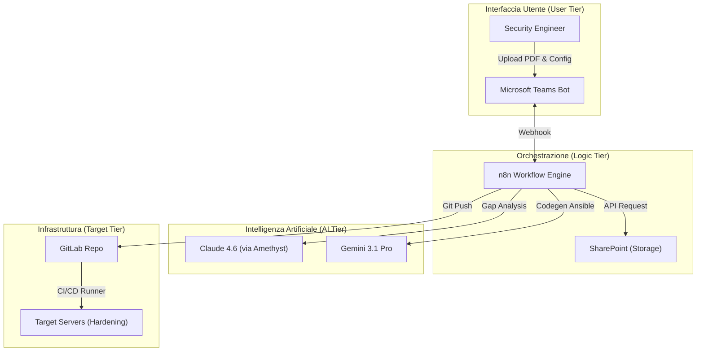
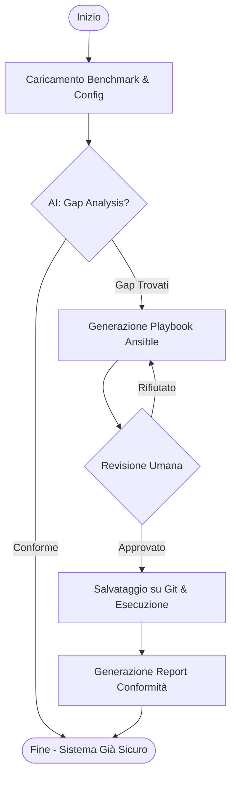
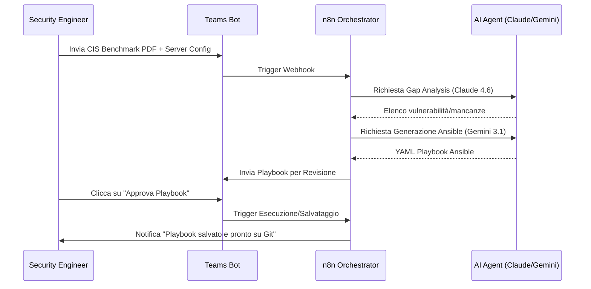

# Blueprint GenAI: Efficentamento del "Hardening Sistemi Operativi"

## 1. Descrizione del Caso d'Uso
**Categoria:** Security & Compliance
**Titolo:** Hardening Sistemi Operativi
**Ruolo:** Security Engineer
**Obiettivo Originale (da CSV):** Applicazione rigorosa di configurazioni di sicurezza secondo standard internazionali (es. CIS Benchmarks). Disabilitazione di servizi inutili, restrizione dei permessi file, configurazione audit logging e policy password.
**Obiettivo GenAI:** Automatizzare l'analisi delle configurazioni di sistema esistenti rispetto agli standard CIS Benchmarks e generare istantaneamente script Ansible (Playbooks) per la rimozione automatica delle vulnerabilità e la messa in sicurezza (Hardening) del server.

## 2. Fasi del Processo Efficentato

### Fase 1: Ingestione Documentale e Analisi Configurazione
Il Security Engineer carica su un canale Microsoft Teams il file PDF del CIS Benchmark aggiornato e un file di testo contenente il dump delle configurazioni correnti del server (ottenuto tramite uno script di discovery minimale).
*   **Tool Principale Consigliato:** `accenture ametyst`
*   **Alternative:** 1. `claude-code`, 2. `ChatGPT Agent (Enterprise)`
*   **Modelli LLM Suggeriti:** `Anthropic Claude Sonnet 4.6` (eccelle nell'analisi di documenti tecnici complessi e PDF).
*   **Modalità di Utilizzo:** Caricamento dei file nell'interfaccia protetta di Amethyst. L'LLM estrae le regole di hardening dal PDF e le confronta con la configurazione attuale, identificando i "gap".
*   **Azione Umana Richiesta:** Selezione dei controlli CIS da applicare (es. Livello 1 o Livello 2).
*   **Stima Reale di Efficienza:** 
    *   *Tempo As-Is (Manuale):* 4 ore (Lettura manuale PDF e check manuale file config)
    *   *Tempo To-Be (GenAI):* 10 minuti
    *   *Risparmio %:* 96%
    *   *Motivazione:* L'AI esegue il cross-referencing tra migliaia di righe di benchmark e configurazione in pochi secondi.

### Fase 2: Generazione Playbook Ansible di Hardening
Sulla base della "Gap Analysis" della fase precedente, viene generato automaticamente un codice Ansible pronto per essere eseguito.
*   **Tool Principale Consigliato:** `gemini-cli`
*   **Alternative:** 1. `visualstudio + copilot`, 2. `n8n` (nodo AI)
*   **Modelli LLM Suggeriti:** `Google Gemini 3.1 Pro`
*   **Modalità di Utilizzo:** Utilizzo di uno script Python o comando CLI che invia il JSON della Gap Analysis a Gemini con un system prompt specifico per la generazione di codice IaC (Infrastructure as Code).
    *   **Bozza System Prompt:** 
    ```text
    Sei un esperto Security Engineer e sviluppatore Ansible. 
    Dato l'elenco dei gap di sicurezza fornito, genera un Playbook Ansible modulare per l'Hardening di un server [OS_NAME]. 
    Assicurati di includere tag per ogni task basati sull'ID del CIS Benchmark. 
    Usa solo moduli Ansible standard e includi una modalità 'check' (dry-run).
    ```
*   **Azione Umana Richiesta:** Review del codice generato e test in ambiente di staging.
*   **Stima Reale di Efficienza:** 
    *   *Tempo As-Is (Manuale):* 6 ore (Scrittura manuale di centinaia di task Ansible)
    *   *Tempo To-Be (GenAI):* 5 minuti
    *   *Risparmio %:* 98%
    *   *Motivazione:* La generazione di codice boilerplate e task ripetitivi è istantanea con Gemini 3.1.

### Fase 3: Esecuzione e Report di Conformità
Esecuzione dello script e generazione di un report PDF finale che attesta l'avvenuta messa in sicurezza.
*   **Tool Principale Consigliato:** `n8n`
*   **Alternative:** 1. `Microsoft Teams (Chatbot UI)`
*   **Modelli LLM Suggeriti:** `Google Gemini 3 Deep Think` (per spiegare eventuali errori di esecuzione).
*   **Modalità di Utilizzo:** Un workflow n8n riceve l'output dell'esecuzione Ansible via Webhook, lo riassume tramite LLM e invia una notifica su Teams con il report di conformità aggiornato.
*   **Azione Umana Richiesta:** Approvazione finale e archiviazione del report su SharePoint.
*   **Stima Reale di Efficienza:** 
    *   *Tempo As-Is (Manuale):* 2 ore (Stesura report e notifica stakeholder)
    *   *Tempo To-Be (GenAI):* 2 minuti
    *   *Risparmio %:* 98%
    *   *Motivazione:* Automatizzazione totale della reportistica post-intervento.

## 3. Descrizione del Flusso Logico
Il flusso è progettato come un approccio **Single-Agent** orchestrato da **n8n**. L'utente interagisce esclusivamente tramite **Microsoft Teams**. 
1. L'utente invia i file (Benchmark PDF e Config Dump) al Bot.
2. n8n invia i documenti a **Claude 4.6** (via Amethyst API) per l'estrazione delle regole.
3. n8n passa i risultati a **Gemini 3.1 Pro** per la generazione dell'Ansible Playbook.
4. Il Playbook viene restituito all'utente su Teams per la revisione.
5. Dopo l'approvazione (clic su bottone in Teams), lo script viene salvato su Git/SharePoint e il processo si conclude con la generazione del report.

## 4. Diagrammi UML (Mermaid.js)

### 4.1 Architecture Diagram


### 4.2 Process Diagram


### 4.3 Sequence Diagram


## 4. Guida all'Implementazione Tecnica
### Prerequisiti
- Accesso a **Microsoft Teams** con permessi per aggiungere App/Bot.
- Istanza **n8n** (Cloud o Self-hosted) con API Key attive.
- Licenza **Accenture Amethyst** o API Key per **Anthropic/Google Cloud**.
- Repository **GitLab/GitHub** per lo stoccaggio del codice IaC.

### Step 1: Configurazione Bot su Teams tramite Copilot Studio
1. Accedi a Copilot Studio e crea un nuovo Bot "Hardening Assistant".
2. Configura un topic di "Analisi Sicurezza" che accetta allegati.
3. Configura un connettore Power Automate o un Webhook diretto verso n8n.

### Step 2: Workflow n8n per Gap Analysis
1. Crea un workflow che riceve il file binario da Teams.
2. Usa il nodo **HTTP Request** per inviare il PDF a un servizio OCR/Parsing (se necessario) o direttamente all'LLM se supporta il formato.
3. Inserisci un nodo **AI Agent** con il prompt descritto nella Fase 2 per mappare le regole CIS sui parametri di configurazione del server.

### Step 3: Generazione e Output
1. Collega il risultato a un nodo Gemini per trasformare la lista dei gap in un file `.yml`.
2. Invia il file `.yml` come risposta al bot di Teams usando il nodo "Microsoft Teams" (Send Chat Message with Attachment).

## 5. Rischi e Mitigazioni
- **Rischio: Allucinazioni nel codice Ansible (es. comandi errati).** -> **Mitigazione:** Obbligo di Human-in-the-loop per la revisione del codice e test iniziale obbligatorio in modalità `ansible-playbook --check`.
- **Rischio: Esposizione configurazioni sensibili (IP, Password).** -> **Mitigazione:** Mascheramento (Anonymization) preventivo dei dati sensibili nel dump della configurazione prima dell'invio all'LLM, o utilizzo di modelli locali tramite **OpenClaw**.
- **Rischio: Disabilitazione servizi critici per il business.** -> **Mitigazione:** Definizione di una "Exclusion List" (Whitelist) di servizi che l'AI non deve mai toccare, inserita nel System Prompt.
