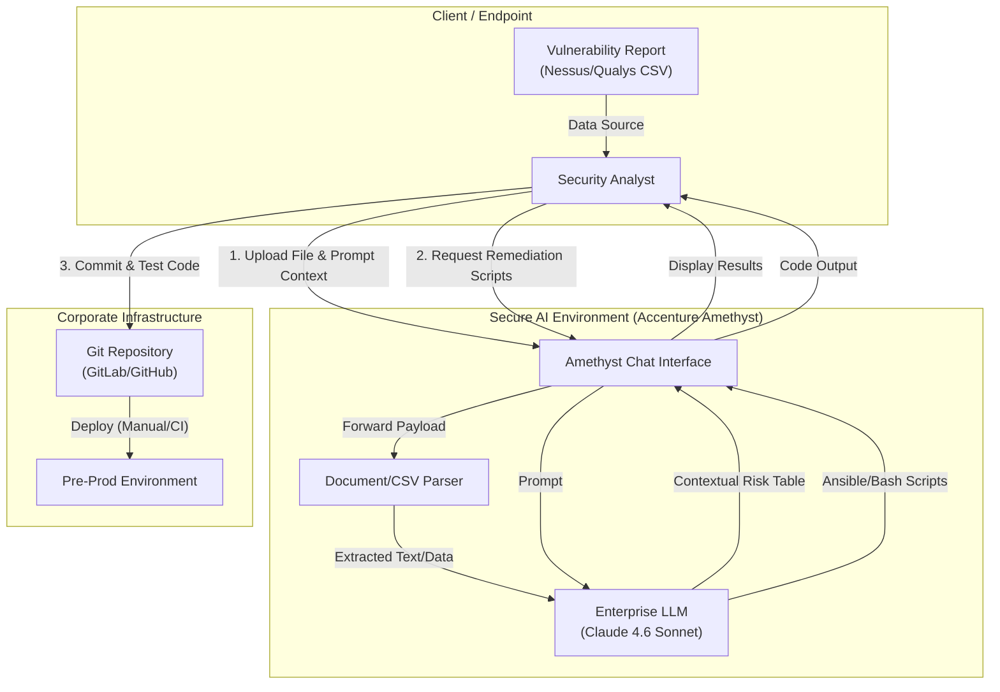
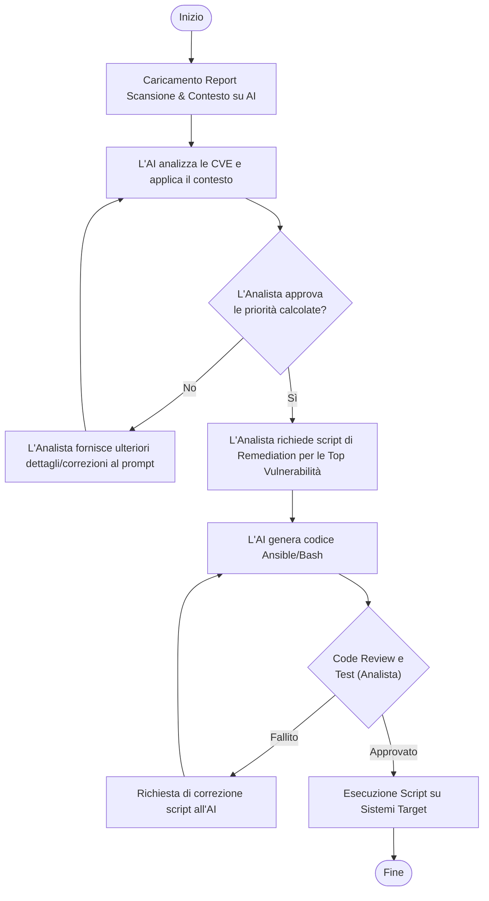
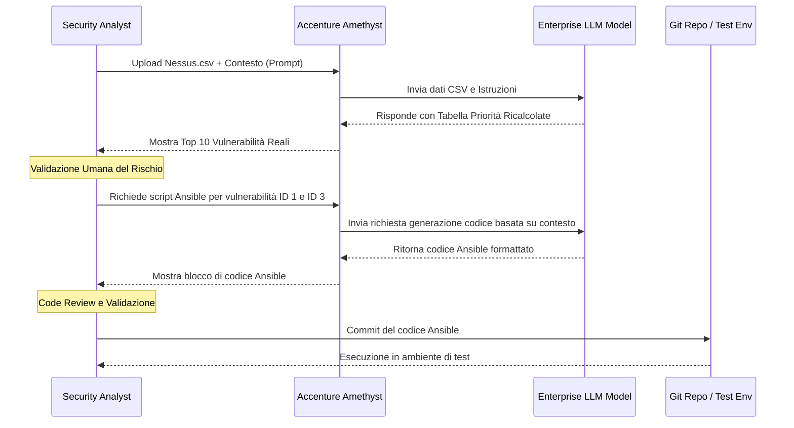

# Blueprint GenAI: Efficentamento del "Vulnerability Assessment e Remediation"

## 1. Descrizione del Caso d'Uso
**Categoria:** Security & Compliance
**Titolo:** Vulnerability Assessment e Remediation
**Ruolo:** Security Analyst
**Obiettivo Originale (da CSV):** Analisi dei report generati dai tool di scansione vulnerabilità (es. Nessus, Qualys). Classificazione dei rischi reali nel contesto dell'infrastruttura cliente e applicazione tempestiva dei workaround o delle patch correttive.
**Obiettivo GenAI:** Automatizzare l'ingestion e l'analisi dei report di vulnerabilità (Nessus/Qualys) per filtrare i falsi positivi in base al contesto infrastrutturale, ricalcolare la priorità reale di rischio e generare automaticamente gli script di remediation (es. Ansible, Bash) o le istruzioni per i workaround.

## 2. Fasi del Processo Efficentato

### Fase 1: Ingestion Report e Classificazione Contestuale del Rischio
L'analista di sicurezza carica il report grezzo generato dai tool di scansione (in formato CSV o PDF) all'interno di un ambiente chat enterprise sicuro, fornendo in input il contesto dell'infrastruttura (es. server esposti su internet, reti isolate, tipologia di dati trattati). L'AI analizza le CVE, correla le raccomandazioni e scarta le vulnerabilità non applicabili al contesto specifico, producendo una lista priorizzata (Prioritized Action Plan).
*   **Tool Principale Consigliato:** `accenture ametyst` (Garantisce la privacy assoluta dei dati sensibili presenti nei report di vulnerabilità).
*   **Alternative:** 1. `OpenClaw` (per esecuzione on-premise di modelli locali), 2. `Microsoft Teams (Chatbot UI)` (se integrato con backend enterprise sicuro).
*   **Modelli LLM Suggeriti:** Anthropic Claude Sonnet 4.6 (eccellente per l'analisi tecnica di grandi dataset e logica contestuale) o OpenAI GPT-5.4.
*   **Modalità di Utilizzo:** Caricamento del file del report direttamente nella chat di Amethyst con un prompt specifico di contesto.
    ```text
    **Prompt suggerito per l'analista:**
    "In allegato trovi il report di scansione Nessus dell'infrastruttura 'Cluster_DB_Backend'. 
    Contesto: Questi server sono in una rete interna isolata e non hanno accesso a Internet. Il traffico è filtrato da firewall e ospitano dati sensibili. 
    Analizza le vulnerabilità e ricalcola il livello di rischio reale. Ignora o declassa le vulnerabilità che richiedono un attacco da rete pubblica. Forniscimi una tabella con le Top 10 vulnerabilità reali su cui dobbiamo agire immediatamente, includendo CVE, Host e azione consigliata."
    ```
*   **Azione Umana Richiesta (Human-in-the-loop):** L'analista deve validare la valutazione contestuale dell'AI e confermare che le vulnerabilità "scartate" siano effettivamente falsi positivi o rischi accettabili.
*   **Stima Reale di Efficienza:** 
    *   *Tempo As-Is (Manuale):* 4 ore (per un report di 500+ righe)
    *   *Tempo To-Be (GenAI):* 15 minuti
    *   *Risparmio %:* 93%
    *   *Motivazione:* L'AI abbatte i tempi morti di lettura sequenziale, correlando istantaneamente le definizioni delle CVE con le regole di contesto fornite dall'analista.

### Fase 2: Generazione Automatica degli Script di Remediation
Una volta validata la lista delle vulnerabilità prioritarie, l'analista chiede all'AI di tradurre le raccomandazioni di sicurezza testuali (es. "Disabilitare il protocollo TLS 1.0", "Modificare la chiave di registro", "Aggiornare il pacchetto OpenSSH") in script esecutivi (Ansible, Bash, o PowerShell) pronti per essere applicati sui sistemi bersaglio.
*   **Tool Principale Consigliato:** `accenture ametyst` (continuazione della sessione precedente per mantenere il contesto).
*   **Alternative:** 1. `gemini-cli` (per generazione rapida da terminale locale), 2. `visualstudio + copilot`.
*   **Modelli LLM Suggeriti:** Anthropic Claude Sonnet 4.6 (specializzato nella generazione di codice infrastrutturale pulito e idiomatico).
*   **Modalità di Utilizzo:** Richiesta discorsiva nella chat in base ai risultati della Fase 1.
    ```text
    **Prompt per generazione script:**
    "Per le vulnerabilità ID 1 (TLS 1.0 abilitato) e ID 3 (Aggiornamento OpenSSH) identificate nella tabella precedente sui server Linux RHEL 8, generami un Playbook Ansible completo per applicare la remediation. Il playbook deve includere un task di verifica pre-modifica e uno di restart dei servizi coinvolti, oltre a gestire gli errori."
    ```
*   **Azione Umana Richiesta (Human-in-the-loop):** L'analista di sicurezza o il sistemista MUST revisionare il codice generato prima di qualsiasi esecuzione in produzione. Il codice deve essere testato in un ambiente di Pre-Prod.
*   **Stima Reale di Efficienza:** 
    *   *Tempo As-Is (Manuale):* 3 ore (ricerca della sintassi, scrittura e testing base dello script)
    *   *Tempo To-Be (GenAI):* 20 minuti (generazione e revisione)
    *   *Risparmio %:* 88%
    *   *Motivazione:* L'AI traduce in pochi secondi una raccomandazione funzionale in codice IaC sintatticamente corretto, riducendo drasticamente il tempo di ricerca sulla documentazione.

## 3. Descrizione del Flusso Logico
Il flusso adotta un approccio **Single-Agent** conversazionale basato su Accenture Amethyst, per massimizzare la semplicità operativa e garantire la protezione dei dati (essenziale in ambito security). Il Security Analyst avvia una chat, carica il CSV del Vulnerability Assessment e fornisce il contesto dell'infrastruttura. L'AI agisce come un assistente esperto: prima digerisce il report e filtra il rumore proponendo una lista di priorità ristretta; successivamente, dopo la validazione umana, produce il codice di remediation. L'output finale (i playbook o gli script) viene copiato dall'utente e versionato nel repository aziendale, pronto per essere testato ed eseguito sui target.

## 4. Diagrammi UML (Mermaid.js)

### 4.1 Application & System Architecture Schematic


### 4.2 Process Diagram


### 4.3 Sequence Diagram


## 5. Guida all'Implementazione Tecnica

### Prerequisiti
- Accesso alla piattaforma enterprise AI (es. Accenture Amethyst) con approvazione per il trattamento di dati "Confidential" (report di vulnerabilità).
- Disabilitazione esplicita del training dell'LLM sui dati immessi nella chat (garantito dalle piattaforme enterprise).
- Report di scansione esportati in formato CSV (preferibile per l'analisi tabellare dell'AI) o PDF strutturato.

### Step 1: Preparazione e Ingestion del Report
1. Accedere all'interfaccia web del tool AI (es. Amethyst).
2. Avviare una nuova sessione di chat impostando il modello più performante disponibile per logica e codice (es. Claude 3.5 Sonnet o 4.6).
3. Utilizzare la funzione "Upload File" per allegare l'esportazione del tool di scansione (Nessus, Qualys, ecc.).
4. Inserire il prompt di contestualizzazione suggerito nella Fase 1, assicurandosi di specificare chiaramente se i server sono esposti, il tipo di sistema operativo e se ci sono limitazioni note (es. "Non possiamo riavviare questo server prima di sabato").

### Step 2: Validazione e Generazione Remediation
1. Leggere attentamente la tabella generata dall'AI. Verificare a campione se una CVE declassata dall'AI è effettivamente inoffensiva nel proprio contesto (es. vulnerabilità di un browser su un server headless).
2. Per le vulnerabilità che richiedono intervento (workaround o patch configuration), inserire il prompt della Fase 2 per richiedere lo script specifico nel linguaggio utilizzato in azienda (es. Ansible per Linux, PowerShell per Windows).
3. Copiare lo script generato cliccando sull'icona "Copia codice".

### Step 3: Deployment e Testing
1. Incollare lo script nel proprio IDE o editor di testo.
2. Eseguire una rapida verifica sintattica e logica (es. controllare che non ci siano comandi distruttivi generati per allucinazione).
3. Salvare lo script nel repository aziendale ed eseguirlo prima in un ambiente di pre-produzione per verificare che il workaround non causi disservizi applicativi.

## 6. Rischi e Mitigazioni
- **Rischio 1: Data Leakage di informazioni sensibili.** Il caricamento di report contenenti IP, hostname e vulnerabilità esatte rappresenta un rischio critico se si usano tool AI pubblici. -> **Mitigazione:** Utilizzo esclusivo di soluzioni Enterprise AI "ring-fenced" (come Amethyst) dove è contrattualmente garantito che i dati non escano dal perimetro aziendale e non vengano usati per addestrare modelli pubblici.
- **Rischio 2: Allucinazioni nel codice di Remediation.** L'AI potrebbe suggerire un comando Bash o un task Ansible sintatticamente corretto ma che "rompe" un'altra dipendenza del sistema operativo. -> **Mitigazione:** Obbligo procedurale (Human-in-the-loop) per il Security Analyst / Sistemista di revisionare riga per riga il codice generato ed eseguire test rigorosi in ambiente non produttivo prima dell'applicazione definitiva.
- **Rischio 3: Scarto errato di vulnerabilità (Falsi Negativi Indotti).** L'AI, interpretando male il contesto, potrebbe declassare a "rischio basso" una vulnerabilità che in realtà è critica. -> **Mitigazione:** Il prompt deve sempre richiedere di esplicitare la *motivazione* per cui una vulnerabilità è stata declassata. L'analista deve revisionare la lista delle esclusioni per intercettare difetti di logica.