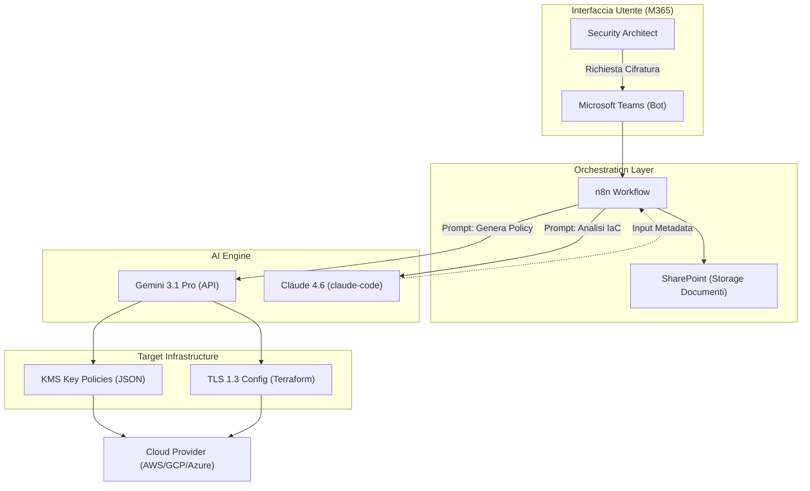
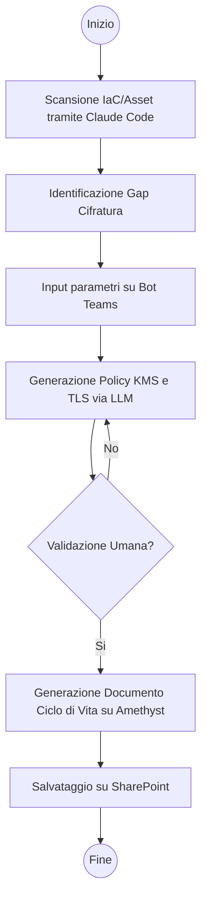
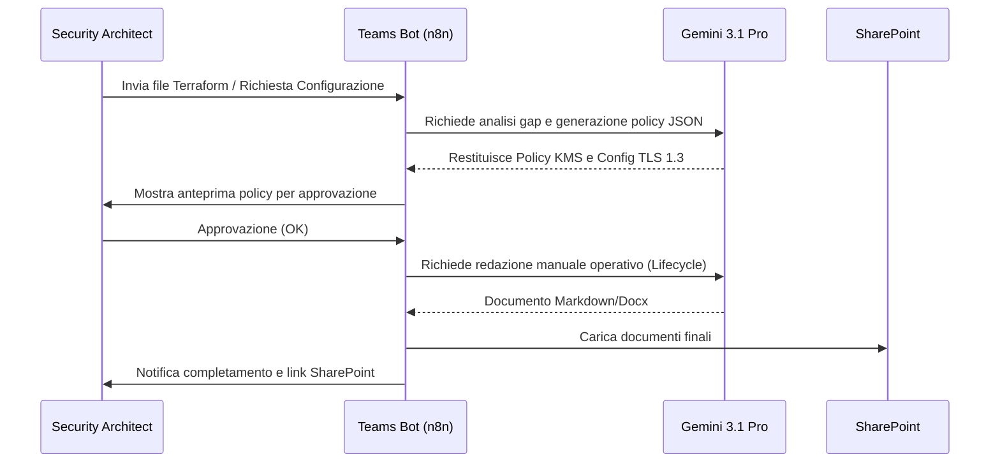

# Blueprint GenAI: Efficentamento del "Implementazione Crittografia Dati"

## 1. Descrizione del Caso d'Uso
**Categoria:** Security & Compliance
**Titolo:** Implementazione Crittografia Dati
**Ruolo:** Security Architect
**Obiettivo Originale (da CSV):** Progettazione e configurazione di soluzioni per la cifratura dei dati "a riposo" (su dischi, bucket storage, database) e "in transito" (TLS 1.3), inclusa la gestione sicura del ciclo di vita delle chiavi KMS aziendali.
**Obiettivo GenAI:** Automatizzare la generazione di policy di cifratura, configurazioni TLS 1.3 e piani di gestione del ciclo di vita delle chiavi (KMS) partendo dall'analisi dei metadati dell'infrastruttura esistente.

## 2. Fasi del Processo Efficentato

### Fase 1: Discovery e Scansione Requisiti
In questa fase, un agente analizza i file di configurazione (Terraform, CloudFormation o descrizioni testuali dell'asset) per identificare dove la crittografia è mancante o non allineata agli standard TLS 1.3.
*   **Tool Principale Consigliato:** `claude-code`
*   **Alternative:** 1. `visualstudio + copilot`, 2. `accenture ametyst`
*   **Modelli LLM Suggeriti:** Anthropic Claude 4.6 Sonnet
*   **Modalità di Utilizzo:** Esecuzione di `claude-code` sulla cartella dell'infrastruttura (IaC) per mappare i bucket, i database e gli endpoint privi di cifratura.
    ```bash
    # Esempio comando claude-code
    claude analyze "Identifica tutte le risorse Cloud (S3, RDS, EBS) in questo repository che non hanno la cifratura AES-256 abilitata e genera un report in markdown."
    ```
*   **Azione Umana Richiesta:** Validazione del report di gap-analysis prodotto.
*   **Stima Reale di Efficienza:** 
    *   *Tempo As-Is (Manuale):* 4 ore (ispezione manuale dei file e della console cloud)
    *   *Tempo To-Be (GenAI):* 10 minuti
    *   *Risparmio %:* 96%
    *   *Motivazione:* L'AI scansiona migliaia di righe di codice in pochi secondi individuando pattern di insicurezza.

### Fase 2: Generazione Policy KMS e Configurazione TLS
Creazione automatica delle Key Policy per KMS e dei parametri di cifratura in transito conformi agli standard aziendali.
*   **Tool Principale Consigliato:** `Microsoft Teams (Chatbot UI)` via `n8n`
*   **Alternative:** 1. `gemini-cli`, 2. `copilot studio`
*   **Modelli LLM Suggeriti:** Google Gemini 3.1 Pro
*   **Modalità di Utilizzo:** L'architetto interagisce con un bot su Teams inviando il nome del servizio. Il bot, tramite n8n, richiama l'LLM con un System Prompt specifico per generare la JSON policy KMS e i parametri TLS 1.3.
    *   **Bozza System Prompt:**
        ```text
        Sei un esperto di Cloud Security. Genera una KMS Key Policy per AWS che consenta la rotazione annuale, permetta l'uso solo al ruolo 'AppRole' e garantisca l'amministrazione al gruppo 'SecurityAdmin'. Output richiesto: JSON formattato.
        ```
*   **Azione Umana Richiesta:** Revisione e approvazione della policy generata prima dell'applicazione.
*   **Stima Reale di Efficienza:** 
    *   *Tempo As-Is (Manuale):* 3 ore (scrittura e test di policy JSON complesse)
    *   *Tempo To-Be (GenAI):* 5 minuti
    *   *Risparmio %:* 97%
    *   *Motivazione:* Eliminazione degli errori di sintassi e dei permessi troppo permissivi tramite template dinamici AI.

### Fase 3: Documentazione Ciclo di Vita Chiavi
Generazione del piano operativo per la creazione, rotazione, revoca e distruzione delle chiavi (Key Lifecycle Management).
*   **Tool Principale Consigliato:** `accenture ametyst`
*   **Alternative:** 1. `chatgpt agent`, 2. `gemini-cli`
*   **Modelli LLM Suggeriti:** OpenAI GPT-5.4
*   **Modalità di Utilizzo:** Caricamento delle policy generate nella fase 2 su Amethyst per produrre un documento HLD (High Level Design) strutturato e pronto per l'audit.
*   **Azione Umana Richiesta:** Approvazione finale del documento di conformità.
*   **Stima Reale di Efficienza:** 
    *   *Tempo As-Is (Manuale):* 5 ore (redazione documentazione tecnica e tabelle di gestione)
    *   *Tempo To-Be (GenAI):* 20 minuti
    *   *Risparmio %:* 93%
    *   *Motivazione:* L'AI struttura i contenuti tecnici in formati standard (ISO27001/NIST) istantaneamente.

## 3. Descrizione del Flusso Logico
Il processo è orchestrato come un approccio **Single-Agent** potenziato da workflow di automazione. L'utente interagisce esclusivamente tramite **Microsoft Teams**. Una richiesta di "Nuova Configurazione Cifratura" attiva un workflow su **n8n** che:
1.  Recupera i dati tecnici dell'infrastruttura (via MCP o upload file).
2.  Interroga **Gemini 3.1 Pro** per generare le policy tecniche (KMS/TLS).
3.  Salva l'output su **SharePoint** aziendale.
4.  Restituisce all'utente su Teams il link alla documentazione e i blocchi di codice pronti all'uso.

## 4. Diagrammi UML (Mermaid.js)

### 4.1 Architecture Diagram


### 4.2 Process Diagram


### 4.3 Sequence Diagram


## 5. Guida al'Implementazione Tecnica
### Prerequisiti
- Licenza **n8n** (self-hosted o cloud).
- API Key per **Google Gemini** e **Anthropic**.
- App Registration su Azure AD per il Bot Teams.
- Accesso in lettura al repository Git dell'infrastruttura.

### Step 1: Configurazione n8n e Teams
1.  Creare un nuovo workflow in n8n con un nodo "Microsoft Teams Trigger".
2.  Configurare il bot per rispondere a comandi come `/encrypt-gen`.
3.  Aggiungere un nodo "HTTP Request" per chiamare le API di Gemini 3.1 Pro.

### Step 2: Ingestion dei Requisiti
1.  Utilizzare `claude-code` localmente per estrarre la lista delle risorse non cifrate: `claude analyze "List all unencrypted resources" > gap_report.txt`.
2.  Inviare il contenuto di `gap_report.txt` al bot Teams.

### Step 3: Generazione e Salvataggio
1.  Il bot processa il file e genera un file `.tf` (Terraform) con le risorse `aws_kms_key` e `aws_kms_alias`.
2.  Configurare il nodo "Microsoft OneDrive/SharePoint" in n8n per caricare automaticamente il file generato nella cartella di progetto.

## 6. Rischi e Mitigazioni
- **Rischio 1: Lock-out (Chiavi non accessibili):** Policy KMS errate possono bloccare l'accesso ai dati. -> **Mitigazione:** Il prompt include sempre una clausola di "Safety Break" che garantisce l'accesso permanente al ruolo 'Admin' e richiede validazione umana obbligatoria.
- **Rischio 2: Incompatibilità TLS 1.3:** Alcuni client legacy potrebbero non supportare TLS 1.3. -> **Mitigazione:** L'AI genera anche una configurazione di "Fallback monitorato" o un report di compatibilità client basato sui log forniti.
- **Rischio 3: Allucinazioni nei parametri crittografici:** Generazione di algoritmi obsoleti. -> **Mitigazione:** Uso di modelli "Deep Think" con System Prompt che impone esclusivamente standard NIST 2026.
