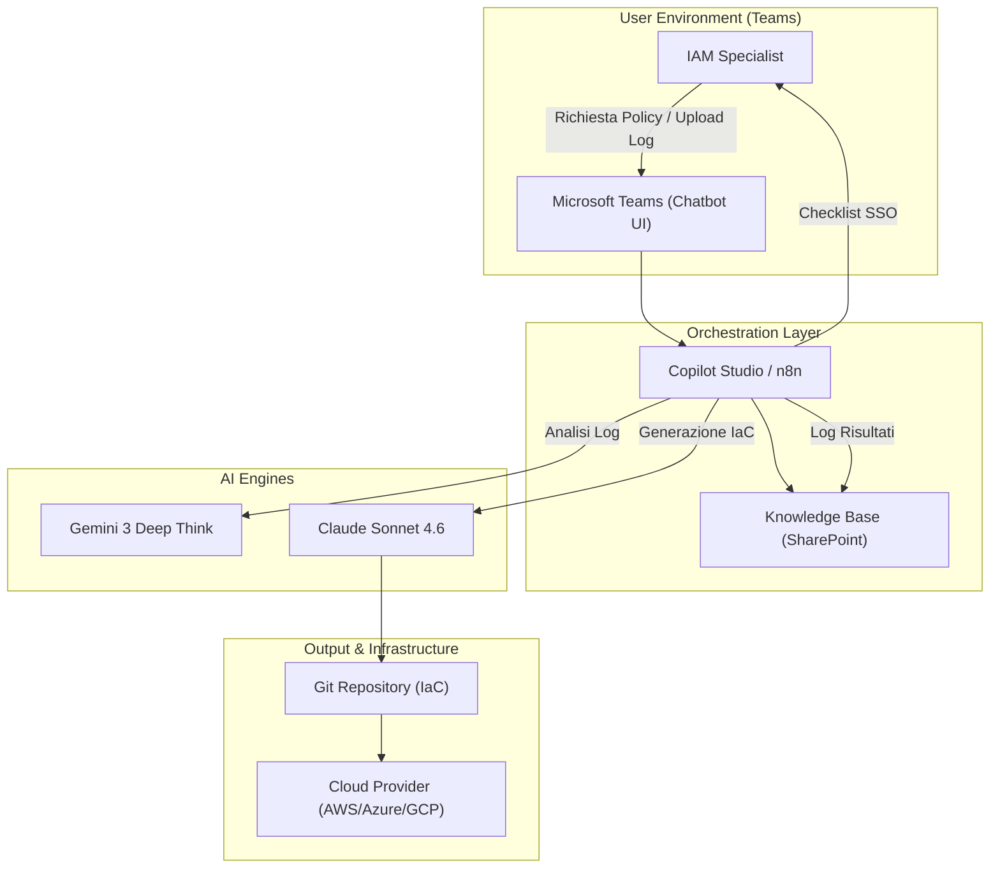
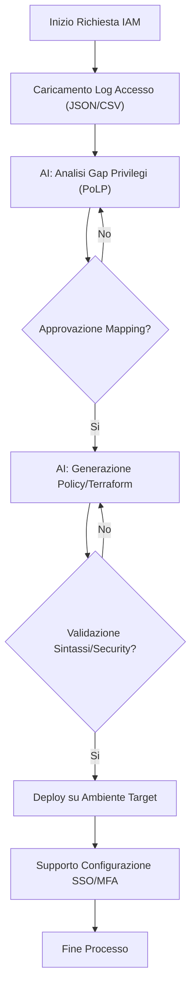
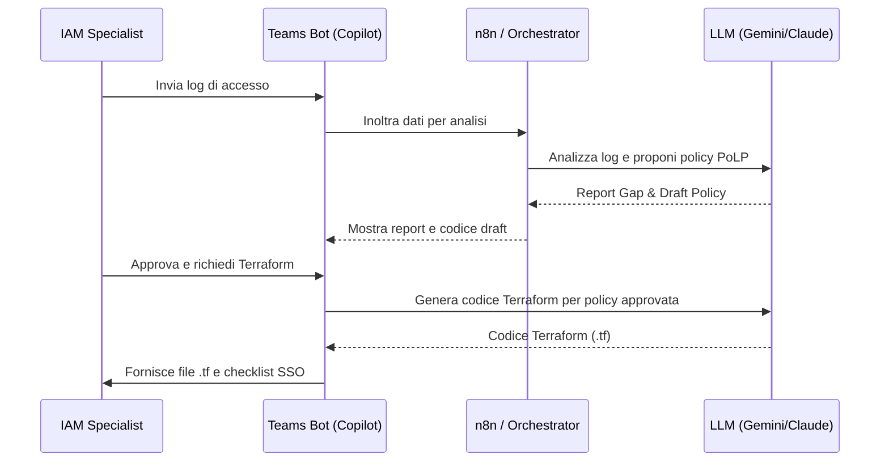

# Blueprint GenAI: Efficentamento del "Identity and Access Management (IAM)"

## 1. Descrizione del Caso d'Uso
**Categoria:** Security & Compliance
**Titolo:** Identity and Access Management (IAM)
**Ruolo:** IAM Specialist
**Obiettivo Originale (da CSV):** Progettazione e implementazione di ruoli, gruppi e policy IAM basate sul principio del minimo privilegio (PoLP). Integrazione di sistemi di Single Sign-On (SSO) e Multi-Factor Authentication (MFA) per accessi admin.
**Obiettivo GenAI:** Automatizzare l'analisi dei log di accesso per mappare i privilegi necessari, generare istantaneamente policy IAM (JSON/Terraform) aderenti al PoLP e fornire una guida interattiva per l'integrazione SSO/MFA tramite un assistente dedicato su Microsoft Teams.

## 2. Fasi del Processo Efficentato

### Fase 1: Audit Intelligente e Mapping PoLP
L'AI analizza i log di accesso storici (CloudTrail, Azure Monitor, Okta Logs) per identificare quali permessi sono effettivamente utilizzati e quali sono ridondanti, proponendo una mappatura basata sul "Minimo Privilegio".
*   **Tool Principale Consigliato:** `gemini-cli`
*   **Alternative:** 1. Accenture Amethyst (per analisi documentale), 2. Claude-code
*   **Modelli LLM Suggeriti:** Google Gemini 3 Deep Think (ideale per l'analisi di grandi volumi di log e ragionamento logico complesso).
*   **Modalità di Utilizzo:** Scripting via `gemini-cli` che processa file CSV/JSON di log e restituisce un report di "Excessive Permissions".
    ```bash
    # Esempio di prompt per gemini-cli
    gemini analyze --file access_logs.json --prompt "Analizza questi log di accesso AWS. Identifica le azioni (actions) mai utilizzate negli ultimi 90 giorni per l'utente 'admin-temp' e genera una nuova policy JSON che includa solo le azioni realmente necessarie (PoLP)."
    ```
*   **Azione Umana Richiesta:** L'IAM Specialist deve validare la lista dei permessi rimossi per evitare blocchi su attività infrequenti ma critiche (es. Disaster Recovery).
*   **Stima Reale di Efficienza:** 
    *   *Tempo As-Is (Manuale):* 8 ore (analisi manuale log e incrocio tabelle)
    *   *Tempo To-Be (GenAI):* 30 minuti
    *   *Risparmio %:* 94%
    *   *Motivazione:* L'AI correla istantaneamente migliaia di righe di log con le definizioni delle policy.

### Fase 2: Generazione Automatica Policy e IaC
Traduzione dei requisiti di accesso in codice pronto all'uso (Terraform, CloudFormation o JSON nativo).
*   **Tool Principale Consigliato:** `visualstudio + copilot`
*   **Alternative:** 1. Claude-code, 2. OpenAI Codex
*   **Modelli LLM Suggeriti:** Anthropic Claude Sonnet 4.6 (eccellente nella generazione di codice infrastrutturale preciso e sicuro).
*   **Modalità di Utilizzo:** Utilizzo di Copilot all'interno dell'IDE per generare blocchi Terraform partendo da una descrizione in linguaggio naturale.
    *   *Prompt suggerito:* "Genera un modulo Terraform per un ruolo IAM AWS destinato a un DB Admin. Deve avere accesso ReadWrite solo su RDS e S3 bucket 'db-backups', con condizione di accesso limitata all'IP aziendale 1.2.3.4."
*   **Azione Umana Richiesta:** Code review e test in ambiente di staging/sandbox.
*   **Stima Reale di Efficienza:** 
    *   *Tempo As-Is (Manuale):* 2 ore (scrittura e debug sintassi)
    *   *Tempo To-Be (GenAI):* 10 minuti
    *   *Risparmio %:* 92%
    *   *Motivazione:* Eliminazione degli errori di sintassi e boilerplate pre-compilato.

### Fase 3: Supporto Integrazione SSO/MFA
Un chatbot guida lo specialista nei passaggi di configurazione per l'integrazione di Identity Provider (IdP) come Azure AD, Okta o Ping.
*   **Tool Principale Consigliato:** `copilot studio` (pubblicato su **Microsoft Teams**)
*   **Alternative:** 1. ChatGPT Agent, 2. n8n (per workflow di verifica)
*   **Modelli LLM Suggeriti:** OpenAI GPT-5.4
*   **Modalità di Utilizzo:** Bot Teams configurato con accesso alla documentazione tecnica aziendale (SharePoint) e vendor docs via RAG. Fornisce checklist step-by-step e script di test.
*   **Azione Umana Richiesta:** Esecuzione materiale dei comandi sui pannelli di amministrazione e validazione del test di login.
*   **Stima Reale di Efficienza:** 
    *   *Tempo As-Is (Manuale):* 4 ore (consultazione manuali e troubleshooting)
    *   *Tempo To-Be (GenAI):* 1 ora
    *   *Risparmio %:* 75%
    *   *Motivazione:* Accesso immediato alle best practice e risoluzione rapida degli errori comuni di configurazione (es. mismatch di claim SAML).

## 3. Descrizione del Flusso Logico
Il processo è gestito secondo un approccio **Single-Agent** orchestrato tramite un **IAM Copilot** su Microsoft Teams. L'agente funge da interfaccia unica: l'utente carica i log, il bot richiama via n8n le API di Gemini/Claude per l'analisi e la generazione del codice, e restituisce i file pronti su una cartella SharePoint dedicata. L'approccio single-agent è preferito per mantenere la semplicità di interazione per lo specialista, che ha il controllo totale sulla validazione di ogni output.

## 4. Diagrammi UML (Mermaid.js)

### 4.1 Architecture Diagram


### 4.2 Process Diagram


### 4.3 Sequence Diagram


## 5. Guida all'Implementazione Tecnica

### Prerequisiti
- Licenza **Microsoft 365** con accesso a Teams e SharePoint.
- Licenza **Copilot Studio** o istanza **n8n** (self-hosted o cloud).
- API Key per **Google Gemini** e **Anthropic Claude**.
- Accesso in sola lettura ai log del Cloud Provider.

### Step 1: Configurazione Bot su Teams
1.  Accedi a **Copilot Studio**.
2.  Crea un nuovo bot nominato "IAM-Security-Assistant".
3.  Carica nella sezione "Generative AI" i documenti PDF/Markdown relativi alle policy di sicurezza aziendali e alle guide vendor (AWS/Azure IAM).
4.  Configura un nodo di input per ricevere file (log di accesso).

### Step 2: Integrazione n8n per Analisi Bulk
1.  Crea un workflow in n8n con un trigger **Webhook** richiamato da Copilot Studio.
2.  Aggiungi un nodo **Read Binary File** per processare i log caricati.
3.  Aggiungi un nodo **AI Agent** (o HTTP Request) che invia i dati a Gemini 3 con il System Prompt:
    > "Sei un esperto di cybersecurity specializzato in IAM. Analizza i log forniti, identifica i permessi non utilizzati e genera una policy Least Privilege. Rispondi solo con il JSON della policy e una breve spiegazione delle modifiche."
4.  Restituisci l'output a Teams.

### Step 3: Generazione IaC in VS Code
1.  Installa l'estensione **GitHub Copilot** in Visual Studio Code.
2.  Crea un file `iam_roles.tf`.
3.  Utilizza la chat (`Cmd+I`) per incollare il JSON generato nella Fase 1 e chiedi: "Converti questo JSON di policy IAM in un modulo Terraform riutilizzabile".

## 6. Rischi e Mitigazioni
- **Rischio 1: Allucinazioni nelle Policy (Permessi mancanti).** L'AI potrebbe omettere permessi rari ma necessari. -> **Mitigazione:** Implementazione obbligatoria di una fase di "Dry Run" o "Audit Mode" prima dell'applicazione in produzione.
- **Rischio 2: Esposizione dati sensibili nei log.** I log potrebbero contenere IP o nomi utente sensibili. -> **Mitigazione:** Utilizzo di **OpenClaw** con modelli locali per l'analisi dei log se i dati non possono uscire dal perimetro aziendale.
- **Rischio 3: Sintassi IaC errata.** -> **Mitigazione:** Integrazione nel workflow di tool di validazione statica (es. `terraform validate`, `tflint`) guidati dall'AI.
