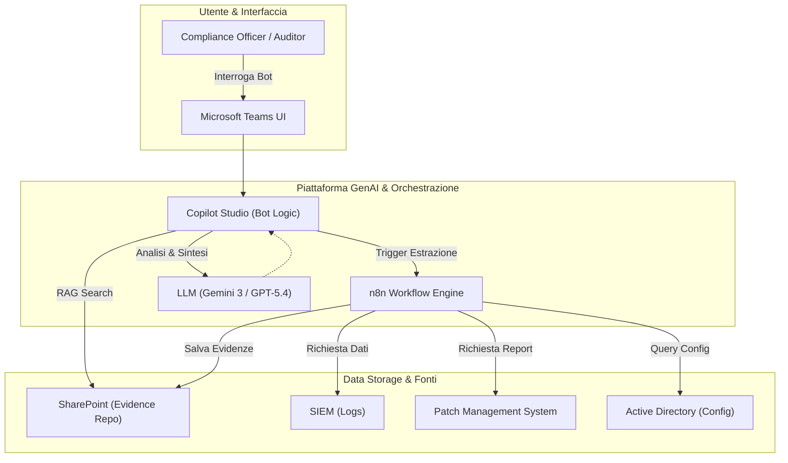
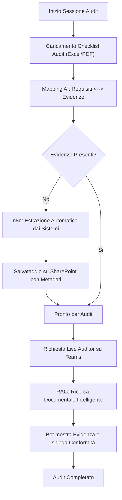
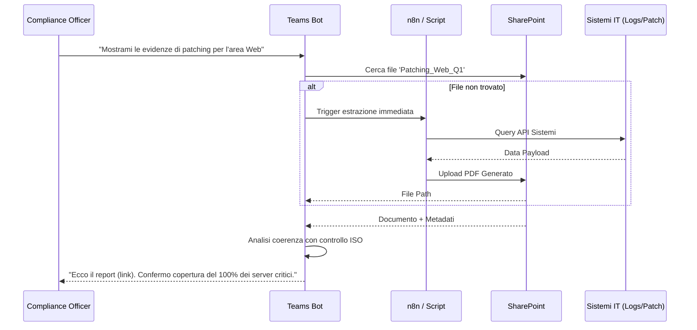

# Blueprint GenAI: Efficentamento del "Supporto Tecnico ad Audit di Sicurezza"

## 1. Descrizione del Caso d'Uso
**ID Riga CSV:** 65  
**Categoria:** Security & Compliance  
**Titolo:** Supporto Tecnico ad Audit di Sicurezza  
**Ruolo:** Compliance Officer  

**Obiettivo Originale (da CSV):**  
Partecipazione attiva alle sessioni di audit interni o esterni (es. ISO 27001, PCI-DSS). Estrazione tempestiva di log di sistema, evidenze di configurazione e reportistica di patching per dimostrare la conformità ai framework normativi.

**Obiettivo GenAI:**  
Automatizzare il reperimento, la classificazione e la presentazione delle evidenze tecniche (log, configurazioni, stati di patching) tramite un **Compliance Evidence Agent** integrato in Microsoft Teams, capace di mappare istantaneamente i requisiti dell'audit (es. controlli ISO) ai file tecnici estratti.

## 2. Fasi del Processo Efficentato

### Fase 1: Mapping Intelligente Requisiti-Evidenze
L'AI analizza la checklist dell'audit (es. file Excel o PDF fornito dall'auditor) e identifica quali log o report specifici servono per ogni controllo.
*   **Tool Principale Consigliato:** `accenture ametyst` (per analisi sicura di documenti di compliance).
*   **Alternative:** 1. `gemini-cli`, 2. `chatgpt agent`.
*   **Modelli LLM Suggeriti:** Google Gemini 3 Deep Think (eccellente per il ragionamento logico tra clausole normative e parametri tecnici).
*   **Modalità di Utilizzo:** Caricamento del framework di audit (es. Annex A ISO 27001). L'LLM genera un file JSON di mappatura che associa il controllo (es. "A.12.1.2") al comando shell o al report da estrarre.
*   **Azione Umana Richiesta:** Il Compliance Officer valida la matrice di mappatura proposta dall'AI prima di procedere all'estrazione massiva.
*   **Stima Reale di Efficienza:** 
    *   *Tempo As-Is (Manuale):* 4 ore (lettura framework e identificazione fonti).
    *   *Tempo To-Be (GenAI):* 10 minuti.
    *   *Risparmio %:* 96%
    *   *Motivazione:* L'AI incrocia istantaneamente migliaia di righe normative con le knowledge base tecniche.

### Fase 2: Orchestrazione ed Estrazione Automatica
Un workflow automatizzato raccoglie i dati dai vari sistemi (SIEM, Patch Management tool, AD) e li organizza in un repository strutturato.
*   **Tool Principale Consigliato:** `n8n`.
*   **Alternative:** 1. `gemini-cli` (tramite script Python), 2. `Ansible`.
*   **Modelli LLM Suggeriti:** OpenAI GPT-5.4 (per la generazione dinamica di query SQL o comandi API basati sulla mappatura della Fase 1).
*   **Modalità di Utilizzo:** n8n riceve l'input dalla Fase 1, interroga le API dei sistemi (es. Microsoft Endpoint Manager per il patching), salva i report su **SharePoint** e usa un'API LLM per rinominare i file in modo "Audit-Ready" (es. `Evidenza_Patching_Server_Web_Q1_2026.pdf`).
*   **Azione Umana Richiesta:** Supervisione dell'esecuzione del workflow e verifica che i sistemi di destinazione siano raggiungibili.
*   **Stima Reale di Efficienza:** 
    *   *Tempo As-Is (Manuale):* 8 ore (accesso a diversi portali, download manuale, rename file).
    *   *Tempo To-Be (GenAI):* 5 minuti (tempo di esecuzione script).
    *   *Risparmio %:* 99%
    *   *Motivazione:* Eliminazione totale del "swivel-chair" tra diverse console di amministrazione.

### Fase 3: Audit Interactive Assistant (Teams Interface)
Durante la sessione di audit live, il Compliance Officer interroga un bot su Teams per recuperare l'evidenza richiesta dall'auditor in tempo reale.
*   **Tool Principale Consigliato:** `copilot studio` (pubblicato su **Microsoft Teams**).
*   **Alternative:** 1. `n8n` (Chatbot node), 2. `accenture ametyst`.
*   **Modelli LLM Suggeriti:** Anthropic Claude Sonnet 4.6 (per la chiarezza espositiva e la precisione nel recupero dati da SharePoint via RAG).
*   **Modalità di Utilizzo:** Configurazione di un chatbot con accesso al repository SharePoint. Il bot non solo fornisce il file, ma spiega *perché* quel file soddisfa il requisito citato dall'auditor.
*   **Azione Umana Richiesta:** Presentazione dell'evidenza all'auditor e validazione finale della spiegazione fornita dal bot.
*   **Stima Reale di Efficienza:** 
    *   *Tempo As-Is (Manuale):* 30 minuti per ogni ricerca "on-the-fly" durante l'audit.
    *   *Tempo To-Be (GenAI):* 30 secondi.
    *   *Risparmio %:* 98%
    *   *Motivazione:* Ricerca semantica istantanea invece di navigazione manuale tra cartelle.

## 3. Descrizione del Flusso Logico
Il sistema adotta un approccio **Single-Agent** denominato "Compliance Guardian". L'agente agisce come orchestratore centrale: legge i requisiti, attiva i sensori (n8n) per raccogliere le prove e serve i dati tramite interfaccia Teams. Il flusso è lineare: **Input (Checklist Audit) -> Processo (n8n Extraction) -> Output (Interactive Chatbot)**. L'uso del **RAG (Retrieval-Augmented Generation)** su SharePoint garantisce che le risposte siano basate esclusivamente su evidenze reali e aggiornate.

## 4. Diagrammi UML (Mermaid.js)

### 4.1 Application & System Architecture

### 4.2 Process Diagram

### 4.3 Sequence Diagram

## 5. Guida all'Implementazione Tecnica

### Prerequisiti
- Licenza **Microsoft Copilot Studio** e **Teams**.
- Istanza **n8n** (Self-hosted o Cloud) con credenziali API per i sistemi target.
- Document Library su **SharePoint Online** dedicata all'Audit.
- API Key per **Google Gemini** o **OpenAI**.

### Step 1: Configurazione Workflow n8n
Creare un workflow che:
1.  Riceve un Webhook da Copilot Studio o un trigger programmato.
2.  Esegue nodi "HTTP Request" verso i sistemi di monitoraggio/patching.
3.  Utilizza un nodo "AI Agent" per formattare i dati grezzi in un report leggibile.
4.  Carica il file su SharePoint usando il nodo "Microsoft SharePoint".

### Step 2: Configurazione RAG su Copilot Studio
1.  Creare un nuovo Copilot in Copilot Studio.
2.  Nella sezione **Generative AI**, collegare la cartella SharePoint come "Knowledge Source".
3.  Impostare il **System Prompt**:
    > "Sei un esperto di Compliance IT. Il tuo compito è assistere durante gli audit. Quando l'utente chiede un'evidenza, cercala nei documenti caricati. Fornisci il link al file e spiega brevemente in che modo il documento risponde al requisito normativo citato. Sii formale, preciso e non inventare dati non presenti nei documenti."

### Step 3: Deployment su Teams
1.  Pubblicare il bot da Copilot Studio.
2.  Aggiungere il bot al canale "Audit & Compliance" su Microsoft Teams.

## 6. Rischi e Mitigazioni
- **Rischio:** Accesso non autorizzato a log sensibili tramite il bot. -> **Mitigazione:** Implementare il Single Sign-On (SSO) e restringere l'accesso al bot solo al team Compliance tramite policy di Teams.
- **Rischio:** Documentazione obsoleta fornita all'auditor. -> **Mitigazione:** Inserire un timestamp automatico generato dall'AI in ogni report estratto e configurare un alert se l'evidenza ha più di 30 giorni.
- **Rischio:** Allucinazione nel mapping normativo. -> **Mitigazione:** "Human-in-the-loop": il Compliance Officer deve apporre un flag di "Approvato per Audit" sul file in SharePoint prima che il bot possa mostrarlo all'auditor esterno.
