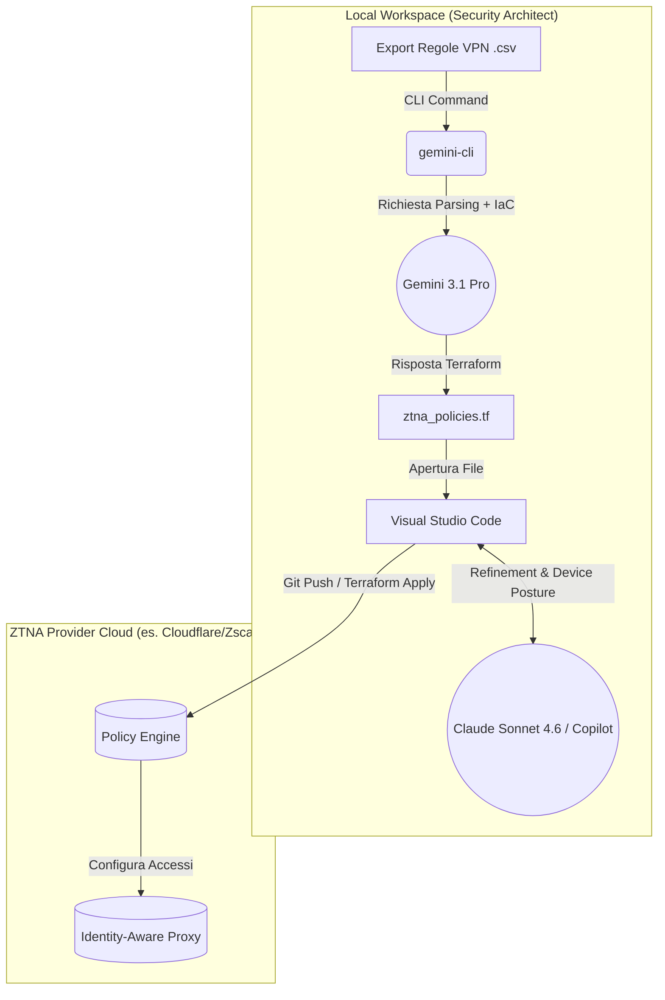
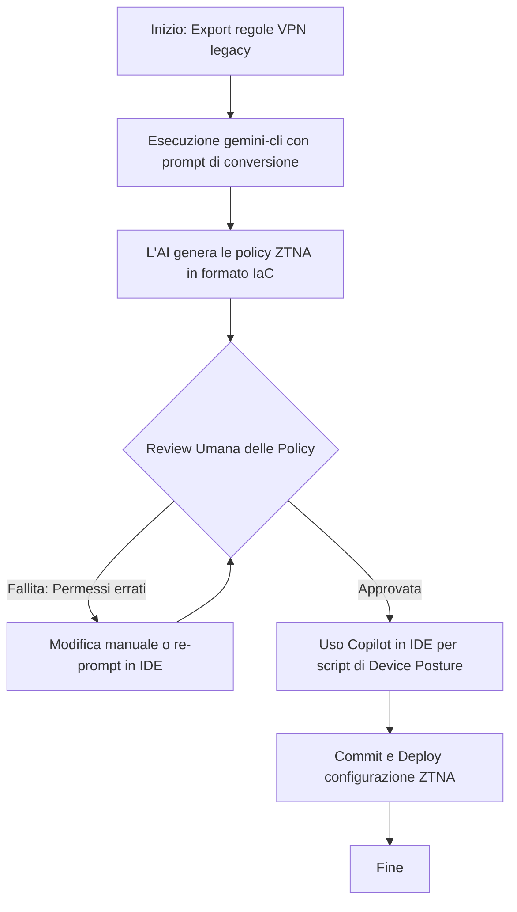
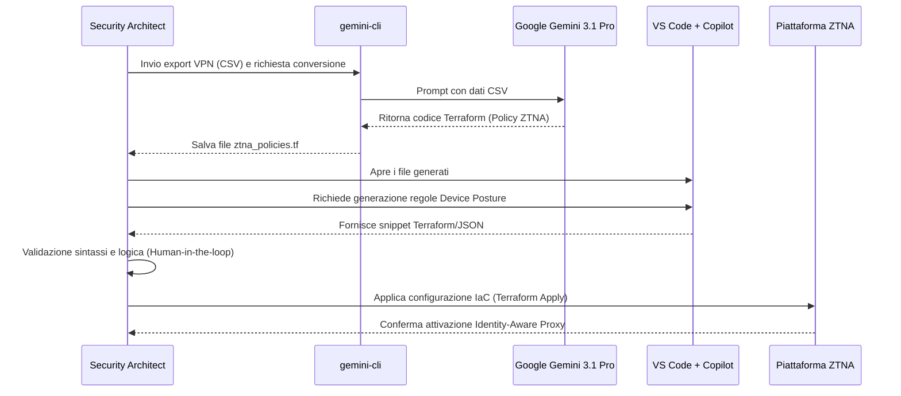

# Blueprint GenAI: Efficentamento del "Implementazione Zero Trust Network Access (ZTNA)"

## 1. Descrizione del Caso d'Uso
**Categoria:** Security & Compliance
**Titolo:** Implementazione Zero Trust Network Access (ZTNA)
**Ruolo:** Security Architect
**Obiettivo Originale (da CSV):** Sostituzione delle tradizionali VPN con architetture ZTNA per l'accesso remoto sicuro. Configurazione di identity-aware proxies, verifica della postura dei device e micro-segmentazione degli accessi applicativi.
**Obiettivo GenAI:** Automatizzare l'analisi delle vecchie regole VPN e la loro conversione in policy granulari di micro-segmentazione ZTNA (es. Terraform per Cloudflare/Zscaler), oltre a generare rapidamente gli script di verifica della postura dei dispositivi.

## 2. Fasi del Processo Efficentato

### Fase 1: Conversione Regole VPN in Policy ZTNA (Micro-segmentazione)
L'AI analizza gli export delle regole firewall/VPN tradizionali (es. formato CSV) e genera automaticamente il codice IaC (Terraform) o i file JSON/YAML per configurare le policy di accesso e i proxy identity-aware sulla nuova piattaforma ZTNA.
*   **Tool Principale Consigliato:** `gemini-cli`
*   **Alternative:** 1. `visualstudio + copilot`, 2. `chatgpt agent`
*   **Modelli LLM Suggeriti:** Google Gemini 3.1 Pro (ottimo per il parsing di log strutturati e la generazione di codice Terraform preciso)
*   **Modalità di Utilizzo:** Script Bash che invia il file delle regole legacy a Gemini per ottenere l'output Terraform.
    ```bash
    gemini ask "Converti le regole VPN in questo file CSV in blocchi Terraform per Cloudflare Access. Crea policy di micro-segmentazione per ogni applicazione citata, consentendo l'accesso solo ai gruppi Entra ID corrispondenti. File: $(cat vpn_rules.csv)" > ztna_policies.tf
    ```
*   **Azione Umana Richiesta:** Il Security Architect deve validare visivamente le policy Terraform generate prima del commit, assicurandosi che non ci siano permessi troppo ampi (over-permissive).
*   **Stima Reale di Efficienza:**
    *   *Tempo As-Is (Manuale):* 16 ore (analisi regole, mappatura app, scrittura codice)
    *   *Tempo To-Be (GenAI):* 1 ora (generazione automatica e review accurata)
    *   *Risparmio %:* 93%
    *   *Motivazione:* L'AI elimina il lavoro manuale di "traduzione" di centinaia di righe di routing/firewalling in policy applicative moderne, eseguendo il parsing e la conversione in codice in pochi secondi.

### Fase 2: Configurazione Automatica dei Controlli di Postura Device
Generazione degli script o delle configurazioni per verificare lo stato di sicurezza degli endpoint (presenza EDR, firewall attivo, aggiornamenti OS) prima di concedere l'accesso al proxy.
*   **Tool Principale Consigliato:** `visualstudio + copilot`
*   **Alternative:** 1. `gemini-cli`
*   **Modelli LLM Suggeriti:** Anthropic Claude Sonnet 4.6 (eccellente nel coding inline)
*   **Modalità di Utilizzo:** Utilizzo di Copilot direttamente nell'IDE mentre si definiscono le regole di postura ZTNA.
    *Prompt in IDE:* 
    ```terraform
    // Genera una regola Terraform per Cloudflare Access che verifichi la presenza del processo 'crowdstrike.exe' e la chiave di registro specifica per la compliance aziendale Windows.
    ```
*   **Azione Umana Richiesta:** Test in ambiente di staging per verificare che la regola di postura non blocchi i dispositivi legittimi (falsi positivi).
*   **Stima Reale di Efficienza:**
    *   *Tempo As-Is (Manuale):* 4 ore (ricerca documentazione vendor, scrittura sintassi esatta)
    *   *Tempo To-Be (GenAI):* 15 minuti
    *   *Risparmio %:* 93%
    *   *Motivazione:* Il LLM conosce già le sintassi complesse dei vari provider ZTNA per i controlli di postura, fornendo immediatamente lo snippet corretto senza dover consultare lunghi manuali.

## 3. Descrizione del Flusso Logico
Il processo segue un approccio **Single-Agent** coadiuvato da strumenti integrati nell'IDE. Il Security Architect estrae prima le regole dalla vecchia VPN (CSV/JSON). Utilizzando `gemini-cli`, passa questo file al modello LLM che effettua il parsing e produce le regole di micro-segmentazione come Infrastructure as Code (IaC). Successivamente, l'architetto apre i file generati nel proprio IDE e usa `visualstudio + copilot` per integrare e rifinire i controlli di Device Posture. L'umano agisce sempre come revisore obbligatorio ("Human-in-the-loop") prima di applicare le policy tramite la pipeline CI/CD o la CLI del vendor ZTNA. L'uso di un Single-Agent per la conversione garantisce la massima velocità operativa.

## 4. Diagrammi UML (Mermaid.js)

### 4.1 Architecture Diagram


### 4.2 Process Diagram


### 4.3 Sequence Diagram


## 5. Guida all'Implementazione Tecnica

### Prerequisiti
- Installazione di `gemini-cli` e configurazione API key di Google (es. `export GEMINI_API_KEY="..."`).
- Visual Studio Code con estensione Copilot (o equivalente come Claude Code) attiva.
- Accesso in lettura all'appliance VPN legacy per estrarre le regole.
- Provider IaC (es. Terraform) installato localmente per il test di validazione sintattica.

### Step 1: Estrazione Regole VPN
Estrarre le regole firewall/VPN attuali in un formato leggibile e strutturato (CSV o JSON è preferibile, ma il modello può parsare anche file di testo tabellari). Salvare il file localmente nel workspace di lavoro come `vpn_rules.csv`.

### Step 2: Traduzione in Policy ZTNA via CLI
Aprire il terminale integrato dell'IDE e lanciare il comando di traduzione:
```bash
gemini ask "Agisci da Security Architect. Leggi le seguenti regole VPN legacy e convertile in risorse Terraform 'cloudflare_access_policy' e 'cloudflare_access_application'. Applica il principio del minimo privilegio, sostituendo le ampie subnet IP con le singole applicazioni web descritte. File: $(cat vpn_rules.csv)" > ztna_microsegmentation.tf
```

### Step 3: Integrazione Device Posture in IDE
1. Aprire il file `ztna_microsegmentation.tf` appena generato all'interno di Visual Studio Code.
2. Posizionarsi nel blocco della policy in cui si desidera limitare l'accesso.
3. Utilizzare Copilot (tramite commento inline `//` o chat integrata) per aggiungere la verifica della postura:
   *Scrivere nel codice:* `// Aggiungi un blocco 'require' per la device posture che verifichi l'integrazione con Microsoft Intune (is_compliant = true).`
4. Accettare (premere Tab) e revisionare il blocco di codice suggerito dall'assistente.

### Step 4: Validazione e Deploy
1. Eseguire `terraform plan` per validare sintatticamente il codice generato dall'AI e verificare i moduli mancanti.
2. Controllare attentamente le modifiche previste a video per scongiurare permessi estesi.
3. Eseguire `terraform apply` per implementare concretamente il proxy ZTNA e le relative policy di micro-segmentazione.

## 6. Rischi e Mitigazioni
- **Rischio 1:** **Over-permissive Policies (Allucinazioni LLM)**: Il modello potrebbe tradurre erroneamente una regola VPN, concedendo l'accesso a intere subnet invece che alla singola applicazione specifica. -> **Mitigazione:** Obbligo rigoroso di validazione "Human-in-the-loop" tramite code review prima di eseguire qualsiasi push o `apply` sull'infrastruttura di sicurezza.
- **Rischio 2:** **Falsi positivi sulla Device Posture**: Le regole generate potrebbero essere troppo stringenti, bloccando utenti legittimi a causa di lievi differenze nelle versioni OS o configurazioni EDR. -> **Mitigazione:** Implementare inizialmente le policy di Device Posture in modalità "Audit-only" o testarle su un gruppo ristretto (pilot) di utenti prima del rollout globale.
- **Rischio 3:** **Esposizione log sensibili**: Il CSV delle regole VPN potrebbe contenere IP sensibili o nomi di applicazioni critiche inviati in chiaro alle API del provider LLM. -> **Mitigazione:** Anonimizzare o mascherare eventuali PII o dati aziendali altamente confidenziali nel CSV prima di sottometterlo a `gemini-cli`. Utilizzare un'istanza enterprise isolata se si processano configurazioni top-secret.