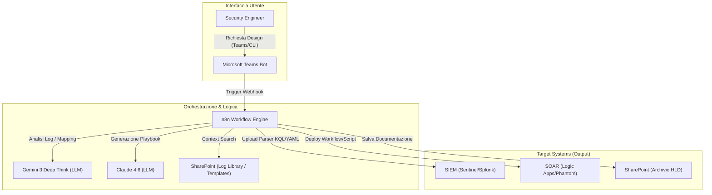
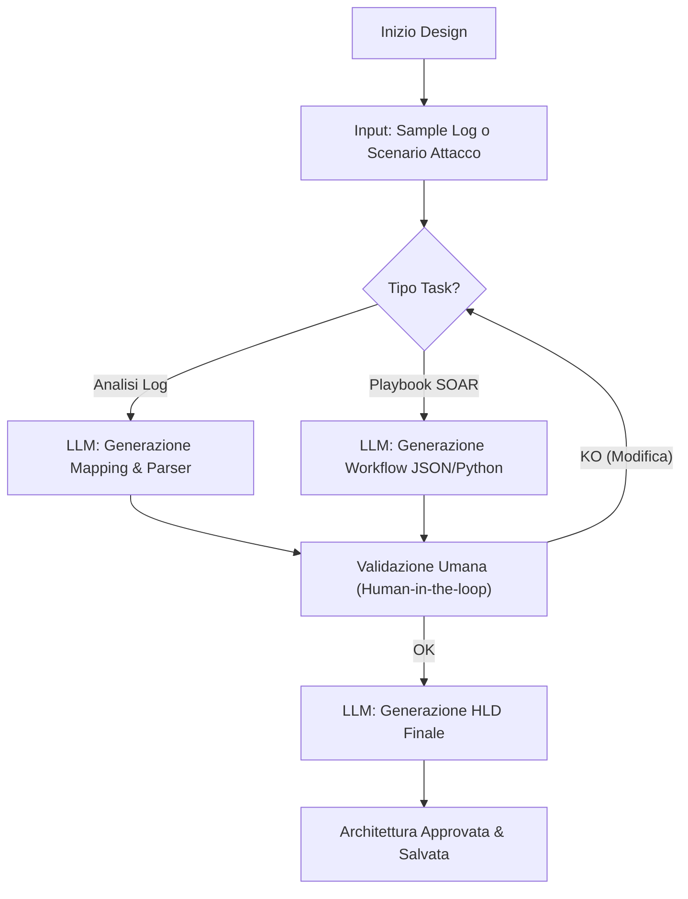
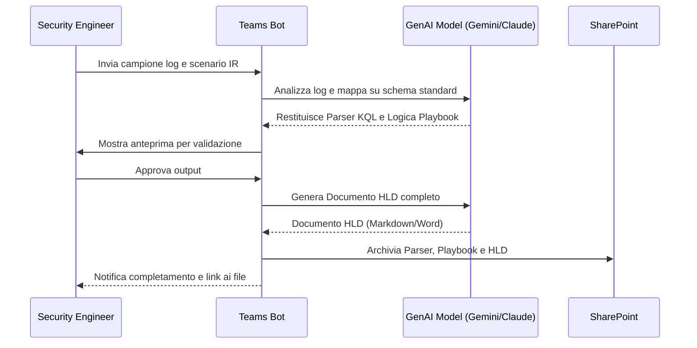

# Blueprint GenAI: Efficentamento del "Design Architettura SIEM/SOAR"

## 1. Descrizione del Caso d'Uso
**Categoria:** Security & Compliance
**Titolo:** Design Architettura SIEM/SOAR
**Ruolo:** Security Engineer
**Obiettivo Originale (da CSV):** Progettazione della raccolta, normalizzazione e analisi dei log di sicurezza attraverso un SIEM (es. Splunk, Microsoft Sentinel). Definizione dei playbook automatizzati nel SOAR per la risposta autonoma agli incidenti di sicurezza.
**Obiettivo GenAI:** Automatizzare la mappatura delle sorgenti log (Normalization Mapping) e la generazione della logica dei playbook SOAR partendo da scenari di minaccia descritti in linguaggio naturale, riducendo drasticamente i tempi di configurazione iniziale e drafting documentale.

## 2. Fasi del Processo Efficentato

### Fase 1: Analisi Log e Mapping di Normalizzazione
In questa fase, l'ingegnere carica campioni di log grezzi (CSV, JSON, Syslog) e l'AI identifica automaticamente i campi chiave, mappandoli verso standard industriali (es. Microsoft Sentinel ASIM, Splunk CIM o Elastic ECS).
*   **Tool Principale Consigliato:** `accenture ametyst`
*   **Alternative:** 1. `claude-code`, 2. `gemini-cli`
*   **Modelli LLM Suggeriti:** Google Gemini 3 Deep Think (ottimale per il riconoscimento di pattern in dati semi-strutturati).
*   **Modalità di Utilizzo:** Caricamento del file di log su Amethyst. L'AI analizza la struttura e produce un file di configurazione (es. KQL per Sentinel o YAML per logstash).
    *   **Prompt Suggerito:** "Analizza questo sample di log grezzo proveniente da un firewall custom. Mappa ogni campo allo schema ASIM (Advanced Security Information Model) di Microsoft Sentinel. Genera la query KQL di parser necessaria per la normalizzazione."
*   **Azione Umana Richiesta:** Validazione della correttezza del mapping dei campi critici (es. Source IP, Timestamp).
*   **Stima Reale di Efficienza:** 
    *   *Tempo As-Is (Manuale):* 6 ore (analisi manuale e scrittura Regex/Parser)
    *   *Tempo To-Be (GenAI):* 20 minuti
    *   *Risparmio %:* 94%
    *   *Motivazione:* L'AI eccelle nel pattern matching e nella traduzione di formati dati non strutturati.

### Fase 2: Generazione Logica Playbook SOAR
Traduzione di uno scenario di incidente (es. "Rilevamento login da IP sospetto") in una sequenza logica di azioni per il SOAR (Arricchimento, Notifica, Blocco).
*   **Tool Principale Consigliato:** `visualstudio + copilot`
*   **Alternative:** 1. `n8n`, 2. `ChatGPT Agent`
*   **Modelli LLM Suggeriti:** Anthropic Claude Sonnet 4.6 (leader nella generazione di codice strutturato e logica booleana).
*   **Modalità di Utilizzo:** Utilizzo di un Agent dedicato che riceve la descrizione della procedura operativa (SOP) e restituisce il file di definizione del playbook (es. Logic App JSON o Python Script).
    *   **Bozza System Prompt Agent:** "Sei un esperto di Automation Security. Riceverai una procedura di Incident Response. Il tuo compito è tradurla in un workflow logico JSON compatibile con Azure Sentinel Playbooks, includendo step di approvazione umana su Teams prima di azioni distruttive."
*   **Azione Umana Richiesta:** Revisione dei nodi decisionali del workflow per evitare "false positive block".
*   **Stima Reale di Efficienza:** 
    *   *Tempo As-Is (Manuale):* 8 ore (disegno workflow e configurazione connettori)
    *   *Tempo To-Be (GenAI):* 45 minuti
    *   *Risparmio %:* 91%
    *   *Motivazione:* La generazione automatica del codice/JSON elimina il debugging sintattico dei connettori API.

### Fase 3: Generazione HLD (High Level Design)
Consolidamento delle scelte tecniche, dei mapping e dei flussi in un documento di architettura formale.
*   **Tool Principale Consigliato:** `accenture ametyst`
*   **Alternative:** 1. `ChatGPT Chatbot (Enterprise)`
*   **Modelli LLM Suggeriti:** OpenAI GPT-5.4
*   **Modalità di Utilizzo:** Ingestione degli output delle fasi 1 e 2 per generare un documento Word/Markdown strutturato secondo i template aziendali.
*   **Azione Umana Richiesta:** Revisione finale e approvazione dell'architettura per la compliance normativa.
*   **Stima Reale di Efficienza:** 
    *   *Tempo As-Is (Manuale):* 4 ore
    *   *Tempo To-Be (GenAI):* 15 minuti
    *   *Risparmio %:* 93%
    *   *Motivazione:* L'AI agisce come un redattore tecnico ultra-veloce partendo da dati grezzi già validati.

## 3. Descrizione del Flusso Logico
Il processo segue un approccio **Single-Agent orchestrato via n8n**. Un unico punto di accesso (Teams) permette al Security Engineer di inviare input (log o scenari). Il sistema utilizza n8n per smistare le richieste: se l'input è un file di log, interroga l'LLM per il mapping; se è un testo descrittivo, genera il playbook. L'integrazione con lo **SharePoint aziendale** garantisce che ogni parser e ogni playbook generato siano salvati come "Asset di Sicurezza" riutilizzabili.

## 4. Diagrammi UML (Mermaid.js)

### 4.1 Architecture Diagram

### 4.2 Process Diagram

### 4.3 Sequence Diagram

## 5. Guida all'Implementazione Tecnica
### Prerequisiti
- Accesso ad **Accenture Amethyst** o API Key per **Google Gemini/Claude**.
- Istanza **n8n** (Cloud o Self-hosted) per l'automazione dei flussi.
- Permessi di scrittura su una cartella **SharePoint** dedicata ai "Security Assets".

### Step 1: Configurazione Bot di Ingestione (Teams + n8n)
1. Crea un workflow in **n8n** con un trigger "Webhook".
2. Collega il Webhook a un bot creato tramite **Copilot Studio** o un'integrazione diretta Teams.
3. Configura il nodo LLM in n8n per utilizzare `Gemini 3 Deep Think` con il System Prompt per il mapping dei log.

### Step 2: Prompt Engineering per Playbook
1. Crea un template di prompt che includa le librerie supportate dal tuo SOAR (es. "Usa solo connettori standard per Microsoft Sentinel").
2. Implementa un nodo "HTTP Request" in n8n che invii la descrizione dello scenario all'LLM e riceva il JSON/YAML del playbook.

### Step 3: Pipeline di Documentazione
1. Configura un nodo finale in n8n che utilizzi un template Markdown per assemblare: Titolo, Scopo, Diagramma (generato dall'AI in Mermaid) e configurazioni tecniche.
2. Usa il connettore "Microsoft OneDrive/SharePoint" di n8n per salvare il file finale.

## 6. Rischi e Mitigazioni
- **Rischio 1: Allucinazioni nel codice del Playbook** -> **Mitigazione:** Obbligo di Human-in-the-loop per testare il playbook in ambiente di Sandbox prima della produzione.
- **Rischio 2: Esposizione PII (Personally Identifiable Information) nei log inviati all'AI** -> **Mitigazione:** Utilizzo di modelli tramite `Accenture Amethyst` o `OpenClaw` che garantiscono il non-allenamento sui dati e la privacy enterprise.
- **Rischio 3: Mapping errato dei campi critici** -> **Mitigazione:** Inserire nel prompt la clausola di segnalare esplicitamente i campi con confidenza < 80%.
