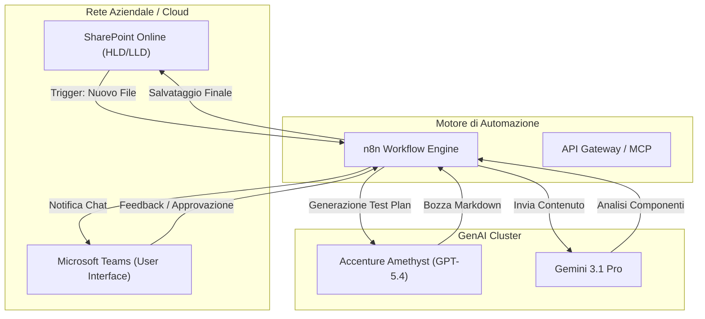
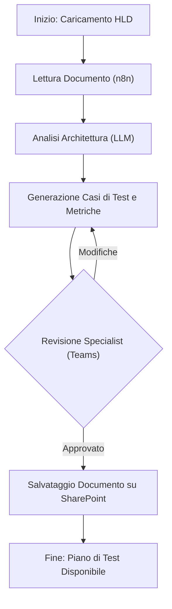
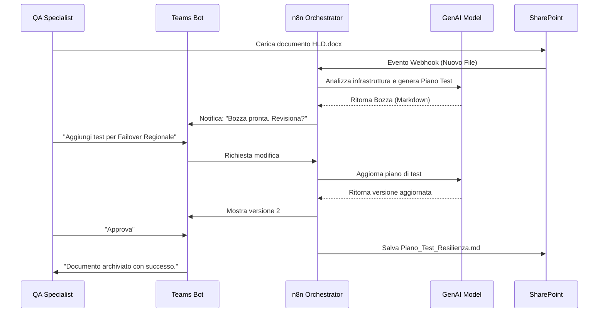

# Blueprint GenAI: Efficentamento del "Scrittura Piani di Test Non Funzionali"

## 1. Descrizione del Caso d'Uso
**Categoria:** Testing & QA
**Titolo:** Scrittura Piani di Test Non Funzionali
**Ruolo:** QA Infrastructure Specialist
**Obiettivo Originale (da CSV):** Progettazione e stesura dei casi di test relativi alla resilienza dell'infrastruttura (scalabilità, failover, ripristino da backup, tolleranza ai guasti di zona). Definizione precisa delle metriche di successo e dei criteri di accettazione.
**Obiettivo GenAI:** Automatizzare la generazione di un piano di test non funzionale completo e strutturato partendo dall'analisi dei documenti di High Level Design (HLD) e dei requisiti di business, producendo scenari di test, metriche (RTO, RPO, Latency) e script di validazione pronti all'uso.

## 2. Fasi del Processo Efficentato

### Fase 1: Ingestion e Analisi Architetturale
In questa fase, il sistema analizza i documenti tecnici (HLD, LLD, matrici di rete) presenti su SharePoint per identificare i "Single Points of Failure" e i componenti critici che richiedono test di resilienza.
*   **Tool Principale Consigliato:** `n8n` (per l'orchestrazione del workflow di lettura documenti).
*   **Alternative:** 1. `accenture amethyst` (Analisi documenti sicura), 2. `gemini-cli`.
*   **Modelli LLM Suggeriti:** `Google Gemini 3.1 Pro` (eccellente per l'estrazione di informazioni da schemi tecnici complessi).
*   **Modalità di Utilizzo:** Un workflow n8n monitora una cartella SharePoint. All'inserimento di un HLD, estrae il testo e lo invia all'LLM con un prompt specifico per identificare i vettori di test (es. "Trova tutti i database clusterizzati e i load balancer").
*   **Azione Umana Richiesta:** Conferma dei componenti critici identificati dall'AI prima di procedere alla generazione dei test.
*   **Stima Reale di Efficienza:** 
    *   *Tempo As-Is (Manuale):* 3 ore (lettura integrale e analisi critica).
    *   *Tempo To-Be (GenAI):* 5 minuti.
    *   *Risparmio %:* 97%
    *   *Motivazione:* L'AI identifica istantaneamente dipendenze e configurazioni di HA (Alta Affidabilità) nel testo.

### Fase 2: Generazione Scenari di Resilienza e Metriche
Creazione automatica dei casi di test per scalabilità, failover e disaster recovery, inclusi i criteri di accettazione (pass/fail).
*   **Tool Principale Consigliato:** `accenture amethyst` (per la generazione del documento formale).
*   **Alternative:** 1. `chatgpt agent`, 2. `claude-code` (se i test devono includere script di automazione).
*   **Modelli LLM Suggeriti:** `OpenAI GPT-5.4` (per la precisione nella definizione di metriche e KPI).
*   **Modalità di Utilizzo:** Utilizzo di un System Prompt strutturato (Agent) che agisce come un esperto di Site Reliability Engineering (SRE).
    *   **Bozza System Prompt:** 
        ```markdown
        Agisci come un QA Infrastructure Specialist esperto in Resilienza. 
        Dato il file HLD allegato, genera un Piano di Test Non Funzionale che includa:
        1. Test di Failover (es. interruzione nodo primario DB).
        2. Test di Scalabilità (es. aumento carico traffico del 300%).
        3. Metriche di Successo: RTO < 30s, RPO = 0, CPU Load < 80%.
        4. Criteri di Accettazione precisi.
        Formato output: Markdown.
        ```
*   **Azione Umana Richiesta:** Revisione tecnica dei valori di soglia (es. validare che 30s di RTO siano accettabili per il business).
*   **Stima Reale di Efficienza:** 
    *   *Tempo As-Is (Manuale):* 6 ore.
    *   *Tempo To-Be (GenAI):* 15 minuti.
    *   *Risparmio %:* 95%
    *   *Motivazione:* La scrittura di tabelle di test e metriche è un task ripetitivo e standardizzato che l'AI esegue con coerenza impeccabile.

### Fase 3: Revisione e Pubblicazione via Teams
Interazione finale con lo specialista per la validazione e il salvataggio del piano di test nel repository ufficiale.
*   **Tool Principale Consigliato:** `Microsoft Teams (Chatbot UI)` tramite `Copilot Studio`.
*   **Alternative:** 1. `n8n` (invio via Webhook), 2. `SharePoint`.
*   **Modelli LLM Suggeriti:** `Google Gemini 3 Deep Think` (per spiegare il ragionamento dietro a specifici test generati).
*   **Modalità di Utilizzo:** Un bot su Teams notifica lo specialista: "Il Piano di Test per il progetto [X] è pronto. Vuoi modificarlo o approvarlo?". L'utente può chiedere modifiche in linguaggio naturale (es. "Aggiungi un test per il guasto della zona AWS eu-south-1b").
*   **Azione Umana Richiesta:** Approvazione finale ("Approve") che scatena il salvataggio in PDF/Markdown su SharePoint.
*   **Stima Reale di Efficienza:** 
    *   *Tempo As-Is (Manuale):* 1 ora (email, feedback, revisioni).
    *   *Tempo To-Be (GenAI):* 10 minuti.
    *   *Risparmio %:* 83%
    *   *Motivazione:* Centralizzazione del feedback in una chat familiare.

## 3. Descrizione del Flusso Logico
Il flusso è un'architettura **Single-Agent** orchestrata da **n8n**. L'agente (QA Specialist Virtuale) opera all'interno di un loop di feedback umano via Microsoft Teams. 
1. L'utente carica l'HLD su SharePoint.
2. n8n invoca l'LLM per analizzare l'infrastruttura.
3. L'LLM genera la bozza del Piano di Test Non Funzionale.
4. Il bot Teams invia la bozza all'umano.
5. L'umano approva o chiede affinamenti.
6. Il documento finale viene archiviato.

## 4. Diagrammi UML (Mermaid.js)

### 4.1 Architecture Diagram


### 4.2 Process Diagram


### 4.3 Sequence Diagram


## 5. Guida all'Implementazione Tecnica

### Prerequisiti
- Accesso a **n8n** (Cloud o Self-hosted).
- Account **Accenture Amethyst** o API Key per **OpenAI/Google Gemini**.
- Permessi di lettura/scrittura su una cartella **SharePoint/OneDrive**.
- Licenza **Microsoft Teams** con accesso a Power Virtual Agents / Copilot Studio.

### Step 1: Configurazione Workflow n8n
1. Crea un nodo `Microsoft SharePoint Trigger` che reagisce ai nuovi file nella cartella "Architetture".
2. Aggiungi un nodo `HTTP Request` (o il nodo specifico Gemini) per inviare il file estratto all'LLM.
3. Configura il prompt per l'analisi e la generazione (usa il prompt fornito nella Fase 2).

### Step 2: Integrazione Microsoft Teams
1. Utilizza il nodo `Microsoft Teams` in n8n per inviare un messaggio "Actionable" o un semplice testo con i casi di test generati.
2. In alternativa, configura un bot su **Copilot Studio** che interroga l'API di n8n per recuperare lo stato del documento.

### Step 3: Definizione del Template di Output
Configura l'LLM per rispondere seguendo uno schema fisso:
- **Scenario ID:** [ID]
- **Componente:** [es. Database]
- **Tipo Test:** [es. Load Test]
- **Procedura:** [Step 1, Step 2...]
- **Metriche Target:** [es. RTO < 60s]

## 6. Rischi e Mitigazioni
- **Rischio 1: Allucinazioni su componenti non esistenti** -> **Mitigazione:** L'LLM deve operare esclusivamente sui dati estratti dal documento HLD (Grounding su SharePoint).
- **Rischio 2: Metriche irrealistiche (es. RTO = 0ms)** -> **Mitigazione:** Human-in-the-loop obbligatorio; lo Specialist deve validare le soglie prima della pubblicazione.
- **Rischio 3: Sicurezza dei dati (HLD sensibili)** -> **Mitigazione:** Utilizzo di istanze Enterprise isolate (es. Accenture Amethyst o Azure OpenAI) per garantire che i dati non vengano usati per il training pubblico dei modelli.
