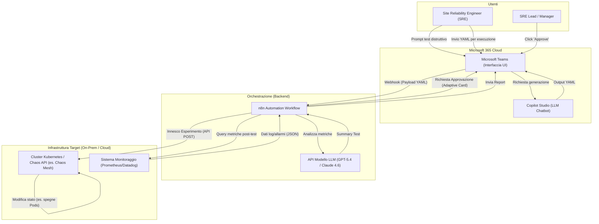
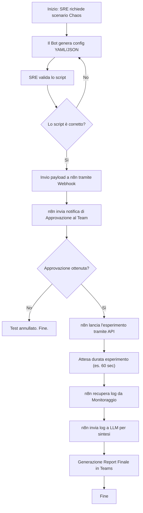
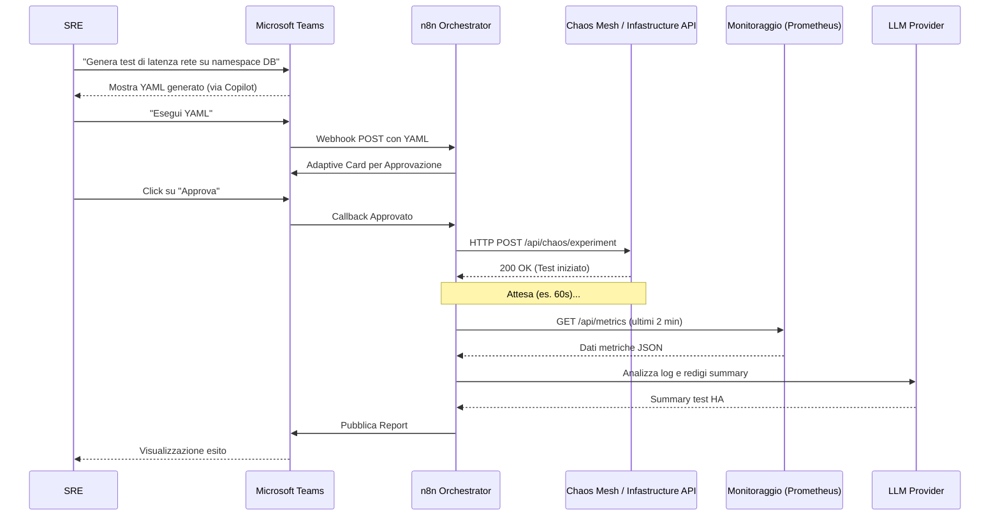

# Blueprint GenAI: Efficentamento del "Esecuzione Chaos Engineering"

## 1. Descrizione del Caso d'Uso
**Categoria:** Testing & QA
**Titolo:** Esecuzione Chaos Engineering
**Ruolo:** Site Reliability Engineer
**Obiettivo Originale (da CSV):** Esecuzione controllata di test distruttivi (spegnimento server, simulazione di latenza di rete, drop di pacchetti) per validare empiricamente che i meccanismi di auto-healing e HA dell'infrastruttura reagiscano come progettato.
**Obiettivo GenAI:** Automatizzare la progettazione degli esperimenti di Chaos Engineering (generazione di file YAML/JSON per tool di chaos) e fornire un'interfaccia conversazionale sicura per orchestrare l'innesco dei test e analizzare i risultati direttamente da Microsoft Teams.

## 2. Fasi del Processo Efficentato

### Fase 1: Generazione dello Scenario di Test Distruttivo
L'SRE richiede al chatbot l'elaborazione di uno scenario di test specifico (es. "Generami un esperimento per simulare il 50% di packet loss sul namespace *payments*"). Il sistema produce istantaneamente la configurazione YAML compatibile con i tool di Chaos Engineering aziendali (es. Chaos Mesh o Gremlin).
*   **Tool Principale Consigliato:** Copilot Studio (Chatbot su Microsoft Teams)
*   **Alternative:** 1. ChatGPT Agent (Enterprise), 2. n8n (con integrazione LLM)
*   **Modelli LLM Suggeriti:** OpenAI GPT-5.4 o Google Gemini 3.1 Pro
*   **Modalità di Utilizzo:** L'SRE interagisce con il bot in linguaggio naturale. Il bot contiene nel suo *System Prompt* le istruzioni per generare YAML sintatticamente corretti per i tool di Chaos.
    ```markdown
    # System Prompt per Copilot Studio
    Sei un assistente esperto in Site Reliability Engineering e Chaos Engineering. 
    Il tuo scopo è generare manifesti YAML per Chaos Mesh in base alle richieste dell'utente.
    Rispondi SEMPRE fornendo solo il blocco di codice YAML, usando le best practice di sicurezza.
    Includi sempre un selettore di label preciso e una durata massima (es. 60 secondi) per evitare danni prolungati.
    ```
*   **Azione Umana Richiesta:** L'SRE deve esaminare attentamente e validare lo script YAML o JSON generato prima di procedere alla sua applicazione.
*   **Stima Reale di Efficienza:** 
    *   *Tempo As-Is (Manuale):* 2 ore (analisi documentazione tool di chaos, stesura YAML, test sintassi)
    *   *Tempo To-Be (GenAI):* 10 minuti
    *   *Risparmio %:* 91%
    *   *Motivazione:* L'LLM elimina il tempo necessario per ricercare la sintassi corretta e scrivere il codice infrastrutturale da zero, producendo un template pronto per la validazione.

### Fase 2: Orchestrazione, Approvazione ed Esecuzione
Invece di lanciare manualmente i comandi (es. `kubectl apply`), l'SRE invia l'esperimento validato a n8n, che orchestra un flusso di approvazione sicura.
*   **Tool Principale Consigliato:** n8n
*   **Alternative:** 1. Google Antigravity, 2. Script Python minimale
*   **Modelli LLM Suggeriti:** N/A (Automazione puramente logica e di API)
*   **Modalità di Utilizzo:** Creazione di un workflow su n8n che riceve l'input tramite Webhook da Teams, invia una scheda adattiva (Adaptive Card) al manager/SRE Lead su Teams per l'approvazione formale ("Approve" o "Reject"), e in caso positivo inoltra l'API Call al server Kubernetes o al servizio di Chaos.
*   **Azione Umana Richiesta:** Clic su "Approva" nella chat di Teams (Human-in-the-loop per garanzia di sicurezza).
*   **Stima Reale di Efficienza:** 
    *   *Tempo As-Is (Manuale):* 45 minuti (richiesta permessi, preparazione ambiente, esecuzione CLI, tracciamento audit)
    *   *Tempo To-Be (GenAI):* 5 minuti
    *   *Risparmio %:* 88%
    *   *Motivazione:* Il workflow centralizza la Governance, automatizzando la fase di approvazione e tracciando l'operazione senza salti di contesto da parte dell'utente.

### Fase 3: Analisi dei Risultati e Sintesi
Dopo l'esecuzione, il sistema interroga il sistema di monitoraggio (es. Prometheus, Datadog), raccoglie gli allarmi scaturiti durante la finestra temporale del test e genera un *Executive Summary* su come il sistema ha reagito.
*   **Tool Principale Consigliato:** n8n (con nodo OpenAI/Gemini)
*   **Alternative:** 1. Copilot Studio, 2. Script Python
*   **Modelli LLM Suggeriti:** OpenAI GPT-5.4 o Anthropic Claude Sonnet 4.6
*   **Modalità di Utilizzo:** n8n preleva le metriche grezze via API e le passa all'LLM.
    ```python
    # Esempio concettuale payload n8n verso LLM
    prompt = f"""
    Analizza i seguenti log e metriche estratti durante l'esperimento di Chaos Engineering:
    {json_metrics}
    Verifica se il pod secondario ha preso il carico correttamente senza disservizi superiori a 500ms. 
    Produci un breve summary per il team.
    """
    ```
*   **Azione Umana Richiesta:** L'SRE legge il summary direttamente in Teams per confermare il successo del test HA.
*   **Stima Reale di Efficienza:** 
    *   *Tempo As-Is (Manuale):* 3 ore (lettura log sparsi, correlazione eventi, stesura report post-mortem/test)
    *   *Tempo To-Be (GenAI):* 15 minuti
    *   *Risparmio %:* 91%
    *   *Motivazione:* L'AI aggrega e comprende moli di log istantaneamente, evidenziando subito le anomalie o confermando l'auto-healing.

## 3. Descrizione del Flusso Logico
Il flusso adotta un approccio **Single-Agent orchestrato tramite n8n**. La scelta ricade su questo modello in quanto l'intero ciclo richiede un tracciamento rigoroso e una forte componente di integrazione API (Teams, Kubernetes/Chaos API, Prometheus). L'SRE interagisce con Microsoft Teams, richiedendo al Copilot la configurazione distruttiva. Una volta generato lo YAML, l'SRE lo convalida e lo invia (sempre via chat) a un Webhook di n8n. n8n sospende l'esecuzione inviando una notifica di approvazione nel canale del team SRE. Solo a seguito del clic umano sull'Approvazione, n8n innesca l'attacco nell'infrastruttura. Terminato il tempo del test, n8n recupera le metriche, invoca l'LLM per una rapida analisi interpretativa dell'accaduto e restituisce il report finale su Teams. Questo crea un'esperienza fluida ("ChatOps") e governata.

## 4. Diagrammi UML (Mermaid.js)

### 4.1 Architecture Diagram


### 4.2 Process Diagram


### 4.3 Sequence Diagram


## 5. Guida all'Implementazione Tecnica
### Prerequisiti
- Accesso a Microsoft Teams e licenza Copilot Studio (o accesso a n8n per gestire il bot).
- Ambiente n8n (On-premise o Cloud) con permessi di accesso alle API dell'infrastruttura di Chaos (es. Chaos Mesh, Gremlin o chiamate cloud native AWS FIS / Azure Chaos Studio).
- API Key per il provider LLM scelto (OpenAI, Google o Anthropic).
- Sistema di Monitoraggio accessibile via API REST (es. Prometheus, Datadog).

### Step 1: Configurazione del Copilot su Microsoft Teams
1. Accedi a Microsoft Copilot Studio.
2. Crea un nuovo Chatbot nominandolo "Chaos-Bot".
3. Nella configurazione del comportamento (Generative AI / System Prompt), inserisci le regole per agire come SRE e restituire ESCLUSIVAMENTE file YAML/JSON per il software di Chaos target dell'azienda.
4. Pubblica il bot all'interno del canale riservato al team SRE.

### Step 2: Sviluppo del Workflow di Orchestrazione su n8n
1. In n8n, crea un nuovo workflow.
2. Aggiungi un nodo **Webhook** (metodo POST) per ricevere il comando di esecuzione e il payload YAML.
3. Collega un nodo **Microsoft Teams** configurato per inviare una *Adaptive Card* contenente il payload in formato testo e due bottoni (Approve / Reject).
4. Usa un nodo **Wait** configurato in modalità *Wait for Webhook Call* per mettere in pausa il flusso finché non arriva la risposta dalla Adaptive Card.
5. Inserisci un nodo **IF**:
   - Se *Reject*, termina il flusso.
   - Se *Approve*, passa a un nodo **HTTP Request**.
6. Nel nodo **HTTP Request**, configura l'endpoint dell'API del tool di Chaos Engineering (es. `https://chaos-mesh-api.local/api/experiments`), autenticazione (Bearer token) e imposta il Body inviando lo YAML validato.

### Step 3: Implementazione della Fase di Analisi
1. Subito dopo l'HTTP Request (o dopo un nodo di *Wait* temporizzato pari alla durata del test), aggiungi un nodo **HTTP Request** per interrogare le API del sistema di monitoraggio (es. `/api/v1/query_range` su Prometheus) passando l'intervallo di tempo appena trascorso.
2. Collega l'output a un nodo **OpenAI / Anthropic**.
3. Configura il prompt del nodo LLM: `"Valuta i seguenti log in formato JSON e scrivi in italiano un riassunto tecnico sull'impatto dell'esperimento di Chaos, evidenziando se i servizi di failover hanno funzionato. Log: {{ $json.data }} "`.
4. L'output testuale dell'LLM va inviato a un ultimo nodo **Microsoft Teams** per essere pubblicato nella chat SRE come messaggio finale.

## 6. Rischi e Mitigazioni
- **Rischio 1:** Esecuzione accidentale o non autorizzata di test distruttivi in ambiente di Produzione. -> **Mitigazione:** Integrare un meccanismo forte di Human-in-the-loop (Approvazione su Teams solo da membri SRE autorizzati) e configurare le API del motore di Chaos in modo che possano operare in produzione solo previa autorizzazione RBAC rigida o su namespace specifici (es. limitare le policy IAM di AWS FIS).
- **Rischio 2:** Allucinazioni dell'LLM che genera configurazioni distruttive "fuori scala" (es. test di 24 ore anziché 60 secondi). -> **Mitigazione:** Istruire n8n tramite Regex o codice Javascript per bloccare automaticamente l'esecuzione di YAML se il campo della durata (`duration`) eccede una soglia limite massima hard-coded (es. max 300s).
- **Rischio 3:** Esposizione di API critiche. -> **Mitigazione:** Implementare n8n on-premise, sfruttando le VPN/VPC interne e secret vault per la gestione sicura dei token API infrastrutturali, evitando chiamate da IP pubblici.
