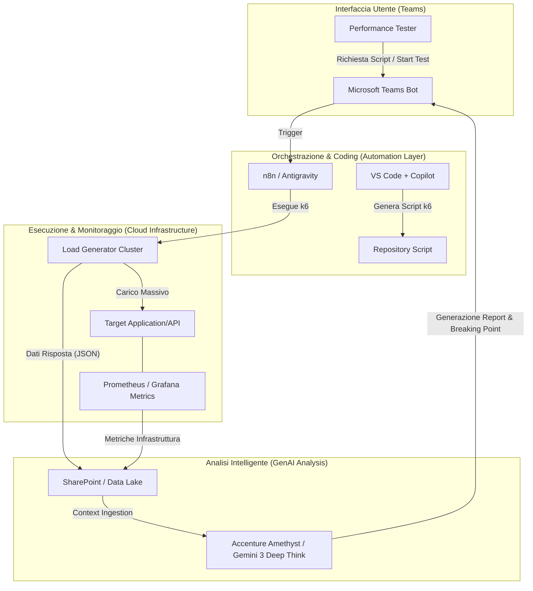
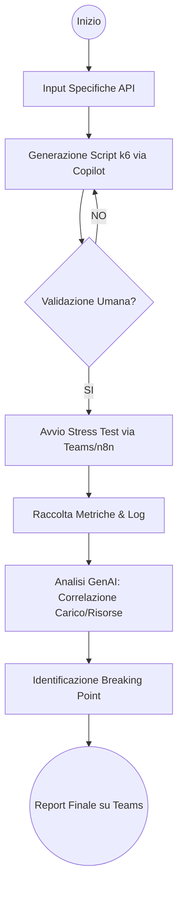
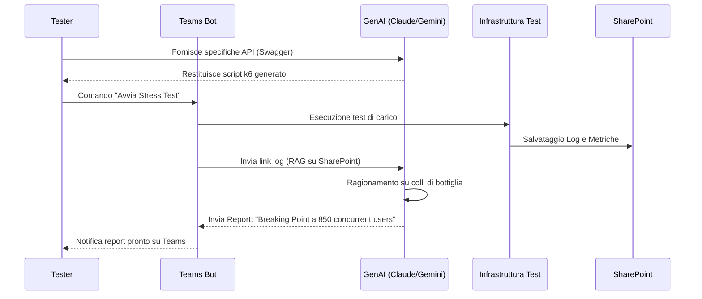

# Blueprint GenAI: Efficentamento del "Esecuzione Performance e Stress Test"

## 1. Descrizione del Caso d'Uso
**Categoria:** Testing & QA
**Titolo:** Esecuzione Performance e Stress Test
**Ruolo:** Performance Tester
**Obiettivo Originale (da CSV):** Realizzazione di test di carico simulando traffico massivo verso gli endpoint applicativi. Misurazione dei tempi di risposta, saturazione delle risorse infrastrutturali e individuazione del punto di rottura (stress test) prima del go-live.
**Obiettivo GenAI:** Automatizzare la generazione di script di test di carico (k6/JMeter) a partire da specifiche API e analizzare in modo intelligente i log di esecuzione per identificare i colli di bottiglia e il punto di rottura (breaking point) delle risorse infrastrutturali.

## 2. Fasi del Processo Efficentato

### Fase 1: Generazione Automatica dello Script di Test
In questa fase, l'LLM analizza la documentazione delle API (Swagger/OpenAPI) o una descrizione testuale degli endpoint per generare script di test di carico pronti all'uso in linguaggio k6 (JavaScript) o JMeter (XML).
*   **Tool Principale Consigliato:** `visualstudio + copilot`
*   **Alternative:** 1. `claude-code`, 2. `gemini-cli`
*   **Modelli LLM Suggeriti:** Anthropic Claude Sonnet 4.6 (eccelle nella generazione di script funzionali e sintatticamente corretti).
*   **Modalità di Utilizzo:** Utilizzo del Copilot Chat all'interno di VS Code per generare lo script k6.
    *   **Prompt Suggerito:** 
    ```text
    "Analizza questo file swagger.json e genera uno script k6 che simuli un carico incrementale (ramping-up) da 0 a 1000 Virtual Users in 5 minuti. Lo script deve validare che il tempo di risposta del 95% delle richieste sia inferiore a 200ms e che non ci siano errori HTTP 5xx. Includi il monitoraggio dei tempi di latenza per ogni endpoint principale."
    ```
*   **Azione Umana Richiesta:** Validazione dello script generato per assicurarsi che i parametri di autenticazione (token/API Key) siano configurati correttamente.
*   **Stima Reale di Efficienza:** 
    *   *Tempo As-Is (Manuale):* 3 ore (scrittura e debugging dello script).
    *   *Tempo To-Be (GenAI):* 10 minuti.
    *   *Risparmio %:* 94%
    *   *Motivazione:* L'AI elimina la scrittura manuale del boilerplate code e la mappatura degli endpoint.

### Fase 2: Orchestrazione ed Esecuzione del Test
L'esecuzione del test viene triggerata tramite un comando o un bot su Microsoft Teams, orchestrata da un workflow che avvia i container di carico e monitora l'infrastruttura.
*   **Tool Principale Consigliato:** `n8n`
*   **Alternative:** 1. `Google Antigravity`, 2. `Microsoft Teams (Chatbot UI)`
*   **Modelli LLM Suggeriti:** Google Gemini 3.1 Pro (per la gestione delle logiche di workflow e parsing degli output).
*   **Modalità di Utilizzo:** Un workflow n8n riceve il comando da un bot Teams, lancia lo script k6 su un cluster Kubernetes o istanza cloud e salva i risultati (CSV/JSON) su uno SharePoint aziendale.
*   **Azione Umana Richiesta:** Avvio del test tramite comando "Start Test" su Teams.
*   **Stima Reale di Efficienza:** 
    *   *Tempo As-Is (Manuale):* 1 ora (setup ambiente e avvio manuale).
    *   *Tempo To-Be (GenAI):* 5 minuti.
    *   *Risparmio %:* 92%
    *   *Motivazione:* Automazione completa del provisioning del carico e del data collection.

### Fase 3: Analisi dei Risultati e Individuazione Breaking Point
L'LLM analizza i dati di performance (tempi di risposta, CPU/RAM del server, Error Rate) per determinare l'esatto momento in cui il sistema è andato in stress e quale risorsa ha ceduto per prima.
*   **Tool Principale Consigliato:** `accenture ametyst`
*   **Alternative:** 1. `AI-Studio Google` (per dashboarding), 2. `ChatGPT Agent`
*   **Modelli LLM Suggeriti:** Google Gemini 3 Deep Think (ottimale per il ragionamento logico su serie temporali e correlazione di metriche).
*   **Modalità di Utilizzo:** Caricamento del file dei risultati (es. `results.json`) e dei log di monitoraggio infrastrutturale (es. Grafana/Prometheus) in Amethyst.
    *   **Prompt per l'analisi:**
    ```text
    "Analizza questi log di performance e le metriche di CPU/RAM del server. Identifica il 'Breaking Point', ovvero il numero di utenti simultanei in cui il tasso di errore ha superato l'1% o i tempi di risposta sono degradati oltre i 2 secondi. Spiega se il collo di bottiglia è causato dalla CPU, dalla memoria o da limiti del Database/Connessioni."
    ```
*   **Azione Umana Richiesta:** Revisione del report finale e approvazione delle raccomandazioni tecniche (es. scale-up risorsa).
*   **Stima Reale di Efficienza:** 
    *   *Tempo As-Is (Manuale):* 4 ore (analisi manuale di grafici e log).
    *   *Tempo To-Be (GenAI):* 15 minuti.
    *   *Risparmio %:* 94%
    *   *Motivazione:* L'AI correla istantaneamente migliaia di righe di log identificando pattern di saturazione invisibili ad occhio nudo.

## 3. Descrizione del Flusso Logico
Il flusso inizia con l'input delle specifiche API. L'architettura è **Single-Agent** per la generazione del codice (Copilot), mentre la fase di analisi utilizza un approccio **Single-Agent con Reasoning avanzato** (Gemini 3 Deep Think). I dati fluiscono dallo script k6 ai log di monitoraggio, vengono aggregati su SharePoint e infine "ingeriti" dall'LLM che produce un Executive Summary su Microsoft Teams. L'interazione umana è limitata alla validazione dello script iniziale e all'analisi del report finale.

## 4. Diagrammi UML (Mermaid.js)

### 4.1 Architecture Diagram


### 4.2 Process Diagram


### 4.3 Sequence Diagram


## 5. Guida all'Implementazione Tecnica

### Prerequisiti
- Licenza **Copilot for Microsoft 365** o **GitHub Copilot**.
- Accesso a **n8n** (self-hosted o cloud) per l'orchestrazione.
- Token API per **Google Gemini** (via AI-Studio) o accesso ad **Accenture Amethyst**.
- Infrastruttura di test (es. cluster Kubernetes per k6 o macchine EC2/Compute Engine).

### Step 1: Configurazione Generatore Script (Copilot)
1. Aprire VS Code nell'ambiente di sviluppo test.
2. Caricare il file `swagger.json` del progetto.
3. Utilizzare Copilot per generare il file `performance_test.js` usando il prompt indicato nella Fase 1.
4. Eseguire un "dry-run" locale con 1 VU (Virtual User) per verificare la connettività.

### Step 2: Automazione con n8n e Teams
1. Creare un workflow in n8n con un trigger **Microsoft Teams (Command Activity)**.
2. Aggiungere un nodo **SSH** o **HTTP Request** per invocare l'esecuzione di k6 sull'infrastruttura di test.
3. Configurare un nodo **Google Drive/SharePoint** per caricare l'output JSON del test al termine.

### Step 3: Configurazione Analisi (Amethyst/Gemini)
1. Creare un Agent in **Accenture Amethyst** (o un prompt configurato in Gemini 3).
2. Definire il **System Prompt**: 
   *"Sei un esperto di Performance Engineering. Analizzerai file JSON di output di k6 e log di sistema. Il tuo compito è identificare il momento esatto in cui i tempi di risposta superano la soglia di tolleranza o il sistema restituisce errori, correlando questo evento con il picco di utilizzo di CPU o RAM."*
3. Collegare l'output di n8n all'input dell'Agent per generare il report finale in formato Markdown.

## 6. Rischi e Mitigazioni
- **Rischio: Allucinazione nell'analisi delle metriche.** L'AI potrebbe interpretare un glitch di rete come un collo di bottiglia infrastrutturale. -> **Mitigazione:** L'analisi deve essere validata da un Performance Tester senior; l'AI fornisce i dati correlati, ma l'uomo conferma la causa radice.
- **Rischio: Saturazione involontaria di sistemi di produzione.** -> **Mitigazione:** Configurare gli script GenAI affinché puntino esclusivamente a URL dell'ambiente di Stage/UAT definiti in una whitelist di sicurezza.
- **Rischio: Dati Sensibili nei Log.** -> **Mitigazione:** Utilizzare **OpenClaw** con modelli locali (Llama 4) se i log contengono informazioni PII o dati sensibili non mascherati.
