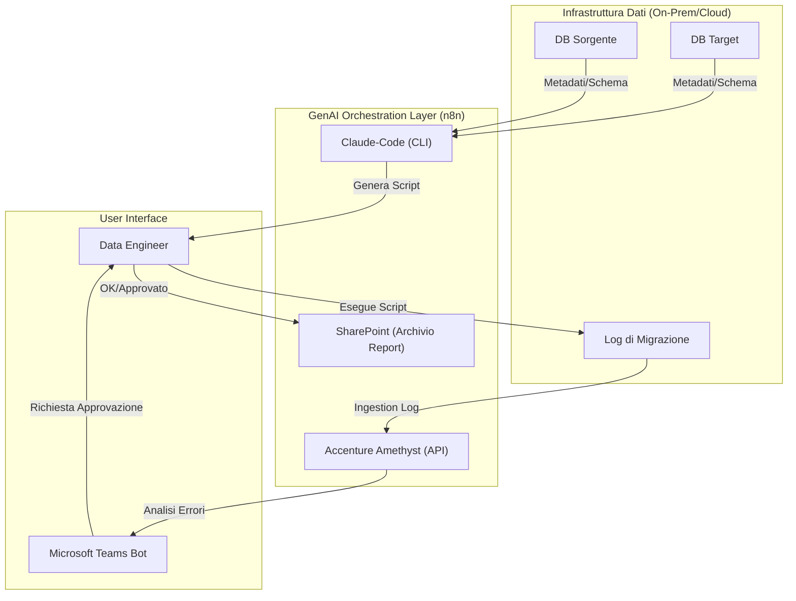
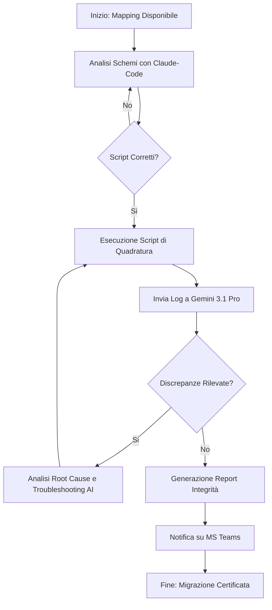
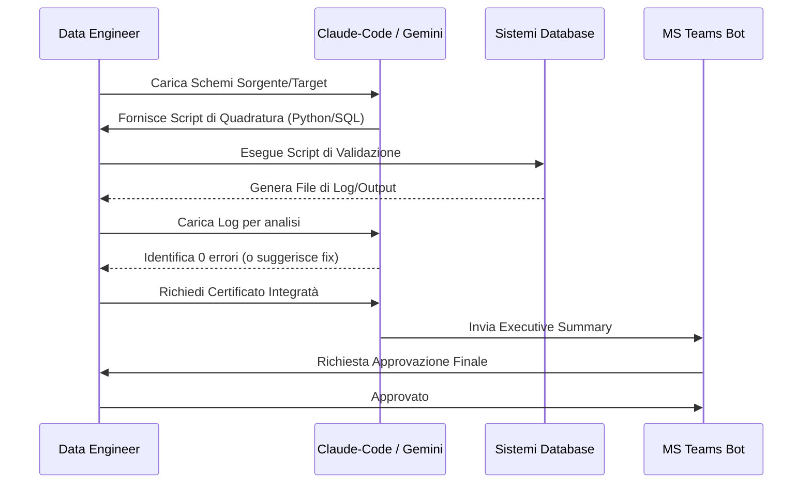

# Blueprint GenAI: Efficentamento della "Validazione Integrità Dati Post-Migrazione"

## 1. Descrizione del Caso d'Uso
**Categoria:** Testing & QA
**Titolo:** Validazione Integrità Dati Post-Migrazione
**Ruolo:** Data Engineer
**Obiettivo Originale (da CSV):** Sviluppo ed esecuzione di script complessi per la quadratura automatica dei record e delle strutture dati a seguito di migrazioni di storage o database, certificando che nessuna informazione sia stata persa o corrotta nel processo.
**Obiettivo GenAI:** Automatizzare la generazione di script di validazione (SQL/Python) basati sul mapping sorgente-destinazione e fornire un'analisi intelligente delle discrepanze rilevate tramite un'interfaccia Chatbot.

## 2. Fasi del Processo Efficentato

### Fase 1: Ingestion Mapping e Generazione Script
In questa fase, l'LLM analizza i documenti di mapping (es. Excel o DDL dei DB) e genera automaticamente gli script di quadratura (checksum, row count, campionamento valori).
*   **Tool Principale Consigliato:** `claude-code`
*   **Alternative:** 1. `visualstudio + copilot`, 2. `gemini-cli`
*   **Modelli LLM Suggeriti:** Anthropic Claude Sonnet 4.6 (eccellente nella precisione del codice e nella logica booleana).
*   **Modalità di Utilizzo:** Utilizzo di `claude-code` da terminale per analizzare la cartella contenente gli schemi SQL e generare una suite di script Python/SQL di validazione.
    *   *Bozza Prompt:* "Analizza i file DDL in /source e /target. Genera uno script Python che esegua il conteggio dei record per ogni tabella, calcoli il checksum per le colonne numeriche e verifichi la presenza di NULL nelle chiavi primarie, evidenziando le differenze tra i due ambienti."
*   **Azione Umana Richiesta:** Revisione della logica di campionamento proposta dallo script per garantire la copertura dei casi limite.
*   **Stima Reale di Efficienza:** 
    *   *Tempo As-Is (Manuale):* 6 ore (scrittura e test script complessi)
    *   *Tempo To-Be (GenAI):* 20 minuti
    *   *Risparmio %:* 94%
    *   *Motivazione:* L'AI traduce istantaneamente il mapping in codice eseguibile, eliminando errori di sintassi e dimenticanze.

### Fase 2: Esecuzione e Analisi Discrepanze
Gli script vengono eseguiti (manualmente o tramite pipeline). I log di output, spesso massivi, vengono processati dall'AI per identificare pattern di errore (es. troncamento dati dovuto a mismatch di encoding).
*   **Tool Principale Consigliato:** `accenture ametyst`
*   **Alternative:** 1. `chatgpt agent`, 2. `OpenClaw` (per dati sensibili)
*   **Modelli LLM Suggeriti:** Google Gemini 3.1 Pro (per l'ampia context window necessaria ad analizzare log voluminosi).
*   **Modalità di Utilizzo:** Caricamento dei file di log della migrazione su Amethyst per identificare la "Root Cause" di eventuali discrepanze.
*   **Azione Umana Richiesta:** Validazione tecnica della causa identificata (es. conferma che un errore di encoding è dovuto al set di caratteri del nuovo DB).
*   **Stima Reale di Efficienza:** 
    *   *Tempo As-Is (Manuale):* 4 ore (analisi manuale log e debugging)
    *   *Tempo To-Be (GenAI):* 15 minuti
    *   *Risparmio %:* 93%
    *   *Motivazione:* L'AI correla istantaneamente migliaia di righe di log trovando l'anomalia comune.

### Fase 3: Certificazione e Reporting su Teams
Generazione di un report sintetico di "Data Integrity" e notifica al team tramite Microsoft Teams.
*   **Tool Principale Consigliato:** `n8n` + `Microsoft Teams (Chatbot UI)`
*   **Alternative:** 1. `copilot studio`
*   **Modelli LLM Suggeriti:** OpenAI GPT-5.4
*   **Modalità di Utilizzo:** Un workflow n8n riceve l'esito dell'analisi, formatta un Executive Summary e lo invia sul canale Teams del progetto, chiedendo l'approvazione finale al Data Engineer.
*   **Azione Umana Richiesta:** Firma digitale o approvazione formale via chat per chiudere l'attività di migrazione.
*   **Stima Reale di Efficienza:** 
    *   *Tempo As-Is (Manuale):* 1 ora (scrittura report e mail)
    *   *Tempo To-Be (GenAI):* 5 minuti
    *   *Risparmio %:* 92%
    *   *Motivazione:* Il report viene generato dai dati di output in tempo reale.

## 3. Descrizione del Flusso Logico
Il processo è **Single-Agent** orchestrato via script o n8n. L'input iniziale sono i metadati dei database. L'AI agisce prima come "Scrittore di Codice" (Fase 1), poi come "Analista di Log" (Fase 2) e infine come "Comunicatore" (Fase 3). L'interazione umana è posizionata come checkpoint critico dopo la generazione del codice e prima della chiusura formale del report di integrità.

## 4. Diagrammi UML (Mermaid.js)

### 4.1 Architecture Diagram

### 4.2 Process Diagram

### 4.3 Sequence Diagram

## 5. Guida all'Implementazione Tecnica
### Prerequisiti
- Accesso a `claude-code` via terminale.
- Licenza `n8n` (self-hosted o cloud).
- API Key per `Gemini 3.1 Pro` (tramite Google Cloud Vertex AI o AI-Studio).
- Webhook configurato su un canale Microsoft Teams.

### Step 1: Generazione Script
1. Esportare il DDL delle tabelle coinvolte in file `.sql`.
2. Eseguire `claude-code` nella cartella: `claude-code "Genera uno script python per comparare row count e checksum md5 delle tabelle descritte nei file SQL qui presenti"`.
3. Testare lo script su un campione limitato.

### Step 2: Automazione n8n
1. Creare un workflow che monitora una cartella SharePoint per nuovi file di log.
2. Utilizzare il nodo "HTTP Request" per inviare il contenuto del log all'LLM (Gemini 3.1 Pro) con un System Prompt dedicato all'analisi dei dati di migrazione.
3. Se il risultato dell'LLM indica "Successo", procedere al nodo "Microsoft Teams" per l'invio della card di approvazione.

## 6. Rischi e Mitigazioni
- **Rischio 1: Falsi Negativi (Errori non rilevati) ->** **Mitigazione:** Implementare sempre un controllo del "Row Count" come baseline assoluta prima di controlli più complessi e richiedere campionamento casuale manuale del 1% dei record.
- **Rischio 2: Sicurezza Dati Sensibili ->** **Mitigazione:** Utilizzare modelli tramite `OpenClaw` (on-premise) o `Accenture Amethyst` che garantiscono la confidenzialità dei dati; non inviare mai i dati reali all'LLM, ma solo le strutture e i log di errore (che contengono metadati, non valori).
