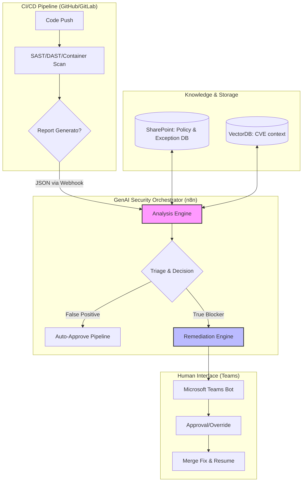
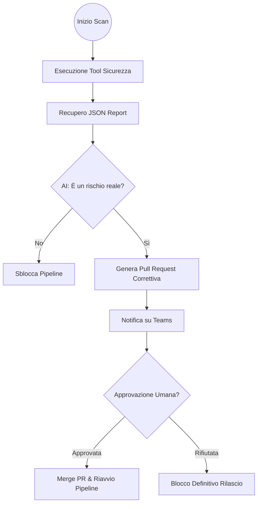
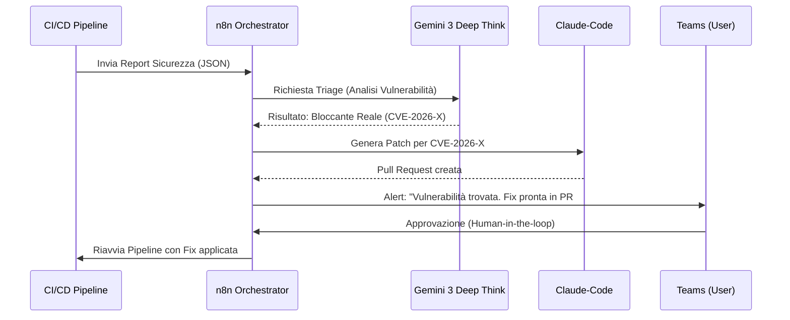

# Blueprint GenAI: Efficentamento del "Automazione Test Sicurezza (DevSecOps)"

## 1. Descrizione del Caso d'Uso
**Categoria:** Testing & QA
**Titolo:** Automazione Test Sicurezza (DevSecOps)
**Ruolo:** DevSecOps Engineer
**Obiettivo Originale (da CSV):** Integrazione di tool SAST (Static Application Security Testing), DAST (Dynamic) e scanner di vulnerabilità per container all'interno delle pipeline di CI/CD, bloccando i rilasci non sicuri.
**Obiettivo GenAI:** Automatizzare l'analisi dei report generati dai tool di sicurezza (SAST/DAST/Container Scan) per distinguere i falsi positivi dalle minacce reali e generare suggerimenti di remediation immediata nel codice IaC o applicativo, accelerando il processo di triage e approvazione dei blocchi in pipeline.

## 2. Fasi del Processo Efficentato

### Fase 1: Ingestion e Triage Intelligente degli Alert
In questa fase, i report JSON generati dai tool (es. SonarQube, Snyk, OWASP ZAP) vengono inviati a un motore GenAI per un'analisi semantica.
*   **Tool Principale Consigliato:** `n8n`
*   **Alternative:** 1. `gemini-cli`, 2. `Google Antigravity`
*   **Modelli LLM Suggeriti:** `Google Gemini 3 Deep Think` (ottimale per il ragionamento logico su vulnerabilità incrociate).
*   **Modalità di Utilizzo:** Un workflow n8n riceve il report via Webhook al termine della pipeline CI/CD. Il nodo AI confronta le vulnerabilità trovate con lo storico delle eccezioni approvate (su SharePoint) e decide se la vulnerabilità è un "False Positive" o un "True Blocker".
    *   **Bozza Prompt per Triage:**
    ```text
    Analizza il seguente report JSON di sicurezza (SAST/DAST).
    Identifica le vulnerabilità con Severity 'High' o 'Critical'.
    Per ogni vulnerabilità, verifica se il contesto del codice (fornito in allegato) rende il rischio effettivo o se si tratta di un falso positivo (es. variabile hardcoded in ambiente di test isolato).
    Output richiesto: JSON con { "is_blocker": boolean, "reasoning": "string", "suggested_fix": "string" }.
    ```
*   **Azione Umana Richiesta:** Validazione della decisione dell'AI solo per i casi marcati come "Ambiguous".
*   **Stima Reale di Efficienza:** 
    *   *Tempo As-Is (Manuale):* 2 ore per triage manuale dei report.
    *   *Tempo To-Be (GenAI):* 2 minuti.
    *   *Risparmio %:* 98%
    *   *Motivazione:* L'AI processa migliaia di righe di log e report istantaneamente, correlandole al contesto del codice.

### Fase 2: Generazione Automatica di Patch e Remediation
L'AI genera il codice corretto per risolvere la vulnerabilità riscontrata (es. sanificazione input, aggiornamento versione immagine Docker).
*   **Tool Principale Consigliato:** `claude-code`
*   **Alternative:** 1. `visualstudio + copilot`, 2. `gemini-cli`
*   **Modelli LLM Suggeriti:** `Anthropic Claude 4.6 Sonnet` (per precisione estrema nel refactoring del codice).
*   **Modalità di Utilizzo:** Se la Fase 1 identifica un bloccante, `claude-code` viene invocato via CLI per analizzare il repository e proporre una Pull Request correttiva automatica.
*   **Azione Umana Richiesta:** Il DevSecOps Engineer o lo Sviluppatore deve approvare la Pull Request generata.
*   **Stima Reale di Efficienza:** 
    *   *Tempo As-Is (Manuale):* 1 ora per scrivere e testare la fix.
    *   *Tempo To-Be (GenAI):* 5 minuti (inclusa creazione PR).
    *   *Risparmio %:* 92%
    *   *Motivazione:* La generazione di patch standard per vulnerabilità comuni (es. SQL Injection, CVE su container) è un task ideale per modelli di coding avanzati.

### Fase 3: Notifica e Governance su Microsoft Teams
Interazione finale con il team per la gestione dell'eccezione o conferma del blocco rilascio.
*   **Tool Principale Consigliato:** `Microsoft Teams (Chatbot UI)` tramite `Copilot Studio`
*   **Alternative:** 1. `n8n` (Node: Teams Send Message)
*   **Modelli LLM Suggeriti:** `OpenAI GPT-5.4`
*   **Modalità di Utilizzo:** Il bot invia una card interattiva su Teams con il riepilogo: "Vulnerabilità bloccante rilevata in Pipeline X. Proposta di fix disponibile qui [Link PR]. Vuoi procedere con il blocco o approvare un'eccezione temporanea?".
*   **Azione Umana Richiesta:** Clic su "Approve Fix" o "Override (Manager Approval)".
*   **Stima Reale di Efficienza:** 
    *   *Tempo As-Is (Manuale):* 30 minuti di meeting/email per decidere il da farsi.
    *   *Tempo To-Be (GenAI):* 1 minuto (scelta rapida da UI familiare).
    *   *Risparmio %:* 96%
    *   *Motivazione:* Centralizza la decisione operativa dove il team già lavora.

## 3. Descrizione del Flusso Logico
Il flusso inizia nel momento in cui una pipeline CI/CD (GitHub Actions/GitLab) termina l'esecuzione dei tool di sicurezza standard. Invece di far fallire la pipeline e attendere un'analisi umana, i risultati vengono inviati a un orchestratore (**n8n**). 

L'orchestratore interroga **Gemini 3 Deep Think** per contestualizzare i risultati (RAG su documentazione di sicurezza interna salvata su **SharePoint**). Se viene confermato un rischio critico, viene attivato **claude-code** per preparare una fix nel repository. Infine, il verdetto e la proposta di fix vengono notificati su **Microsoft Teams**, dove l'umano prende la decisione finale. L'approccio è **Single-Agent** per il triage, ma può evolvere in **Multi-Agent** se si separa l'agente di Analisi (Security Analyst) dall'agente di Codifica (Developer Agent).

## 4. Diagrammi UML (Mermaid.js)

### 4.1 Architecture Diagram


### 4.2 Process Diagram


### 4.3 Sequence Diagram


## 5. Guida all'Implementazione Tecnica

### Prerequisiti
- Licenza **n8n** (Cloud o Self-hosted).
- API Key per **Google Gemini API** e **Anthropic API**.
- Accesso a **Microsoft Copilot Studio** per il bot Teams.
- Pipeline CI/CD con accesso in uscita verso i webhook di n8n.

### Step 1: Configurazione n8n Workflow
1. Crea un nuovo workflow con un nodo **Webhook** (metodo POST).
2. Aggiungi un nodo **HTTP Request** per scaricare i file di codice sorgente relativi alla vulnerabilità segnalata.
3. Inserisci un nodo **AI Agent** che utilizzi il modello `gemini-3-deep-think`.
4. Collega un nodo **Microsoft Teams** per l'invio della card di approvazione.

### Step 2: Integrazione CI/CD
1. Aggiungi uno step finale alla tua pipeline (es. `.github/workflows/security.yml`):
   ```yaml
   - name: Send Report to GenAI
     run: |
       curl -X POST -H "Content-Type: application/json" \
            -d @sast-report.json \
            https://n8n.yourdomain.com/webhook/security-triage
   ```

### Step 3: Setup Bot su Teams
1. In **Copilot Studio**, crea un bot chiamato "Security Shield".
2. Configura un topic che scatta alla ricezione del webhook da n8n.
3. Utilizza le "Adaptive Cards" per mostrare il pulsante "Approva Fix".

## 6. Risks and Mitigations
- **Rischio: Allucinazioni nel codice della fix** -> **Mitigazione:** Obbligo di Human-in-the-loop (l'approvazione umana è bloccante) e riesecuzione dei test unitari automatici sulla nuova PR.
- **Rischio: Esposizione codice sorgente a LLM pubblici** -> **Mitigazione:** Utilizzo di versioni "Enterprise" dei modelli (Vertex AI / Azure OpenAI) con garanzia di non-training sui dati o uso di modelli locali tramite **OpenClaw** per i file più sensibili.
- **Rischio: Latenza della pipeline** -> **Mitigazione:** Eseguire l'analisi GenAI in parallelo ai test di integrazione, in modo che il verdetto sia pronto nel momento in cui i test finiscono.
