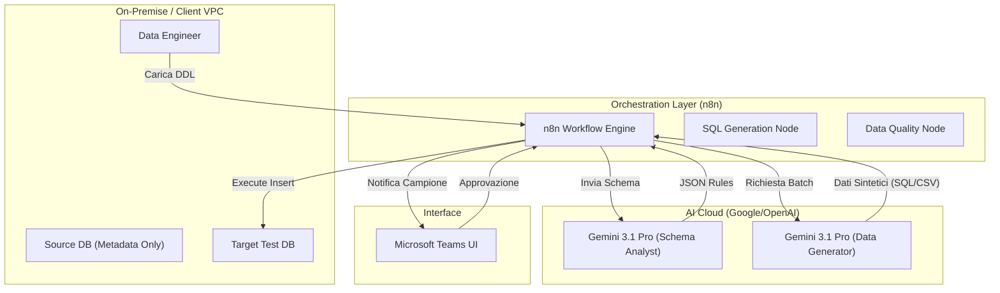
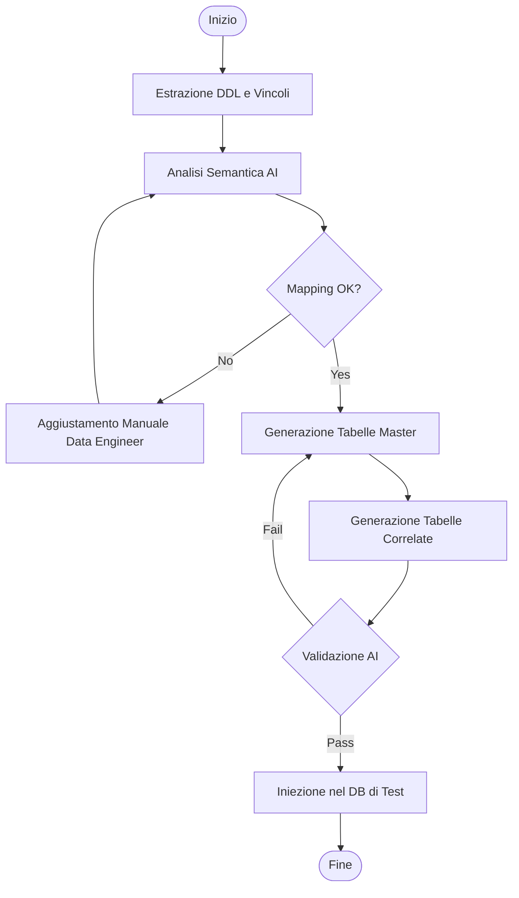
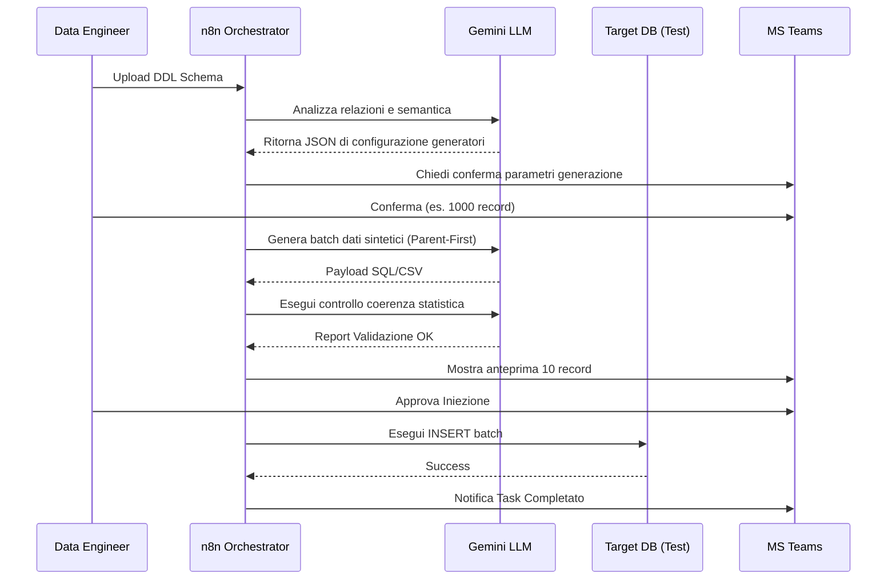

# Blueprint GenAI: Efficentamento della "Generazione Automatica Dati Sintetici"

## 1. Descrizione del Caso d'Uso
**Categoria:** Testing & QA
**Titolo:** Generazione Automatica Dati Sintetici
**Ruolo:** Data Engineer
**Obiettivo Originale (da CSV):** Utilizzo di modelli generativi per creare dataset sintetici realistici e coerenti dal punto di vista relazionale, da utilizzare in ambienti di test e sviluppo, eliminando del tutto la necessità di copiare dati di produzione (Zero-Trust Data).
**Obiettivo GenAI:** Automatizzare la creazione di dataset sintetici che preservino l'integrità referenziale e le proprietà statistiche del database originale partendo esclusivamente dallo schema (DDL) e da metadati descrittivi, garantendo la totale assenza di dati reali (PII) negli ambienti non-prod.

## 2. Fasi del Processo Efficentato

### Fase 1: Analisi dello Schema e Definizione delle Ontologie
In questa fase, l'AI analizza i file DDL (Data Definition Language) o gli export dello schema del database per comprendere tabelle, chiavi primarie, chiavi esterne e vincoli di dominio.
*   **Tool Principale Consigliato:** `claude-code`
*   **Alternative:** 1. `gemini-cli`, 2. `visualstudio + copilot`
*   **Modelli LLM Suggeriti:** Anthropic Claude 4.6 Sonnet (ottimizzato per l'analisi di strutture di codice e schemi complessi).
*   **Modalità di Utilizzo:** Utilizzo di `claude-code` da terminale per scansionare la cartella contenente gli script SQL.
    *   *Esempio Prompt/Comando:* `claude-code "Analizza questi file .sql e genera un file JSON di configurazione che mappi ogni colonna a un tipo di generatore sintetico (es. NOME_REALE, EMAIL_SINTETICA, DATA_COERENTE), mantenendo i vincoli di Foreign Key."`
*   **Azione Umana Richiesta:** Il Data Engineer revisiona il file JSON di mappatura per assicurarsi che le semantiche di business (es. "Stato Ordine") siano interpretate correttamente.
*   **Stima Reale di Efficienza:** 
    *   *Tempo As-Is (Manuale):* 8 ore (analisi manuale di schemi complessi).
    *   *Tempo To-Be (GenAI):* 10 minuti.
    *   *Risparmio %:* 98%
    *   *Motivazione:* L'AI identifica istantaneamente le relazioni cross-tabella che richiederebbero ore di studio della documentazione.

### Fase 2: Orchestrazione Workflow di Generazione
Creazione del workflow che interroga l'LLM per generare i record effettivi seguendo le regole definite nella Fase 1.
*   **Tool Principale Consigliato:** `n8n`
*   **Alternative:** 1. `Google Antigravity`, 2. `OpenAI Codex` (via script Python).
*   **Modelli LLM Suggeriti:** Google Gemini 3.1 Pro (grazie alla context window enorme per gestire dizionari di dati voluminosi).
*   **Modalità di Utilizzo:** Workflow n8n con nodo "HTTP Request" verso le API Gemini. Il workflow legge lo schema, chiede all'LLM di generare N record per tabella in ordine topologico (prima le tabelle "parent", poi le "child") per rispettare i vincoli.
*   **Azione Umana Richiesta:** Definizione del volume di dati richiesto (es. "genera 1000 utenti e 5000 ordini").
*   **Stima Reale di Efficienza:** 
    *   *Tempo As-Is (Manuale):* 16 ore (scrittura di script di mascheramento o generatori custom).
    *   *Tempo To-Be (GenAI):* 30 minuti (tempo di esecuzione del workflow).
    *   *Risparmio %:* 97%
    *   *Motivazione:* Eliminazione della necessità di scrivere codice procedurale per ogni singola tabella.

### Fase 3: Validazione Coerenza e Iniezione
Verifica finale della qualità dei dati (es. se le date di consegna sono successive alle date d'ordine) e caricamento nel DB di test.
*   **Tool Principale Consigliato:** `Microsoft Teams (Chatbot UI)` (via Copilot Studio)
*   **Alternative:** 1. `accenture ametyst`, 2. `AI-Studio google` (per dashboard di reportistica).
*   **Modelli LLM Suggeriti:** OpenAI GPT-5.4.
*   **Modalità di Utilizzo:** Un bot su Teams notifica il completamento del job e fornisce un campione di dati. Il Data Engineer può chiedere in chat: "Controlla se ci sono anomalie nelle correlazioni tra le tabelle Fatture e Pagamenti".
*   **Azione Umana Richiesta:** Approvazione finale ("Approve injection") tramite pulsante interattivo su Teams.
*   **Stima Reale di Efficienza:** 
    *   *Tempo As-Is (Manuale):* 4 ore (query di controllo manuali).
    *   *Tempo To-Be (GenAI):* 5 minuti.
    *   *Risparmio %:* 98%
    *   *Motivazione:* L'AI agisce come un auditor istantaneo sui dati generati.

## 3. Descrizione del Flusso Logico
L'approccio è **Single-Agent orchestrato via n8n**. Un unico agente logico (alimentato da Gemini 3.1 Pro) riceve in input i metadati del database e produce in output i comandi SQL di `INSERT`. n8n funge da orchestratore per garantire che l'ordine di inserimento rispetti le Foreign Keys (evitando errori di violazione vincoli). Il flusso è "Zero-Trust" perché il modello non vede mai i dati reali, ma solo i nomi delle colonne e i tipi di dato.

## 4. Diagrammi UML (Mermaid.js)

### 4.1 Architecture Diagram


### 4.2 Process Diagram


### 4.3 Sequence Diagram


## 5. Guida all'Implementazione Tecnica
### Prerequisiti
- Accesso a un'istanza **n8n** (Cloud o Self-hosted).
- API Key per **Google Gemini API** (Modello Gemini 3.1 Pro).
- Licenza **Copilot Studio** per l'integrazione con Microsoft Teams.
- Accesso in lettura ai file DDL del database sorgente.

### Step 1: Analisi dello Schema
1. Esporta lo schema del database (senza dati!) in un file `.sql`.
2. Utilizza `claude-code` per generare il piano di generazione:
   ```bash
   claude-code "Leggi schema.sql. Crea un piano di generazione dati sintetici per 5 tabelle core. Assicurati che gli ID autoincrementali siano gestiti e che le date d'ordine siano coerenti."
   ```

### Step 2: Configurazione n8n
1. Crea un nuovo workflow in n8n.
2. Inserisci un nodo **HTTP Request** che effettua un POST verso le API di Gemini.
3. Nel body della richiesta, passa il prompt: `"Genera 50 record SQL per la tabella 'Clienti' seguendo questo schema: [DDL]. Usa nomi italiani realistici."`.
4. Utilizza i nodi **Merge** o **Execute Workflow** per concatenare le tabelle in ordine di dipendenza gerarchica.

### Step 3: Integrazione Teams
1. In **Copilot Studio**, crea un bot che interroga il webhook di n8n.
2. Configura un messaggio di "Adaptive Card" per mostrare l'anteprima dei dati generati all'utente prima del caricamento finale.

## 6. Rischi e Mitigazioni
- **Rischio: Violazione Vincoli Relazionali** -> **Mitigazione:** L'orchestratore n8n gestisce l'ordine topologico delle tabelle, garantendo che le chiavi esterne esistano prima di inserire i record figli.
- **Rischio: Dati non realistici (Allucinazioni)** -> **Mitigazione:** Human-in-the-loop obbligatorio su Teams per validare l'anteprima del campione generato.
- **Rischio: Performance di Iniezione** -> **Mitigazione:** Utilizzo di caricamenti batch (BULK INSERT) invece di singole righe per volumi superiori ai 10k record.
