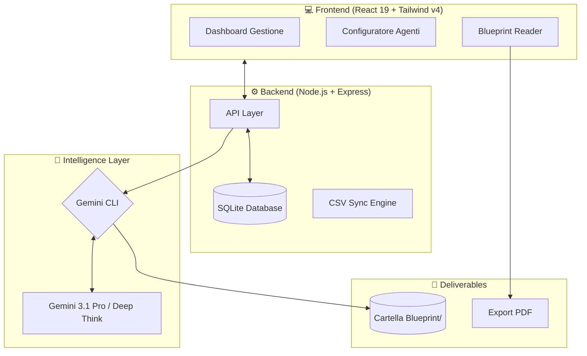

# 🚀 BlueprintAI - Enterprise GenAI Blueprinting Platform

## 📖 Descrizione
**BlueprintAI** è una piattaforma avanzata di orchestrazione GenAI progettata per la generazione massiva di "Blueprint" architetturali e operativi per infrastrutture IT Enterprise. Basata su **Gemini CLI (v2026)**, la soluzione trasforma use case complessi in documentazione tecnica ad alta fedeltà.

Il sistema non è più solo una raccolta di script, ma una **WebApp Full-stack** che permette di:
- 📊 **Gestire Use Case:** Database SQLite integrato per catalogare centinaia di asset infrastrutturali.
- 🧠 **Engine Config:** Configurazione dinamica dei System Prompt (Agenti) per diverse strategie di generazione.
- 📖 **High-Fidelity Reader:** Visualizzatore Markdown con supporto nativo per Mermaid.js, KaTeX e GeoJSON.
- 📄 **Advanced PDF Export:** Esportazione professionale con gestione automatica dei colori e layout ottimizzato per la stampa.

---

## 🏗️ Architettura del Sistema



---

## 🛠️ Installazione e Avvio Rapido

Il progetto è gestito da un unico orchestratore `start_app.sh` che automatizza la gestione dei processi.

### 1. Prerequisiti
- **Node.js** (v20+) e **npm**.
- **Gemini CLI** installato e configurato nel PATH.
- **Chiave API:** `export GEMINI_API_KEY="tua_chiave"` impostata nell'ambiente.

### 2. Setup Iniziale
```bash
# Rendi eseguibili gli script
chmod +x *.sh

# Installa tutte le dipendenze (Backend + Frontend)
./start_app.sh install
```

### 3. Comandi di Gestione
| Comando | Descrizione |
| :--- | :--- |
| `./start_app.sh start` | Avvia Backend (Porta 5000) e Frontend (Porta 5173) in background. |
| `./start_app.sh status` | Controlla lo stato dei servizi e mostra le ultime righe dei log. |
| `./start_app.sh stop` | Arresta in modo pulito tutti i processi attivi. |
| `./start_app.sh restart` | Esegue un ciclo stop/start completo. |

---

## 💎 Caratteristiche Tecniche Avanzate

### 🎨 Rendering PDF "Pure CSS"
A differenza delle soluzioni standard, BlueprintAI implementa un sistema di **PostCSS Transpilation** per garantire la compatibilità dell'export PDF con Tailwind CSS v4. Le variabili colore moderne (oklch) vengono convertite automaticamente in RGB durante il processo di generazione per evitare crash dei motori di rendering (`html2canvas`).

### 🔒 Governance e Privacy
- **Isolamento Dati:** Le cartelle `Blueprint/` e `Backup/` sono inserite nel `.gitignore`.
- **Human-in-the-loop:** Ogni documento generato è progettato per essere validato da un Cloud Architect prima della consegna finale.

---

## 🛠️ Script di Manutenzione
- `backup.sh`: Esegue il backup compresso dell'intero database e dei file generati.
- `github_push.sh`: Sincronizza il codice della piattaforma (escludendo i dati sensibili).
- `update_from_github.sh`: Aggiorna la logica degli Agenti e degli script all'ultima versione.

---

## ✒️ Author
**Developed by Carmelo Battiato**  
*Enterprise AI Infrastructure Architect*  
© 2026 - Tutti i diritti riservati.
