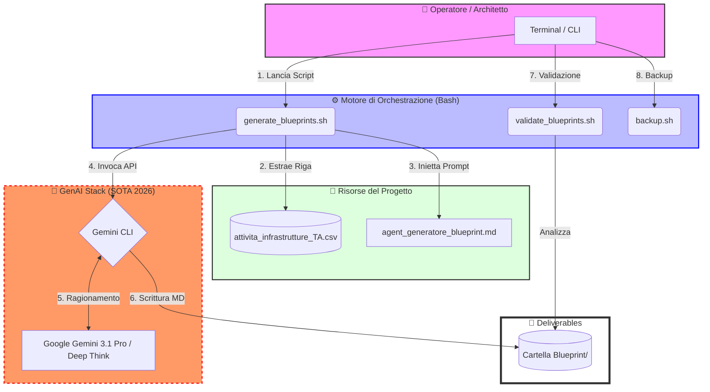
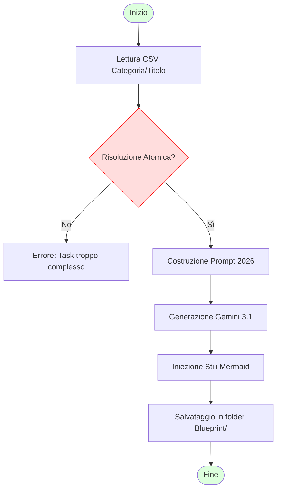

#  🚀 Enterprise GenAI Infrastructure Blueprint Generator

## 📖 Descrizione
Questo progetto è un framework di automazione avanzato basato su **Gemini CLI** (Marzo 2026) progettato per generare massivamente "Blueprint" architetturali e operativi per infrastrutture IT di livello Enterprise. 

Partendo da un elenco di Use Case definiti in un file CSV (es. Architetture Cloud, RAG, MCP, Multi-Agent), il sistema utilizza un **Agent GenAI specializzato** per produrre documenti Markdown completi di:
- 🏛️ **Architetture di Sistema** (Mermaid.js)
- 🔄 **Diagrammi di Processo e Sequenza**
- 📊 **Stime di ROI e Efficienza**
- 🛠️ **Guide all'Implementazione Tecnica**

---

## 🏗️ Architettura del Sistema



---

## 📋 Prerequisiti

> [!IMPORTANT]
> Assicurati di aver configurato correttamente le variabili d'ambiente per l'accesso alle API.

1. **OS:** macOS (Darwin), Linux o WSL2.
2. **Gemini CLI:** Versione 2026 installata (`gemini --version`).
3. **Node.js:** Richiesto per il linter `validate_blueprints.sh` (npx).
4. **Chiave API:** `export GEMINI_API_KEY="tua_chiave"` impostata nel profilo shell.

---

## 🚀 Installazione e Aggiornamento

Se è la prima volta che utilizzi il generatore in questo ambiente:

1. **Clonazione:**
   ```bash
   git clone https://github.com/carmelobattiato/Generatore-Blueprint-GenAI.git
   cd Generatore-Blueprint-GenAI
   ```

2. **Aggiornamento Rapido:**
   Se hai già il progetto ma vuoi scaricare l'ultima logica dell'Agent e degli script:
   ```bash
   chmod +x *.sh
   ./update_from_github.sh
   ```

---

## 🛠️ Utilizzo degli Script

### 1. Generazione Blueprint (`generate_blueprints.sh`)
Lo script più importante. Supporta due modalità di esecuzione:

- **Per Range di ID:**
  ```bash
  ./generate_blueprints.sh 1 10
  ```
- **Per ID Specifici (Lista):**
  ```bash
  ./generate_blueprints.sh "02;05;69"
  ```

### 2. Validazione Qualità (`validate_blueprints.sh`)
Controlla che l'AI non abbia commesso errori di sintassi Markdown o Mermaid.js:
```bash
./validate_blueprints.sh Blueprint/
```
> [!TIP]
> Puoi validare anche un singolo file: `./validate_blueprints.sh Blueprint/01_blueprint_...md`

### 3. Allineamento Cloud (`github_push.sh`)
Invia le modifiche al repository GitHub. Salva il tuo Personal Access Token (PAT) dopo il primo invio grazie all'helper `store`.
```bash
./github_push.sh
```

---

## 🔄 Flusso Operativo Atomico



---

## 🔒 Sicurezza e Governance (Infrastrutture T&A)

> [!WARNING]
> **Data Privacy:** Le cartelle `Blueprint/` e `Backup/` sono inserite nel `.gitignore`. 
> I documenti generati NON vengono mai caricati su GitHub per preservare la riservatezza delle architetture dei clienti.

Il generatore segue il paradigma **Human-in-the-loop**: ogni blueprint prodotta dall'AI richiede la validazione finale di un Cloud Architect o di un Bid Manager per garantire l'aderenza alle specifiche tecniche reali.
