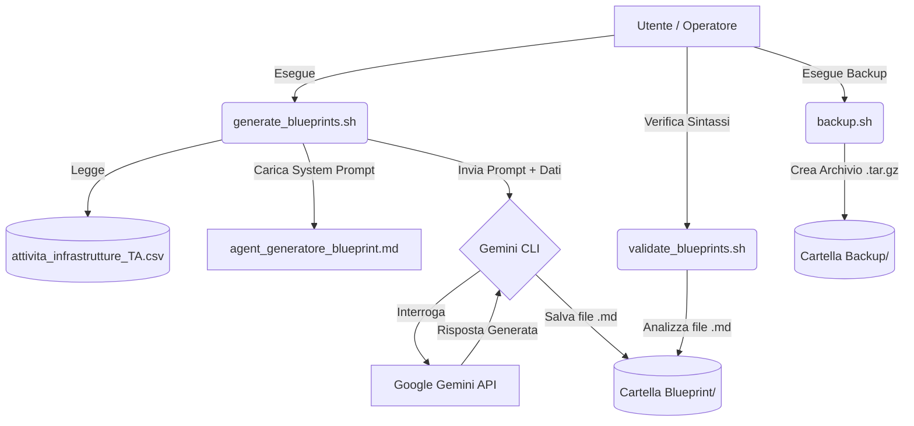
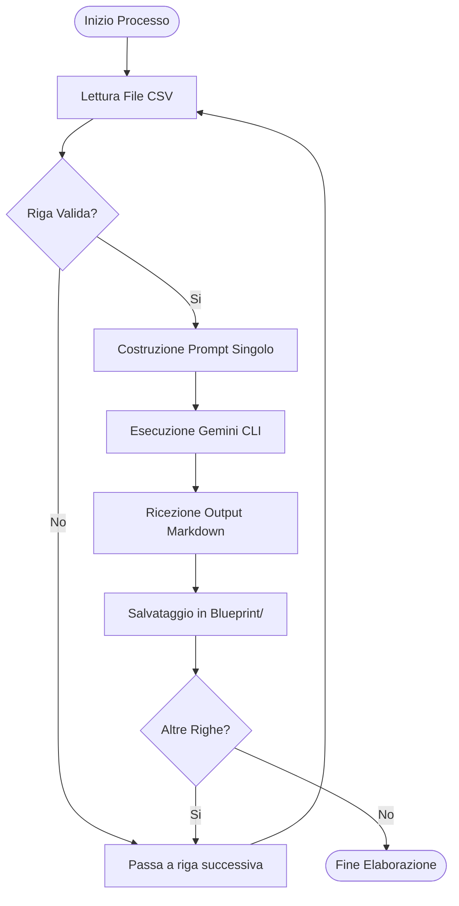
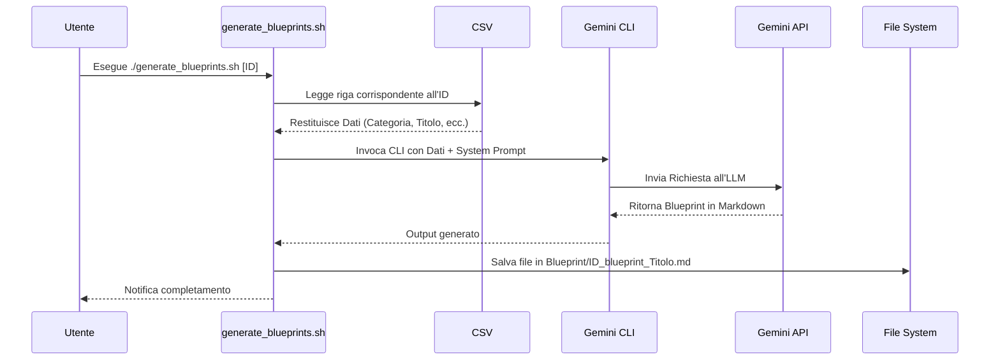

# 🚀 Enterprise GenAI Infrastructure Blueprint Generator

## 📖 Descrizione
Questo progetto è un framework di automazione basato su **Gemini CLI** che permette di generare massivamente "Blueprint" architetturali e operativi per infrastrutture IT. Partendo da un elenco di Use Case definiti in un file CSV, il sistema utilizza un prompt di sistema specializzato per interrogare l'Intelligenza Artificiale Generativa e produrre documenti Markdown dettagliati, completi di architetture, diagrammi e guide all'implementazione.

## 🏗️ Architettura del Sistema



## 🔄 Flusso di Lavoro (Process Flow)



## ⏱️ Diagramma di Sequenza



## 📋 Prerequisiti

Per eseguire questo progetto, è necessario avere installato sul proprio sistema locale:

1. **OS:** Ambiente Linux, macOS o WSL (Windows Subsystem for Linux).
2. **Bash:** Shell standard per l'esecuzione degli script.
3. **Gemini CLI:** Installata e funzionante.
4. **Node.js & npx:** Necessari per l'esecuzione dello script di validazione (`markdownlint-cli` e `@mermaid-js/mermaid-cli`).
5. **Chiave API Gemini:** Una chiave API valida esportata come variabile d'ambiente (`GEMINI_API_KEY`).
6. **Utilità Base:** `awk`, `tar`, `find`.

## 🚀 Installazione

1. Clona il repository in locale:
   ```bash
   git clone https://github.com/carmelobattiato/Generatore-Blueprint-GenAI.git
   cd Generatore-Blueprint-GenAI
   ```

2. Rendi eseguibili gli script Bash:
   ```bash
   chmod +x generate_blueprints.sh validate_blueprints.sh backup.sh github_push.sh
   ```

3. Esporta la tua chiave API Gemini:
   ```bash
   export GEMINI_API_KEY="la-tua-chiave-api-qui"
   ```

## 🛠️ Utilizzo

Il progetto include diversi script per gestire l'intero ciclo di vita della generazione.

### 1. Generazione dei Blueprint

Usa lo script `generate_blueprints.sh` per creare i documenti Markdown. Supporta due modalità (con opzione opzionale `-v` per output di debug):

- **Modalità Lista (per ID specifici):**
  ```bash
  # Genera la blueprint per l'ID 74
  ./generate_blueprints.sh "74"
  
  # Genera per più ID separati da punto e virgola
  ./generate_blueprints.sh "9;13;74"
  ```

- **Modalità Range (da ID a ID):**
  ```bash
  # Genera i blueprint dall'ID 1 all'ID 5
  ./generate_blueprints.sh 1 5
  ```

Tutti i file generati verranno salvati nella cartella `Blueprint/` (ignorata da git per mantenere la privacy dei documenti).

### 2. Validazione dei Blueprint

Usa `validate_blueprints.sh` per controllare la correttezza della sintassi Markdown e dei diagrammi Mermaid.js generati dall'AI:

```bash
# Valida tutti i file nella cartella Blueprint/
./validate_blueprints.sh Blueprint/
```

### 3. Backup del Progetto

Crea un archivio compresso `.tar.gz` dell'intero progetto (escludendo se stesso e file nascosti):

```bash
./backup.sh
```
I backup verranno salvati nella cartella `Backup/`.

### 4. Push su GitHub

Per aggiornare il repository remoto in modo interattivo e sicuro (richiede un Personal Access Token):

```bash
./github_push.sh
```

## 🔒 Sicurezza e Privacy

- I Blueprint generati contengono potenzialmente informazioni sensibili o proprietarie e sono salvati nella cartella `Blueprint/`.
- Il file `.gitignore` è stato configurato per **impedire** il caricamento dei file `*.md` generati all'interno di `Blueprint/` e dei file compressi all'interno di `Backup/` sul repository pubblico.
