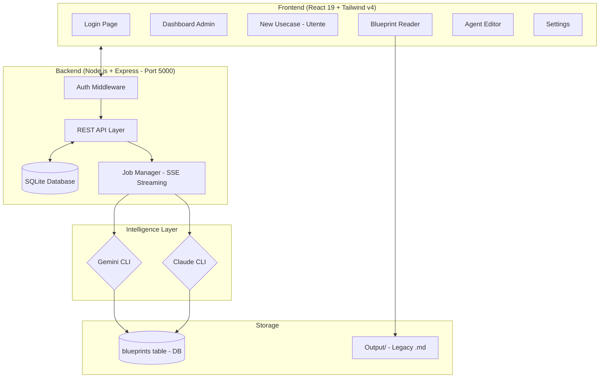

# BlueprintAI - Enterprise GenAI Blueprinting Platform

## Descrizione

**BlueprintAI** è una piattaforma full-stack di orchestrazione GenAI progettata per la generazione massiva di Blueprint architetturali e operativi per infrastrutture IT Enterprise. Supporta **Gemini CLI** e **Claude CLI** come motori di generazione, trasformando use case complessi in documentazione tecnica ad alta fedeltà in formato Markdown.

Il sistema è una **WebApp Full-stack** che permette di:
- **Autenticare gli Utenti:** Sistema di autenticazione integrato con gestione ruoli (Admin / Utente) e sessioni sicure con TTL configurabile.
- **Gestire Use Case:** Database SQLite integrato per catalogare centinaia di asset infrastrutturali, importabili via CSV.
- **Configurare Agenti AI:** Editor dedicato per la gestione dinamica dei System Prompt (Strategie) per diverse modalità di generazione.
- **Generare Blueprint in Parallelo:** Job engine asincrono con streaming real-time (SSE) e concorrenza controllata (max 3 worker).
- **Archiviare Blueprint nel Database:** I blueprint generati sono ora persistiti direttamente nel database SQLite con tracciabilità dell'autore e timestamp.
- **Leggere Blueprint:** Visualizzatore Markdown avanzato con supporto nativo per Mermaid.js, KaTeX, GeoJSON e syntax highlighting.
- **Esportare in PDF:** Export professionale via html2pdf.js con gestione automatica dei layout.

---

## Architettura del Sistema


```mermaid
flowchart TD
    subgraph Client ["Frontend (React 19 + Tailwind v4)"]
        A[Login Page]
        B[Dashboard Admin]
        C[New Usecase - Utente]
        D[Blueprint Reader]
        E[Agent Editor]
        F[Settings]
    end

    subgraph Server ["Backend (Node.js + Express - Port 5000)"]
        G[REST API Layer]
        H[(SQLite Database)]
        I[Job Manager - SSE Streaming]
        J[Auth Middleware]
    end

    subgraph AI_Engine ["Intelligence Layer"]
        K{Gemini CLI}
        L{Claude CLI}
    end

    subgraph Storage ["Storage"]
        M[(blueprints table - DB)]
        N[Output/ - Legacy .md]
    end

    Client <--> J
    J --> G
    G <--> H
    G --> I
    I --> K
    I --> L
    K --> M
    L --> M
    D --> N
```

---

## Stack Tecnologico

| Layer | Tecnologie |
| :--- | :--- |
| **Frontend** | React 19.2, Vite 8, Tailwind CSS v4, React Router DOM v7, Framer Motion, Lucide-react, Axios |
| **Backend** | Node.js, Express.js, better-sqlite3, bcryptjs, csv-parse/csv-stringify |
| **Markdown** | react-markdown, remark (GFM, Math, Frontmatter, ToC, Wikilink), rehype (KaTeX, Highlight, Sanitize) |
| **Diagrammi** | Mermaid.js, KaTeX, Leaflet/react-leaflet (GeoJSON) |
| **AI Engines** | Gemini CLI (stdin/stdout), Claude CLI (--system-prompt) |
| **Export** | html2pdf.js |

---

## Installazione e Avvio Rapido

Il progetto è gestito da un unico orchestratore `start_app.sh`.

### 1. Prerequisiti

- **Node.js** (v20+) e **npm**
- **Gemini CLI** e/o **Claude CLI** installati e configurabili nel PATH
- **Chiave API:** `export GEMINI_API_KEY="tua_chiave"` impostata nell'ambiente

### 2. Setup Iniziale

```bash
# Rendi eseguibili gli script
chmod +x *.sh

# Installa tutte le dipendenze (Backend + Frontend)
./start_app.sh install
```

### 3. Comandi di Gestione

| Comando | Descrizione |
| :--- | :--- |
| `./start_app.sh start` | Avvia Backend (Porta 5000) e Frontend (Porta 5173) in background. PID salvati in `.app.pids`. |
| `./start_app.sh status` | Controlla lo stato dei servizi e mostra le ultime righe dei log. |
| `./start_app.sh stop` | Arresta in modo pulito tutti i processi attivi. |
| `./start_app.sh restart` | Esegue un ciclo stop/start completo. |
| `./start_app.sh restart-backend` | Riavvia solo il backend (porta 5000). |
| `./start_app.sh restart-frontend` | Riavvia solo il frontend (porta 5173). |

---

## Autenticazione e Ruoli

### Credenziali di Default

Al primo avvio, viene creato automaticamente un utente amministratore con le credenziali:

| Username | Password | Ruolo |
| :--- | :--- | :--- |
| `admin` | `admin` | `admin` |

> **Importante:** Cambiare la password dell'admin dalla sezione gestione utenti dopo il primo accesso.

### Sistema di Ruoli

| Ruolo | Accesso | Redirect post-login |
| :--- | :--- | :--- |
| `admin` | Tutte le pagine, incluse dashboard, gestione utenti, agent editor | `/dashboard` |
| `user` | Solo `/newusecase` e `/reader` | `/newusecase` |

### Sessioni

- I token di sessione hanno un TTL di **30 minuti**.
- L'endpoint `/api/auth/sse-token` genera un token temporaneo monouso per la compatibilità con `EventSource` (SSE).
- Un admin può forzare il logout di qualsiasi utente via `POST /api/users/:id/logout`.

---

## Pagine Frontend (URL)

### Pagine Pubbliche

| URL | Descrizione |
| :--- | :--- |
| `http://localhost:5173/login` | Pagina di login — autenticazione con username e password |

### Pagine Utente (redirect automatico per ruolo `user`)

| URL | Descrizione |
| :--- | :--- |
| `http://localhost:5173/newusecase` | Creazione guidata di un nuovo use case con generazione blueprint automatica e log in tempo reale. Supporta upload file (CSV, JSON, testo). |
| `http://localhost:5173/reader` | Blueprint Reader standalone — lista e visualizzazione dei blueprint salvati nel DB |
| `http://localhost:5173/reader?file=<filename>` | Blueprint Reader con file pre-caricato (es. `82_blueprint_test.md`) |
| `http://localhost:5173/settings` | Pagina impostazioni standalone — engine, modello AI, timeout, test connessione |

### Pagine Admin (con sidebar di navigazione completa)

| URL | Descrizione |
| :--- | :--- |
| `http://localhost:5173/` | Dashboard principale — gestione use case, selezione bulk, monitoraggio pipeline |
| `http://localhost:5173/dashboard` | Alias della dashboard principale |
| `http://localhost:5173/editor` | Engine Config standalone — gestione System Prompt (Strategie) |

> **Nota architetturale:** Le pagine standalone non mostrano la barra laterale di navigazione, facilitando l'implementazione di un sistema di autenticazione e visibilità basato su ruoli (RBAC), dove ogni URL può essere protetto indipendentemente.

---

## API Reference

Tutte le API sono esposte dal backend su `http://localhost:5000`.

### Autenticazione

| Metodo | Endpoint | Body / Params | Auth | Descrizione |
| :--- | :--- | :--- | :--- | :--- |
| `POST` | `/api/auth/login` | `{username, password}` | — | Login utente. Ritorna `{token, user: {id, username, role}}` |
| `POST` | `/api/auth/logout` | — | Richiede auth | Invalida il token di sessione corrente |
| `GET` | `/api/auth/logout` | — | — | Logout con redirect |
| `GET` | `/api/auth/me` | — | Richiede auth | Restituisce i dati dell'utente corrente |
| `GET` | `/api/auth/sse-token` | — | Richiede auth | Genera token monouso per SSE. Ritorna `{sseToken}` |

### Gestione Utenti (solo Admin)

| Metodo | Endpoint | Body | Descrizione |
| :--- | :--- | :--- | :--- |
| `GET` | `/api/users` | — | Lista tutti gli utenti |
| `POST` | `/api/users` | `{username, password, role}` | Crea un nuovo utente (password hashata con bcryptjs) |
| `PUT` | `/api/users/:id` | `{password?, role?}` | Aggiorna password e/o ruolo di un utente |
| `POST` | `/api/users/:id/logout` | — | Forza il logout di un utente (invalida tutte le sue sessioni) |
| `DELETE` | `/api/users/:id` | — | Elimina un utente (non applicabile all'utente `admin`) |

### Use Cases

| Metodo | Endpoint | Body / Params | Descrizione |
| :--- | :--- | :--- | :--- |
| `GET` | `/api/csv` | — | Recupera tutti gli use case dal database |
| `POST` | `/api/csv` | `Array<{ID, Categoria, "Titolo Attività", "Descrizione Dettagliata", "Gruppo o Ruolo"}>` | Sincronizza il database (bulk import, sovrascrive tutto) |
| `POST` | `/api/usecases` | `{description, title?, category?}` | Crea un singolo use case con ID sequenziale autogenerato. Ritorna `{id, title, category}` |

### Agenti (System Prompts / Strategie)

| Metodo | Endpoint | Body | Descrizione |
| :--- | :--- | :--- | :--- |
| `GET` | `/api/agents` | — | Lista tutte le strategie salvate |
| `POST` | `/api/agents` | `{name}` | Crea una nuova strategia vuota |
| `POST` | `/api/agents/:id/default` | — | Imposta la strategia come predefinita per la generazione |
| `POST` | `/api/agents/:id/name` | `{name}` | Rinomina una strategia |
| `POST` | `/api/agents/:id/content` | `{content}` | Aggiorna il system prompt di una strategia |
| `DELETE` | `/api/agents/:id` | — | Elimina una strategia (vietato se è quella di default) |

### Impostazioni

| Metodo | Endpoint | Body | Descrizione |
| :--- | :--- | :--- | :--- |
| `GET` | `/api/settings` | — | Recupera tutte le configurazioni |
| `POST` | `/api/settings` | `{engine_type?, gemini_model?, claude_model?, gemini_timeout?, claude_timeout?}` | Salva una o più configurazioni |
| `POST` | `/api/test-engine` | `{apiKey?}` | Esegue un test di connessione al motore AI configurato. Ritorna `{success, output?, error?, durationMs}` |

### Esecuzione Blueprint (Job Engine)

| Metodo | Endpoint | Body / Params | Descrizione |
| :--- | :--- | :--- | :--- |
| `POST` | `/api/run` | `{ids: string[], apiKey?}` | Avvia un job di generazione per gli ID selezionati. Ritorna `{jobId}` |
| `GET` | `/api/run/stream/:jobId` | — | **SSE** — stream eventi real-time del job (`start`, `item_start`, `item`, `done`, `error`, `cancelled`, `debug`) |
| `POST` | `/api/run/:jobId/cancel` | — | Cancella un job in esecuzione (invia SIGTERM ai processi figli) |
| `GET` | `/api/jobs` | — | Lista tutti i job attivi in memoria con metadata `{id, status, engine, ids[], titles[], startedAt}` |

#### Formato eventi SSE (`/api/run/stream/:jobId`)

```jsonc
// Inizio job
{ "type": "start", "total": 3, "engine": "GEMINI" }

// Inizio elaborazione singolo item
{ "type": "item_start", "id": "78", "title": "Nome use case" }

// Risultato elaborazione singolo item
{ "type": "item", "id": "78", "title": "...", "savedFile": "78_blueprint_name.md",
  "isErr": false, "exitCode": 0, "durationMs": 45000, "stdout": "...", "stderr": "...",
  "timedOut": false, "spawnError": null, "completed": 1, "total": 3 }

// Job completato
{ "type": "done", "total": 3, "engine": "GEMINI" }

// Errore job
{ "type": "error", "message": "Descrizione errore" }

// Job cancellato
{ "type": "cancelled" }

// Log di debug (non bloccante)
{ "type": "debug", "level": "info|warn|error|stdout|stderr|cmd", "msg": "...", "t": 1234567890 }
```

### Blueprint (Database)

| Metodo | Endpoint | Body | Descrizione |
| :--- | :--- | :--- | :--- |
| `GET` | `/api/blueprints` | — | Lista tutti i blueprint salvati nel DB (incluse migrazioni legacy da `Output/` e `Blueprint/`) |
| `GET` | `/api/blueprints/:id` | — | Legge il contenuto di un blueprint. Ritorna `{id, title, markdown_data, user_creator, datetime_creation}` |
| `PUT` | `/api/blueprints/:id` | `{content}` | Aggiorna il contenuto markdown di un blueprint esistente |
| `DELETE` | `/api/blueprints/:id` | — | Elimina un blueprint dal database |

---

## Database Schema

```sql
-- Use Case da generare
CREATE TABLE use_cases (
  id          TEXT PRIMARY KEY,
  category    TEXT,
  title       TEXT,
  description TEXT,
  role        TEXT
);

-- Strategie di generazione (System Prompts)
CREATE TABLE agents (
  id         INTEGER PRIMARY KEY AUTOINCREMENT,
  name       TEXT UNIQUE,
  content    TEXT,
  is_default INTEGER DEFAULT 0
);

-- Configurazioni applicazione
CREATE TABLE settings (
  key   TEXT PRIMARY KEY,
  value TEXT
);

-- Utenti (v2.1)
CREATE TABLE users (
  id            INTEGER PRIMARY KEY AUTOINCREMENT,
  username      TEXT UNIQUE NOT NULL,
  password_hash TEXT NOT NULL,
  role          TEXT NOT NULL DEFAULT 'user'   -- 'admin' | 'user'
);

-- Sessioni utente (v2.1)
CREATE TABLE sessions (
  token      TEXT PRIMARY KEY,
  user_id    INTEGER NOT NULL,
  expires_at TEXT NOT NULL,
  FOREIGN KEY (user_id) REFERENCES users(id)
);

-- Blueprint generati (v2.1)
CREATE TABLE blueprints (
  id                INTEGER PRIMARY KEY AUTOINCREMENT,
  user_creator      TEXT,
  datetime_creation TEXT,
  markdown_data     TEXT,
  title             TEXT
);
```

**Valori di default delle impostazioni:**

| Chiave | Valore Default |
| :--- | :--- |
| `engine_type` | `gemini` |
| `gemini_model` | `gemini-2.5-flash` |
| `claude_model` | `sonnet` |
| `gemini_timeout` | `90` (secondi) |
| `claude_timeout` | `360` (secondi) |

---

## Funzionalità del Frontend

### Login Page
- Autenticazione con username e password
- Redirect automatico basato sul ruolo post-login
- Gestione errori e stati di caricamento

### Dashboard (Admin)
- Tabella con tutti gli use case e filtro di ricerca in tempo reale
- Selezione multipla (checkboxes) per avviare generazioni bulk
- Editing inline dei campi direttamente nella tabella
- Import CSV e Export CSV
- Monitoraggio job attivi avviati da `/newusecase`

### New Usecase (Utente)
- Creazione guidata di un nuovo use case con form semplificato
- Upload di file contestuali (CSV, JSON, testo)
- Generazione blueprint con log in tempo reale (SSE)
- Visualizzazione del risultato direttamente nella pagina

### Agent Editor (Admin)
- Gestione completa del ciclo di vita delle strategie (create, rename, edit, delete, set-default)
- Editor testuale per la modifica del system prompt
- Protezione contro l'eliminazione della strategia di default

### Blueprint Reader
- Sidebar con lista dei blueprint dal database, ridimensionabile via drag
- Rendering Markdown completo: tabelle GFM, diagrammi Mermaid, formule KaTeX, mappe GeoJSON, syntax highlighting, frontmatter, table of contents, WikiLinks
- Export PDF via html2pdf.js
- Toggle Dark Mode con persistenza su localStorage
- Modalità fullscreen

### Settings
- Selezione engine (Gemini / Claude) con dropdown modelli
- Configurazione timeout via slider (10-600 secondi)
- Bottone "Test Engine" con misurazione del tempo di risposta

---

## Flusso Operativo

```
1. SETUP
   ├── ./start_app.sh install     → installa le dipendenze (con verifica pacchetti)
   └── ./start_app.sh start        → avvia backend (5000) + frontend (5173)

2. PRIMO ACCESSO
   ├── Aprire http://localhost:5173/login
   ├── Login con admin / admin
   └── Creare utenti aggiuntivi dalla dashboard

3. CONFIGURAZIONE (Admin)
   ├── Dashboard: carica use case via CSV → salvati in SQLite
   ├── Agent Editor: crea/modifica il system prompt di generazione
   └── Settings: seleziona engine (Gemini/Claude), modello e timeout

4. GENERAZIONE BLUEPRINT
   ├── Admin — Dashboard: seleziona uno o più use case, click "RUN"
   ├── Utente — /newusecase: compila il form e avvia la generazione
   ├── Backend: spawn di Gemini/Claude in parallelo (max 3 worker)
   ├── Streaming: il client riceve aggiornamenti real-time via SSE
   └── Output: blueprint salvati nel database SQLite con tracciabilità autore

5. FRUIZIONE
   ├── Blueprint Reader: apre il blueprint e lo renderizza
   └── Export PDF: scarica il documento formattato

6. MANUTENZIONE
   ├── ./backup.sh               → backup compresso DB + Output
   ├── ./github_push.sh          → push codice su GitHub
   └── ./update_from_github.sh   → pull aggiornamenti remoti
```

---

## Caratteristiche Avanzate

### Autenticazione e Sicurezza
- Password hashing con **bcryptjs**
- Token di sessione con TTL 30 minuti e cleanup automatico
- Token SSE monouso per compatibilità con `EventSource` (bypassa i limiti degli header HTTP)
- Middleware `requireAuth` e `requireAdmin` su tutti gli endpoint protetti

### Real-time Streaming (SSE)
Il job engine usa Server-Sent Events per trasmettere il progresso al client. Gli eventi accumulati vengono reinviati automaticamente in caso di riconnessione, garantendo che nessun log venga perso. Il job store mantiene i job in memoria per **10 minuti** dopo il completamento.

### Concorrenza Controllata
Il backend gestisce una coda asincrona con un massimo di 3 processi AI in esecuzione contemporaneamente, con timeout configurabili per engine e gestione graceful della cancellazione.

### Dual Engine Support
- **Gemini CLI:** input del prompt via `stdin`, system prompt via variabile `GEMINI_SYSTEM_MD`
- **Claude CLI:** system prompt passato inline via `--system-prompt`

### Blueprint Database-Backed
I blueprint non sono più salvati solo su filesystem ma sono persistiti nel database SQLite con metadati completi (autore, data, titolo). Al primo avvio, i file legacy da `Output/` e `Blueprint/` vengono migrati automaticamente nel database.

### Logging Dettagliato
Per ogni item generato viene salvato un file di debug in `Output/.debug_agent_*` con il comando esatto eseguito, stdout/stderr completi e timing al millisecondo.

### Governance e Privacy
- Le cartelle `Output/`, `Blueprint/` e `Backup/` sono inserite nel `.gitignore`
- Ogni documento generato è progettato per essere validato da un Cloud Architect prima della consegna finale

---

## Script di Manutenzione

| Script | Funzione |
| :--- | :--- |
| `backup.sh` | Crea un archivio compresso con timestamp del database (inclusi utenti e blueprint) e dei file generati in `Backup/` |
| `github_push.sh` | Sincronizza il codice della piattaforma su GitHub (esclude dati sensibili) |
| `update_from_github.sh` | Aggiorna la logica degli agenti e degli script all'ultima versione remota |

---

## Variabili di Ambiente

```bash
export GEMINI_API_KEY="your-api-key"   # Obbligatorio per Gemini engine
```

Le impostazioni di modello e timeout sono configurabili dall'interfaccia grafica e persistite nel database.

---

## Author

**Developed by Carmelo Battiato**
*Enterprise AI Infrastructure Architect*
© 2026 - Tutti i diritti riservati.
