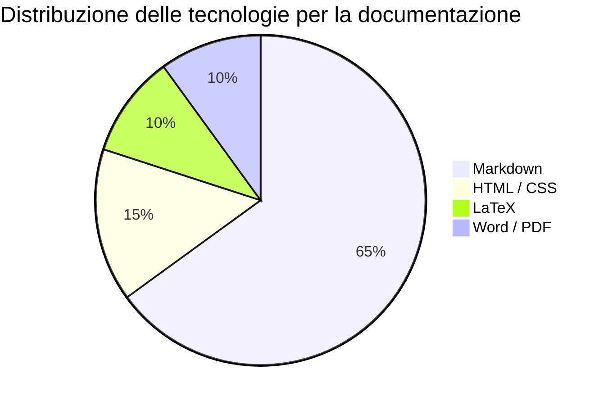
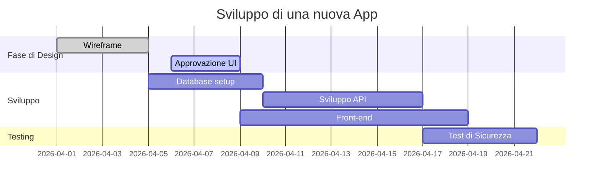
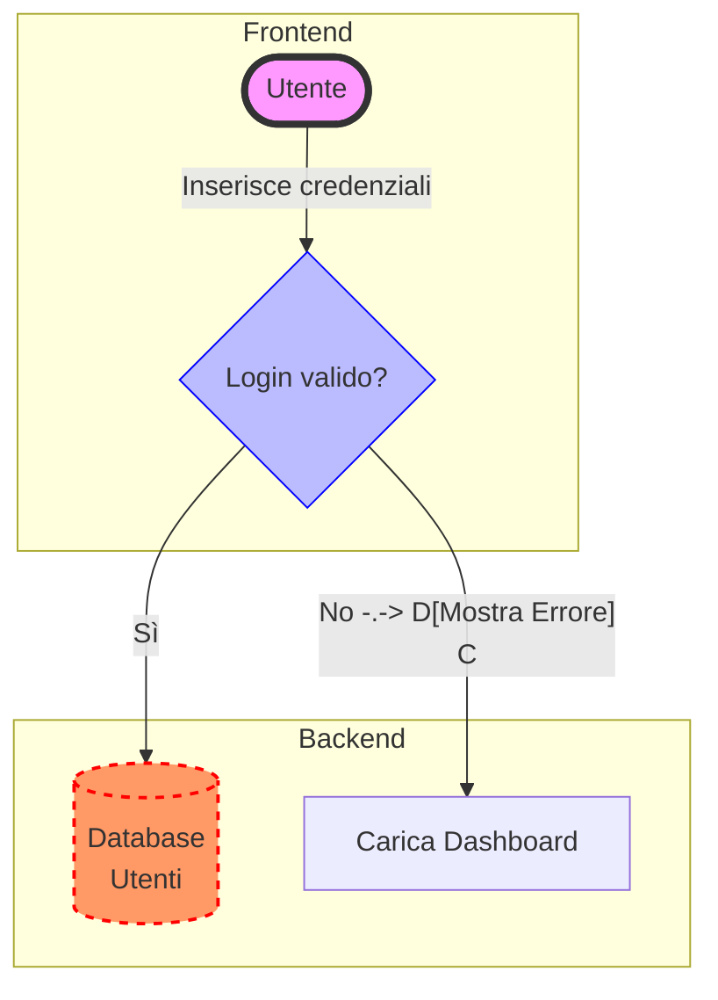
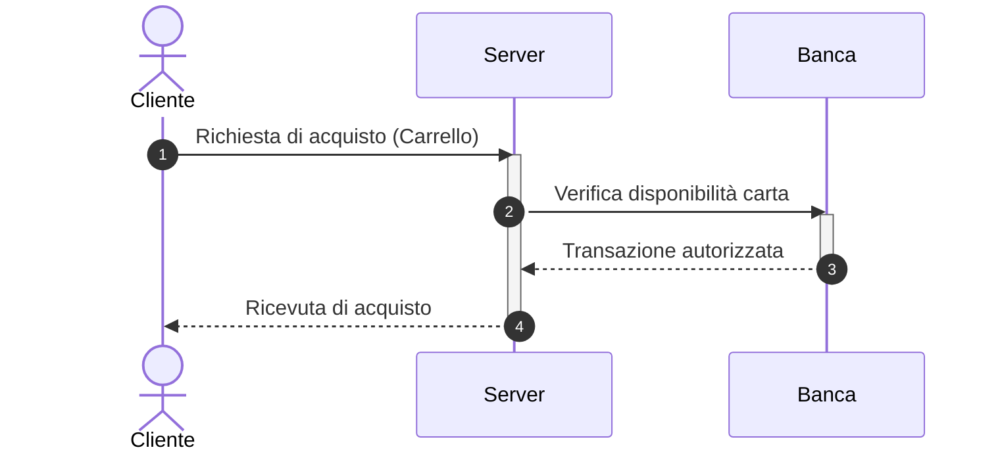
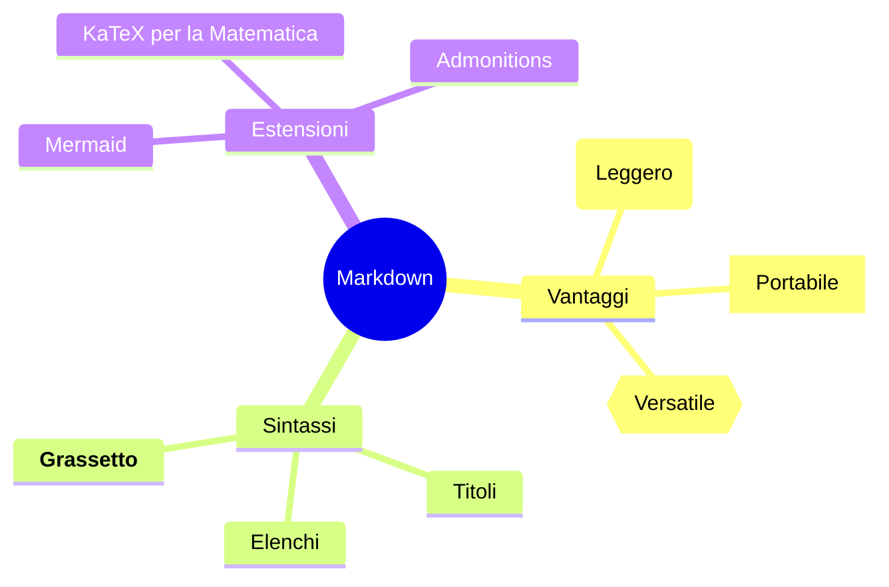
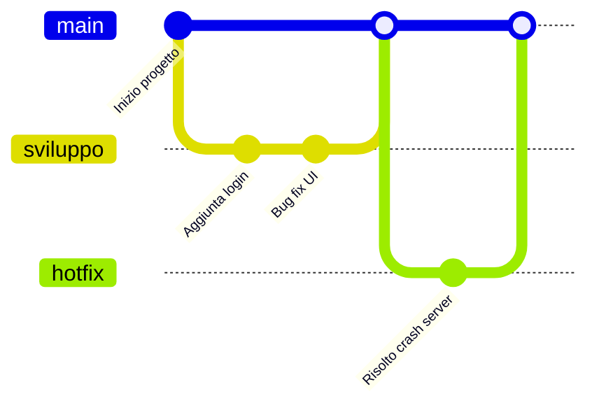
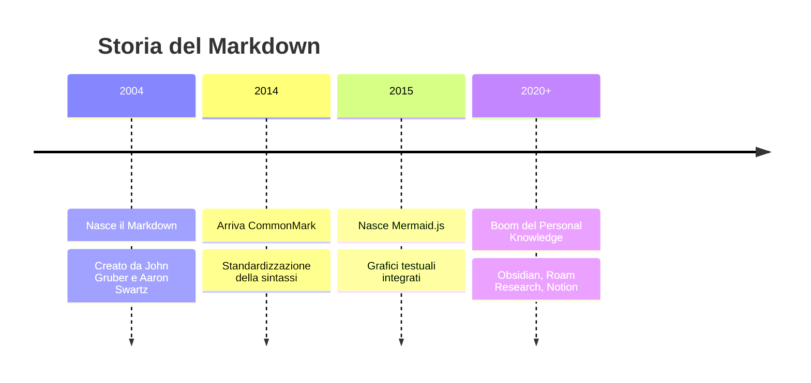
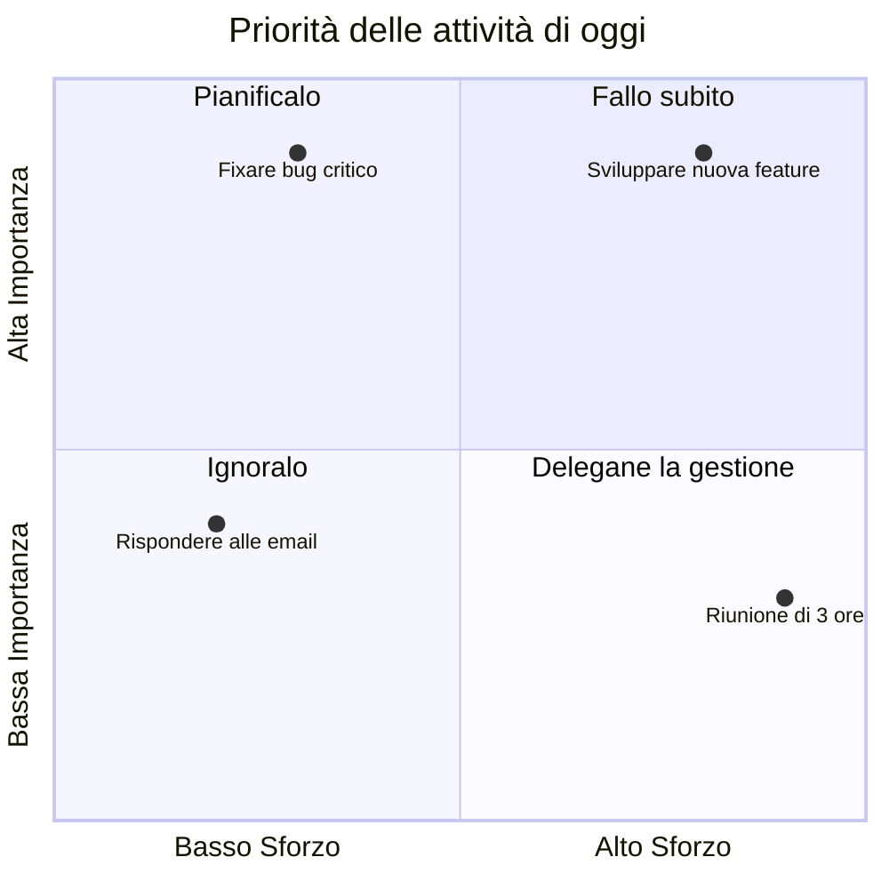

# Libreria dei Grafici Avanzati in Markdown (Mermaid)

Di seguito trovi esempi di come il Markdown può generare grafici complessi, planimetrie di progetto e mappe mentali digitando solo semplice testo.

---

## 1. Grafico a Torta (Data Visualization)
Un grafico a torta vettoriale semplice per visualizzare percentuali o dati.

---

## 2. Diagramma di Gantt (Project Management)
Perfetto per mostrare le tempistiche di un progetto, le dipendenze tra i task e lo stato di avanzamento.

---

## 3. Diagramma di Flusso Avanzato (con stili, colori e sottogruppi)
I flowchart possono diventare molto complessi, gestendo raggruppamenti (subgraph) e stili CSS personalizzati (colori, bordi tratteggiati, forme diverse).

---

## 4. Diagramma di Sequenza (Architettura Software)
Ideale per mostrare come diversi sistemi "parlano" tra loro nel tempo. Utilissimo per documentare le API o i processi di rete.

---

## 5. Mappa Mentale (Mindmap)
Ideale per il brainstorming e prendere appunti. Si basa sull'indentazione del testo per creare automaticamente i rami vettoriali.

---

## 6. Diagramma delle Ramificazioni Git (GitGraph)
Se lavori nello sviluppo software, questo grafico ti permette di disegnare la storia dei commit e dei branch del codice senza dover fare screenshot al terminale.

---

## 7. Timeline (Cronologia)
Perfetto per mostrare eventi storici, la cronologia di un'azienda o le tappe di una roadmap.

---

## 8. Diagramma a Quadranti (Business / Analisi)
Ottimo per l'analisi strategica, come le matrici SWOT o la priorità dei compiti (es. Matrice di Eisenhower).

